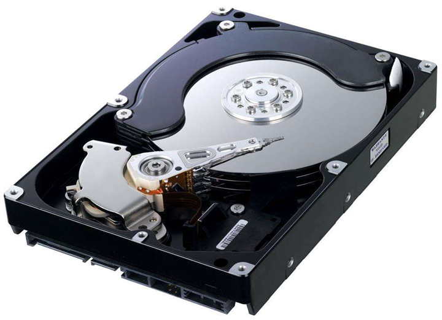

# 1.Linux服务器硬件基础
### 1.1计算机的体系结构(冯诺依曼体系结构)

冯诺依曼体系结构，将计算机部件分为5大部分，分别为：  

* 输入设备: 用于数据输入
* 输出设备：用于数据输出
* 储存器：用于存储数据和指令，内存和硬盘就是其中的一种存储设备
* 运算器： CPU的数据运算单元
* 控制器： CPU的控制单元

### 1.2计算机常见存储单位

* b : bit 比特  `1bit=一个二进制位`   计算机中最小的存储单位
* B : byte 字节 `1byte=8bit`  计算机中最小的可寻址存储单位
* KB `1KB=1024B`
* MB `1MB=1024KB`
* GB `1GB=1024MB`
* TB `1TB=1024GB`
* PB `1PB=1024TB`
* EB `1EB=1024PB`
* ZB `1ZB=1024EB`
* YB `1YB=1024ZB`
* . . . . . . 

### 1.3 服务器分类

#### 塔式服务器

早期的服务器形式，目前较少使用,外形以及结构和平时使用的立式PC差不多,机箱空间大，主板扩展性较强，插槽较多,预留了足够的内部空间，以便日后进行硬盘和电源的冗余扩展，设计一般都考虑降噪.

#### 刀片式服务器

这种服务器组成一组，放在一个框里面，可以整框使用。如图所示为整框的刀片服务器，其中竖条是计算单元，可以单独拿出来
在标准高度的机架式机箱内可插装多个卡式的服务器单元，实现高可用和高密度,更高的密度，集中管理，高性能，灵活扩展，按需配置,
可以使用系统软件将这些母板集合成一个服务器集群。在集群模式下，所有的母板可以连接起来提供高
速的网络环境，并同时共享资源，为相同的用户群服务

#### 机架式服务器

* 按照统一标准设计，配合机柜统一使用，便于统计管理，高密度，节省空间，常用U为单位，
1U=1.75英寸=44.45毫米，机箱尺寸比较小巧，在机柜中可以同时放置多台服务器

* 机架式服务器的宽度为19英寸（48.26cm），厚度通常有1U，2U，3U，4U，5U，7U几种标准的
服务器

* 机柜的尺寸也是采用通用的工业标准，如：宽度600mm,深度1000mm,高度2000mm（42U）

* 现阶段是最主流的的服务器

### 1.4 服务器硬件组成

#### CPU

* **CISC**  
> Complex Instruction Set Computer，复杂指令集比如 X86，X86_64 主导桌面与服务器芯片市场

* **RISC** 
> ARM、RISC-V、MIPS、PA-RISC、PowerArchitecture(包括PowerPC)、DECAlpha和SPARC等.主导移动设备

#### 主板 mainBoard

主板一般为矩形电路板，上面安装了组成计算机的主要电路系统，一般有BIOS芯片、I/O控制芯片、键盘和面板控制开关接口、指示灯插接件、扩充插槽、主板及插卡的直流电源供电接插件等元件.

#### 内存 memory

内存是介于CPU 和外部存储之间，是CPU 对外部存储中程序与数据进行高速运算时存放程序指令、数据和中间结果的临时场所，它的物理实质就是一组具备数据输入输出和数据存储功能的高速集成电路

内存是CPU能直接寻址的存储空间，由半导体器件制成。内存的特点是存取速度快
计算机中所有程序的运行都是在内存中进行的，因此内存的性能对计算机的影响非常大与之相对应的还有外存：硬盘，U盘，软盘，光盘

#### 硬盘 disk

##### 常见的磁盘接口种类:

* IDE：Integrated Drive Electronics，电子集成[驱动器，早期家用电脑常用接口
* SCSI：Small Computer System Interface，小型计算机系统接口，早期的服务器常用接口
* SATA：Serial ATA （Advanced Technology Attachment 高技术配置），家用电脑常用的接口
* SAS：Serial Attached SCSI，是目前服务器上主流的接口
* 光纤通道：Fiber Channel，高性能服务器上采用的接口
* M.2 ：固态硬盘接口，性能更强

##### 机械硬盘 HDD hard disk drive 

* 存储介质（Media）——盘片
* 读写磁头（Read Write Head）——磁头 磁头是硬盘读取数据的关键部件，它的主要作用就是将存储在硬盘盘片上的磁信息转化为电信号向
外传输
* 马达  马达上装有一至多片盘片，以7200，10000，15000 RPM等定速旋转，为保持其平衡不可抖动，
所以其质量要求严谨，不产生高温躁音

##### 固态硬盘 solid state drive

SSD，即固态硬盘，泛指使用NAND Flash组成的固态硬盘。其特别之处在于没有机械结构，以区块写入
和抹除的方式做读写的功能，因此在读写的效率上，非常依赖读写技术上的设计，SSD读写存取速度快，
性能稳定，防震性高，发热低，耐低温，电耗低，无噪音。因为没有机械部分，所以长时间使用也出现
故障几率也较小。缺点：价格高，容量小，相对普通机械硬盘性价比低

#### 网卡 network interface card

服务器一般都在主板上集成了网卡LOM (LAN on motherboard主板集成网卡) ，传输速率通常为
1Gbps，即千兆网卡,特殊应用需要高端网卡，如光纤网卡，Infiniband网卡等，传输速率能达到10Gbps、20Gbps，即万兆
网卡

#### 远程管理卡

远程管理卡是安装在服务器上的硬件设备，提供一个以太网接口，使它可以连接到独立于业务网络的专
用的管理网络中，提供远程访问,如查看服务器状态,调整BIOS,配置RAID,安装系统,重启系统等。这种远
程管理是基于服务器主板上集成的基板管理控制器BMC（Baseboard Manager Controller)实现，BMC
就是一个独立于服务器的微处理器系统, 可以完成负责监测和管理操作系统之外的服务器环境和状态。它
既不会占用服务器系统资源，也不会影响服务器系统的运行。所有远程管理卡都是向BMC发送指令来实
现服务器的管理和监控功能.只要服务器通电而无需启动操作系统,BMC即可正常工作.

#### 阵列卡

Raid卡用来实现RAID的建立和重建，检测和修复多位错误，错误磁盘自动检测等功能。RAID芯片使CPU
的资源得以释放，阵列卡把若干硬盘驱动器按照一定要求组成一个整体、由阵列控制器管理的系统

### 1.5各种硬件的处理速度

如果把计算机世界的时间和人类世界的时间做了对比，CPU 他的一个时钟周期如果按1秒算：其他硬件时间如下图所示

