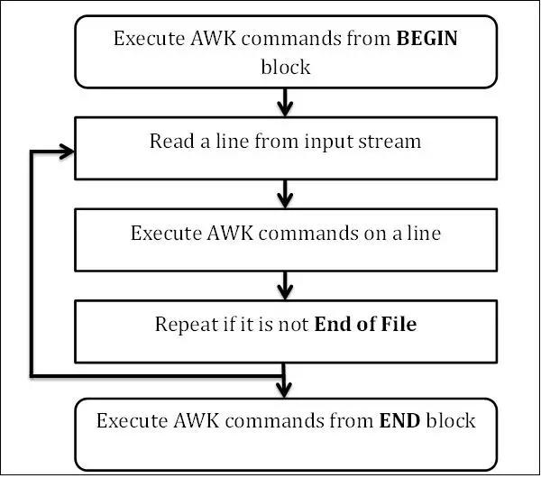

# AWK

## awk：模式扫描和处理语言，可以实现下面功能
* 文本处理
* 输出格式化的文本报表
* 执行算数运算
* 执行字符串操作

## 命令格式
```bash
awk [options]   'program' var=value   file…
awk [options]   -f programfile    var=value file…

```

## 语法说明

#### program通常是被放在单引号中，并可以由三种部分组成
* BEGIN语句块
* 模式匹配的通用语句块
* END语句块

#### Program格式：
`pattern{action statements;...}...`

pattern：决定动作语句何时触发及触发事件，比如：BEGIN,END,正则表达式等

action statements：对数据进行处理，放在{}内指明，常见：print, printf


### 常见选项：

* -F “分隔符” 指明输入时用到的字段分隔符，默认的分隔符是若干个连续空白符
* -v var=$value 变量赋值, var 变量为内置变量，value可以是外部定义的变量


### AWK工作流程



```bash
第一步：执行BEGIN{action;… }语句块中的语句
第二步：从文件或标准输入(stdin)读取一行，然后执行pattern{ action;… }语句块，它逐行扫描文件，
从第一行到最后一行重复这个过程，直到文件全部被读取完毕。 
第三步：当读至输入流末尾时，执行END{action;…}语句块
BEGIN语句块在awk开始从输入流中读取行之前被执行，这是一个可选的语句块，比如变量初始化、打
印输出表格的表头等语句通常可以写在BEGIN语句块中
END语句块在awk从输入流中读取完所有的行之后即被执行，比如打印所有行的分析结果这类信息汇总
都是在END语句块中完成，它也是一个可选语句块 
pattern语句块中的通用命令是最重要的部分，也是可选的。如果没有提供pattern语句块，则默认执行{ 
print }，即打印每一个读取到的行，awk读取的每一行都会执行该语句块
```

### AWK 变量

#### 内置变量
```bash
1. 分隔符分割的字段 $0,$1,$2...$n, 其中$0表示所有字段，$1 字段1， $2 字段2
如果省略action 默认 print $0

2. FS 输入字段分隔符，默认是空白字符，功能相当于 -F

3. OFS：输出字段分隔符，默认为空白字符

4. RS：输入记录record分隔符，指定输入时的换行符

5. ORS：输出记录分隔符，输出时用指定符号代替换行符

6. NF：字段数量

7.NR：记录的编号

8.length: 每行的字符数，行的长度
```

#### 自定义变量

自定义变量是区分字符大小写的,使用下面方式进行赋值

* -v var=value 
* 在program中直接定义


### print 动作

`print item1, item2, ...`

* 逗号分隔符
* 输出item可以字符串，也可是数值；当前记录的字段、变量或awk的表达式
* 如省略item，相当于print $0
* 固定字符符需要用“ ” 引起来，而变量和数字不需要


### 注意
`awk  'pattern{action statements...}....'  FILE....`

其中，处理模式跟sed很相似，也是一行文本，一行文本的处理，只有被pattern匹配到的行才会被后面处理， pattern 这个位置事实上

就是一个表达式，返回为true，表示为真。 所以这个位置既可以是正则也可以是变量参与的逻辑表达式

```bash
范围行
awk 'BEGIN{action statements...} /pattern/,/pattern/{action statements...} END{action statements...}'
awk 'BEGIN{action statements...}  NR>=1&&NR<=10{action statements...} END{action statements...}'
awk 'BEGIN{action statements...}  NR==1,NR==10{action statements...} END{action statements...}'
awk 'BEGIN{action statements...} /pattern/{action statements...} END{action statements...}' #仅处理能够模式匹配到的行


awk -v FS=: -v OFS=' '  -v RS='\n'  -v ORS='\n' \
'BEGIN{print "行号  username   UID"} NR==3,NR==10{print NR,$1,"--->",$3} END{print "=========end=========="}' \
/etc/passwd 
```


### awk 脚本
```bash
awk {}内和pattern位置，都是支持编程的，pattern位置如果是真，就表示匹配上这一行，如果是假就表示没有匹配上，
所以， 这个位置完全可以是一个表达式，可以是三目表达式，或者其他表达式，只要能产生真或假的表达式都行

awk的最外面的{} 其实完全可以看作是一个代码块，然后里面完全可以写类C风格的语句，继续嵌套{}都行

pattern
$0 ~ ^root  #是否匹配右边
$0 !~ ^root #是否不匹配


awk 可以通过-v 这种方式往脚本中注入外部变量, 如果想全局初始化一些变量，可以放在BEGIN{}块中，可以在行匹配之前
执行，pattern{} 这中的脚本将会在每匹配一行，都会执行一次

awk {} 内变量引用跟C语言风格类似，$1 $2 自定义变量， x=$1;y=NR 这样直接把变量放在右边，作为右值就行了,
一个语句分号分隔就行了。例如
awk 'BEGIN{x++;print x}'

print 后面打印变量 ，分割， 变量直接C风格引用， 如果不是变量，需要用"" 包裹起来
awk 'BEGIN{x=1;y=2;z=3;print x,y,z,"不是变量"}' 


printf 跟C语言类似
printf "%s"  $1
printf "%d"  x

%s
%d
%f
%和字母之间可以加5,3 数字，前面数字表示显示宽度，后面数字表示小数位长度，默认右对齐，在数字前面加-表示左对齐
...


awk 中的数组更像是一个map， key value的键值对
a["hello"]='goood'
a[x]=y
想遍历数组
for(i in a) print a[i],i

in也可以是一个运算符，用来计算索引是否在数组中存在
awk 'BEGIN{arr["aa"]=23;print "aa" in arr }'  #结果是1

```


### 文件拆分

```bash
Proto Recv-Q Send-Q Local-Address          Foreign-Address             State
tcp        0      0 0.0.0.0:3306           0.0.0.0:*                   LISTEN
tcp        0      0 0.0.0.0:80             0.0.0.0:*                   LISTEN
tcp        0      0 127.0.0.1:9000         0.0.0.0:*                   LISTEN

awk '{print > $6}' test.txt
意思是， 以$6,也就是第6个字段作为key,把每一行进行分类，然后以这个key作为文件名，属于这个key的行，放在同一个文件中

也可以，指定一行中哪些字段放在文件中

awk '{print $1,$2} > $6' test.txt 

这个意思是，按照$6字段进行分类，然后取每行中的$1,$2为一行放在一个文件中

```

### 常见的内置函数

```bash
rand()：返回0和1之间一个随机数
srand()：配合rand() 函数,生成随机数的种子
int()：返回整数

length([s])：返回指定字符串的长度
sub(r,s,[t])：对t字符串搜索r表示模式匹配的内容，并将第一个匹配内容替换为s
gsub(r,s,[t])：对t字符串进行搜索r表示的模式匹配的内容，并全部替换为s所表示的内容
split(s,array,[r])：以r为分隔符，切割字符串s，并将切割后的结果保存至array所表示的数组中，第
一个索引值为1,第二个索引值为2,…
systime() 当前时间到1970年1月1日的秒数
strftime() 指定时间格式  

```


