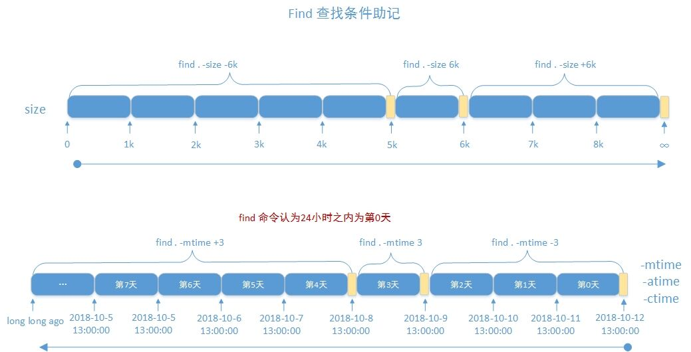

# 11.文件查找和打包压缩

## 1.非实时查找 locate

```bash
依赖于/var/lib/mlocate/mlocate.db
执行updatedb 可以更新数据库
locate和updatedb命令来自于mlocate包
搜索文件的全路径，不能指定路径
locate [OPTION]... [PATTERN]...
-i 不区分大小写的搜索
-n N 只列举前N个匹配项目
-r 使用基本正则表达式
```

## 2.实时文件查找 find

> find [OPTION]... [查找路径] [查找条件] [处理动作]


### 根据文件名和inode查找


```bash
-maxdepth level     #最大搜索目录深度,指定目录下的文件为第1级
-mindepth level     #最小搜索目录深度
-depth              #先处理目录内的文件在处理目录本身
-name '文件名称'     #支持使用glob,通配符要加双引号引起来
-iname '文件名称'    #不区分字母大小
-inum n             #按inode号查找
-samefile name      #相同inode号的文件
-links n            #链接数为n的文件
-regex 'pattern'    #以pattern来匹配整个文件路径，而非文件名称
```

### 根据属主，属组查找

```bash
-user       USERNAME 
-group     GRPNAME
-uid       UserID
-gid       GroupID
-nouser   #查找没有属主的文件
-nogroup  #查找没有属组的文件
```

### 根据文件类型查找

```bash

 -type
 
 f: 普通文件
 d: 目录文件
 l: 符号链接文件
 s: 套接字文件
 b: 块设备文件
 c: 字符设备文件
 p: 管道文件


```

### 空文件或者空目录

` -empty`

### 组合条件

```bash
 与： -a  不写默认就是与
 或： -o
 非： -not !
 注意： 在find的表达式写()分组需要转义
```

### 德摩根定律

```bash
 （非A）且（非B）=非（A或B）
 （非A）或（非B）=非（A且B）
```


### 排除目录

-path '目录路径' #排除这个


### 根据文件大小来查找

```bash
 -size [+|-] #UNIT  #常用单位K M G c(byte) 注意大小写敏感
 6K 表示  (5k, 6k]
 -6k 表示 [0,5k]
 +6k 表示 (6K, ∞)
```


### 根据时间戳

```bash
 以天为单位
 -atime [+|-] 时间
 -ctime [+|-] 时间
 -mtime [+|-] 时间
 6 [6,7)
 +6 [7, ∞]
 -6 [0, 6)
 以分钟为单位
 -amin
 -mmin
 cmin
```
### 根据权限查找

```bash
-perm [/|-] MODE
MODE  #精确匹配
/MODE #任何一类(u,g,o)对象的权限中只要有一位匹配即可，或关系用/ 不要用+ ，+从Centos7开始淘汰
-MODE #每一类对象都必须同时拥有指定关系 与关系，只要有这个权限，不是说必须精确匹配，包括/MODE 也是这个含义
0 权限数字位是0表示不关注

```




### 正则

```bash
-regex 
-regextype 正则类型
            posix-awk
            posix-basic
            posix-egrep
            posixextended
```


### 处理动作

```bash
-print  默认打印
-ls  
-fls  file  #查找到的所有文件的长格式信息保存至指定文件中
-delete 删除文件
-ok CMD () \; #对查找到的每个文件执行CMD，交互式与用户
-exec CMD {} \;  #对查找到的每个文件执行CMD非交互

find -name ".conf" -exec cp {} {}.orig \;
{}表示前面find找到的文件，写在这个位置相当于引用前面find找到的文件，
\;表示转义;告诉shell，这个;是要给find的不是给shell的表明-exec 到; 是作为find参数
关于 {} \;更加详细说明
https://askubuntu.com/questions/339015/what-does-mean-in-the-find-command


xargs 动态生成参数，动态从标准输入读
-n 数字  #多少个参数为一行
-null 或者 -0  #使用二进制0 来表示参数分隔符而不是空格 防止文件名中有空格而使用空格分隔符
会产生混淆情况发生
```


## 3.文件解压缩、打包、分割文件

### 文件解压缩
```bash
gzip 
gunzip
文件后缀 .gz
-k keep, 保留原文件,CentOS 8 新特性
-d 解压缩，相当于gunzip
-c 结果输出至标准输出，保留原文件不改变
-# 指定压缩比，#取值为1-9，值越大压缩比越大

bzip2和bunzip2
对应的文件是 .bz2 后缀

 xz 和 unxz
对应的文件是 .xz 后缀

```


### tar使用

```bash
tar
创建归档，保留权限
tar -cpvf /path/file.tar  file.....
查看归档文件中的文件列表
tar -t -f /PATH/FILE.tar

展开归档
tar xf /PATH/FILE.tar
tar xf /PATH/FILE.tar  -C /PATH/  #指定展开到某某目录

结合压缩工具实现：归档并压缩 
-z 相当于gzip压缩工具
-j 相当于bzip2压缩工具
-J 相当于xz压缩工具

--exclude 排除文件
只打包目录内的文件，不所括目录本身
#方法1
[root@centos8 ~]#cd /etc
[root@centos8 etc]#tar zcvf /root/etc.tar.gz ./
#方法2
[root@centos8 ~]#tar -C /etc -zcf etc.tar.gz ./

tar zcvf /root/a.tgz  --exclude=/app/host1 --exclude=/app/host2 /app

-T 选项指定输入文件
-X 选项指定包含要排除的文件列表

tar zcvf mybackup.tgz -T /root/includefilelist -X /root/excludefilelist

```

### 分割和合并文件

```bash
split
split 命令可以分割一个文件为多个文件
split -b Size –d tar-file-name prefix-name
示例：
split -b 1M mybackup.tgz mybackup-parts


#切换成的多个小分文件使用数字后缀
split -b 1M –d mybackup.tgz mybackup-parts

将多个切割的小文件合并成一个大文件
cat mybackup-parts* > mybackup.tar.gz

```


