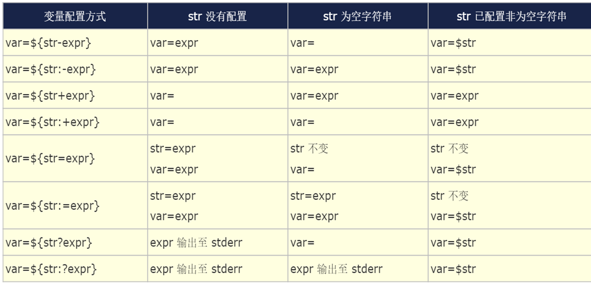

# shell脚本编程

## 1.脚本创建和执行

* 首行shebang机制,首行需要指明脚本执行的解释器, 例如`#!\bin\bash` 
* 注解使用#
* 标识符:数字 字母 下划线，开头不能是数字
* shebang下面 可以加上两行
    * set -u #未声明的变量不能引用
    * set -e #脚本发生错误，停止执行

### 不执行脚本只检查语法
bash -n script.sh

### 调试并执行
bash -x script.sh

### 执行脚本几种方式

bash script.sh

. script.sh  #在当前环境中执行

source script.sh #在当前环境中执行

chmod u+x script.sh
./script.sh


## 2.shell的变量

### 内置变量
    `PS1，PATH，UID，HOSTNAME，$$，BASHPID，PPID，$?，HISTSIZE SHLVL `

    $$ 和 BASHPID区别在于，在脚本中$$会显示最初的脚本BASH id， 不管是否是在子进程中打印$$,而BASHIP则是显示当前bash 进程id，注意这两个区别是在脚本中体现

    SHLVL shell的嵌套深度


### 用户自定义变量
```bash
变量=赋值  #即可完成变量定义，不要留有空格

作用范围，脚本执行的进程
```

### 注意： 
bash不支持浮点数

变量赋值是临时生效，当退出终端后，变量会自动删除，无法持久保存，脚本中的变量会随着脚
本结束，也会自动删除


### 环境变量
```bash
环境变量可以子进程中读到值，普通变量在子进程中无法读到值

export 变量

declare -x  变量

```

### 本地变量-局部变量
```bash
local 变量名字=值

这种变量只能在局部代码块有效， 通常在函数中

```

### 常量
```bash
readonly name
declare -r name

查看只读变量
readonly [-p]
declare -r

```

### 位置变量,在脚本中或者函数中存在
```bash
$1, $2, ... 对应第1个、第2个等参数，shift [n]换位置
$0 命令本身,包括路径，相对路径执行，就是相对路径，绝对路径执行，就是绝对路径
$* 传递给脚本的所有参数，全部参数合为一个字符串
$@ 传递给脚本的所有参数，每个参数为独立字符串
$# 传递给脚本的参数的个数
注意：$@ $* 只在被“双引号”包起来的时候才会有差异

```

### 变量的操作
```bash
普通操作下，默认bash中变量的值都是字符串
所以字符拼接：
X=${X}other-content
or
X+=other-content

通常对于变量引用，有一下方式
$VAR
${VAR} #这种方式可以防止名字和其他字符混淆
"${VAR}"  #这中方式可以防止字符分割同时可以保留VAR内容的原本格式

```


## 状态值

不同的命令执行之后，都会有一个状态值，保存在环境变量$?中，0表示成功，其他值表示失败，$?取值范例 0-255 

用户可以在脚本中使用以下命令自定义退出状态码

`exit N`

true 命令总是返回0

false 命令总是返回 1


### 注意

* 脚本中一旦遇到exit命令，脚本会立即终止；终止退出状态取决于exit命令后面的数字
* 如果exit后面无数字,终止退出状态取决于exit命令前面命令执行结果
* 如果没有exit命令, 即未给脚本指定退出状态码，整个脚本的退出状态码取决于脚本中执行的最后一条命令的状态码


## 算数和逻辑运算

```bash
let var=算术表达式
((var=算术表达式)) 和上面等价
var=$[算术表达式]
var=$((算术表达式))

内建的随机数生成器变量：
$RANDOM   取值范围：0-32767

按位运算 & | ^ 
逻辑取反 ！
短路逻辑运算 && || 

```


## 条件测试

```bash
[ EXPRESSION ] 
[[ EXPRESSION ]] 相当于增强版的 [ ], 支持[]的用法,且支持扩展正则表达式和通配符，但是不支持 -o 条件或 -a 条件且
注意： EXPRESSION前后必须有空白字符

变量测试
    [ -v NAME ] 

数值测试
    -eq 是否等于
    -ne 是否不等于
    -gt 是否大于
    -ge 是否大于等于
    -lt 是否小于
    -le 是否小于等于

数值比较测试，也可以使用 ((  )), 在双括号里面可以使用C风格的条件测试
== 
!= 
<= 
>= 
< 
> 

字符串测试
        -z STRING 字符串是否为空，没定义或空为真，不空为假，
        -n STRING 字符串是否不空，不空为真，空为假 
        STRING   同上
        STRING1 = STRING2 是否等于，注意 = 前后有空格
        STRING1 != STRING2 是否不等于
        > ascii码是否大于ascii码
        < 是否小于

[[ ]] 字符串测试用法
    == 左侧字符串是否和右侧的PATTERN相同
    注意:此表达式用于[[ ]]中，PATTERN为通配符，通配符直接写，不需要“”和//
     =~ 左侧字符串是否能够被右侧的正则表达式的PATTERN所匹配
    注意: 此表达式用于[[ ]]中为扩展的正则表达式  正则直接写，不需要“”和//   如果不想表示元字符，而是符号本身可以使用""或者/转义

    注意字符串比较的时候，如果不需要分割的地方要用双引号，否则会字符串分割，如果需要分割的地方就不要用双引号


文件测试
    -e FILE: 文件存在性测试，存在为真，否则为假
    -b FILE：是否存在且为块设备文件
    -c FILE：是否存在且为字符设备文件
    -d FILE：是否存在且为目录文件
    -f FILE：是否存在且为普通文件
    -h FILE 或 -L FILE：存在且为符号链接文件
    -p FILE：是否存在且为命名管道文件
    -S FILE：是否存在且为套接字文件

    注意：如果是符号连接文件，那么-f 测试结果也是0，原因是-f测试的是解引用了，所以要具体判断还要结合-h的结果


文件权限测试：
    -r FILE：是否存在且可读
    -w FILE: 是否存在且可写
    -x FILE: 是否存在且可执行
    -u FILE：是否存在且拥有suid权限
    -g FILE：是否存在且拥有sgid权限
    -k FILE：是否存在且拥有sticky权限
    注意：最终结果由用户对文件的实际权限决定，而非文件属性决定


文件属性测试
    -s FILE #是否存在且非空
    -t fd #fd 文件描述符是否在某终端已经打开
    -N FILE #文件自从上一次被读取之后是否被修改过
    -O FILE #当前有效用户是否为文件属主
    -G FILE #当前有效用户是否为文件属组
    FILE1 -ef FILE2 #FILE1是否是FILE2的硬链接
    FILE1 -nt FILE2 #FILE1是否新于FILE2（mtime）
    FILE1 -ot FILE2 #FILE1是否旧于FILE2


组合测试条件
    [ EXPRESSION1 -a EXPRESSION2 ] #并且，EXPRESSION1和EXPRESSION2都是真，结果才为真
    [ EXPRESSION1 -o EXPRESSION2 ] #或者，EXPRESSION1和EXPRESSION2只要有一个真，结果就为真
    [ ! EXPRESSION ] #取反
    说明： -a 和 -o 需要使用测试命令进行，[[ ]] 不支持


```

## ()和{}命令批量执行

```bash
( list ) 会开启子shell,并且list中变量赋值及内部命令执行后,将不再影响后续的环境,但是可以读取到外部变量的值
{ list; } 不会启子shell, 在当前shell中运行,会影响当前shell环境
(umask 066;touch f1.txt)
( cd /data;ls )
```


## read 读取输入

```bash
-p "提示"
-r "禁止转义，原序列输出"
```

## bash shell 配置文件生效顺序

```bash
全局配置：针对所有用户皆有效
    /etc/profile
    /etc/profile.d/*.sh
    /etc/bashrc

个人配置：只针对特定用户有效
    ~/.bash_profile
    ~/.bashrc

shell登录两种方式分类
    交互式登录
        直接通过终端输入账号密码登录
        使用 su - UserName 切换的用户
            配置文件生效和执行顺序：
                放在每个文件最前
                    /etc/profile
                    /etc/profile.d/*.sh
                    /etc/bashrc
                    ~/ .bash_ profile
                    ~/ .bashrc
                    /etc/bashrc
                放在每个文件最后
                    /etc/profile.d/*.sh
                    /etc/bashrc
                    /etc/profile
                    /etc/bashrc    #此文件执行两次
                    ~/.bashrc
                    ~/.bash_profile

    非交互式登录
        su UserName
        图形界面下打开的终端
        执行脚本
        任何其它的bash实例
    执行顺序：
        /etc/profile.d/*.sh
        /etc/bashrc
        ~/.bashrc

功能划分分类
    profile类为交互式登录的shell提供配置
        用于定义环境变量
        运行命令或脚本

    bashrc类：为非交互式和交互式登录的shell提供配置
        定义命令别名和函数
        定义本地变量

Bash 退出任务
    在~/.bash_logout文件中（用户）,在退出登录shell时运行
        创建自动备份
        清除临时文件
```

## if分支

```bash
判断条件, 这个地方是根具命令返回值，来判断成功或者失败

if 判断条件;then
   条件为真的分支代码
fi


if 判断条件; then
 条件为真的分支代码
else
 条件为假的分支代码
fi


if 判断条件1; then
 条件1为真的分支代码
elif 判断条件2; then
 条件2为真的分支代码
elif 判断条件3; then
 条件3为真的分支代码
...
else
 以上条件都为假的分支代码
fi

```

## case 分支

```bash

case支持glob风格的通配符：
* 任意长度任意字符
? 任意单个字符
[] 指定范围内的任意单个字符
|   或者，如: a|b

case 变量引用 in
PAT1)
 分支1
 ;;
PAT2)
 分支2
 ;;
...
*)
 默认分支
 ;;
esac

```


## for 循环

```bash
列表变量 这个位置不要用双引号，这个位置需要字符分割
列表可以省略，省略之后使用位置变量

for 变量名  in 列表;do
 循环体
done


for 变量名  in 列表
do
 循环体
done


for 循环列表生成方式：

直接给出列表
整数列表：
    {start..end}
    $(seq [start [step]] end)

返回列表的命令:
    $(COMMAND)

使用glob，如：*.sh
变量引用

也可以使用C风格for

for ((控制变量初始化;条件判断表达式;控制变量的修正表达式)); do
 循环体
done


for ((控制变量初始化;条件判断表达式;控制变量的修正表达式))
do
 循环体
done

```

## while 循环
```bash
while CONDITION; do
 循环体
done

```

## while 特殊用法 while read

```bash
while read line; do
 循环体
done < /PATH/FROM/SOMEFILE
```

##  循环 until
```bash
until CONDITION; do
 循环体
done

进入条件： CONDITION 为false
退出条件： CONDITION 为true

```

## continue 和 break

```bash
continue [N]   提前结束第N层的本轮循环，而直接进入下一轮判断；最内层为第1层
break [N]  提前结束第N层整个循环，最内层为第1层

```

## 循环控制 shift 命令

```bash

shift [n] 用于将参量列表 list 左移指定次数，缺省为左移一次。
参量列表 list 一旦被移动，最左端的那个参数就从列表中删除。while 循环遍历位置参量列表时，常用到shift

```

## 循环与菜单 select

```bash
select NAME in list ;do 
 循环体命令
done

select 循环主要用于创建菜单，按数字顺序排列的菜单项显示在标准错误上，并显示 PS3 提示符，
等待用户输入
用户输入菜单列表中的某个数字，执行相应的命令
用户输入菜单列表中的某个数字，会将对应的WORD值赋值给NAME变量
用户输入被保存在内置变量 REPLY 中
select 是个无限循环，因此要用 break 命令退出循环，或用 exit 命令终止脚本。也可以按 ctrl+c 
退出循环
select 经常和 case 联合使用
与 for 循环类似，可以省略 in list，此时使用位置参量

```

## 函数 function

> 它与shell程序形式上是相似的，不同的是它不是一个单独的进程，不能独立运行，而是shell程序的一部分


**函数和shell程序区别**

* Shell程序在子Shell中运行
* 函数在当前Shell中运行。因此在当前Shell中，函数可对shell中变量进行修改


### 定义函数

```bash

#语法一：
func_name （）{
 ...函数体...
}

#语法二：
function func_name {
 ...函数体...
} 

#语法三：
function func_name （） {
 ...函数体...
} 

```

### 查看函数

```bash

#查看当前已定义的函数名
declare -F
#查看当前已定义的函数定义
declare -f
#查看指定当前已定义的函数名
declare -f func_name 
#查看当前已定义的函数名定义
declare -F func_name

```

### 使用函数文件

```bash
创建函数文件，只存放函数的定义
在shell脚本或交互式shell中调用函数文件，格式如下：

. filename 
source   filename 

```

### 函数返回值

```bash
函数的执行结果返回值：
    使用echo等命令进行输出
    函数体中调用命令的输出结果

函数的退出状态码：
    默认取决于函数中执行的最后一条命令的退出状态码
    自定义退出状态码，其格式为：
        return 从函数中返回，用最后状态命令决定返回值
        return 0 无错误返回
        return 1-255 有错误返回

```

### 函数参数

```bash
函数可以接受参数：
    传递参数给函数：在函数名后面以空白分隔给定参数列表即可，如：testfunc arg1 arg2 ...
    在函数体中当中，可使用$1, $2, ...调用这些参数；还可以使用$@, $*, $#等特殊变量
```

### 函数递归


##  信号捕捉 trap

trap 命令可以捕捉信号,修改信号原来的功能,实现自定义功能

```bash
#列出所有信号
trap -l
#进程收到系统发出的指定信号后，将执行自定义指令，而不会执行原操作
trap '触发指令' 信号
#忽略信号的操作
trap '' 信号
 
#恢复原信号的操作
trap '-' 信号
#列出自定义信号操作
trap -p

#当脚本退出时，执行finish函数
trap finish EXIT 

```

## 创建临时文件 mktemp

```bash
mktemp 命令用于创建并显示临时文件，可避免冲突
说明：TEMPLATE: filenameXXX，X至少要出现三个
-d #创建临时目录
-p DIR或--tmpdir=DIR   #指明临时文件所存放目录位置

```

## 安装复制文件 install

```bash
install 功能相当于cp，chmod，chown，chgrp ,mkdir 等相关工具的集合
install命令格式：
install [OPTION]... [-T] SOURCE DEST 单文件
install [OPTION]... SOURCE... DIRECTORY
install [OPTION]... -t DIRECTORY SOURCE...
install [OPTION]... -d DIRECTORY... #创建空目录

-m MODE，默认755
-o OWNER
-g GROUP
-d DIRNAME 目录


```

## 交互式转化批处理工具 expect
> expect 是由Don Libes基于 Tcl（ Tool Command Language ）语言开发的，主要应用于自动化交互式
操作的场景，借助 expect 处理交互的命令，可以将交互过程如：ssh登录，ftp登录等写在一个脚本上，
使之自动化完成。

```bash
 安装expect  #yum -y install expect

expect 语法：

expect [选项] [ -c cmds ] [ [ -[f|b] ] cmdfile ] [ args ]

常见选项：
-c：从命令行执行expect脚本，默认expect是交互地执行的
-d：可以调试信息


expect中相关命令
spawn 启动新的进程
expect 从进程接收字符串
send 用于向进程发送字符串 注意：这个发送一般需要带上\n或者\r
interact 允许用户交互
exp_continue 反复匹配此串，在expect 的后面加这个，不加这个，默认匹配一次
expect eof 目的主要是等待当前会话或进程的结束
send_user 向用户（而不是向进程）发送输出，通常用于脚本的调试或通知。
set  设置脚本内的变量。
    set timeout 30  # 设置超时为30秒
 expect_after  定义在所有其他 expect 之后仍未被匹配时，所要执行的动作。
 expect_before   与 expect_after 相反，定义在其他 expect 命令之前要检查的模式。
close  关闭由 spawn 打开的进程。
puts 输出字符串
exit 表示退出expect


语法： 
    注释  #
    变量定义和使用
    使用 set 命令定义变量，使用 $ 访问变量的值。    
        set username "admin"  # 定义变量
        puts "Username is $username"  # 使用变量
    
    模式匹配

        expect {
            "password:" {send "my_password\r"; exp_continue}
            "logged in" {send "run_some_command\r"}
            timeout {puts "Connection timed out"; exit}
        }
        这个表示，这个expect 一次匹配，可以匹配这三个中的其一

        -re 开启正则匹配

可以shell脚本调用expect
    expect <<EOF
    EOF

    也可以 
    expect -c '脚本'
```

## 数组 array

```bash
索引的编号从0开始，属于数值索引
索引可支持使用自定义的格式，而不仅是数值格式，即为关联索引，bash 4.0版本之后开始支持
bash的数组支持稀疏格式（索引不连续）

#普通数组可以不事先声明,直接使用
declare -a ARRAY_NAME
#关联数组必须先声明,再使用
declare -A ARRAY_NAME


注意：两者不可相互转换

单个元素赋值 name[0]="hehehehe"
一次赋值全部元素
    ARRAY_NAME=("VAL1" "VAL2" "VAL3" ...)
也可以使用扩展和通配符
    array_name=({1..10})

 引用数组
    ${ARRAY_NAME[INDEX]}
    #如果省略[INDEX]表示引用下标为0的元素

引用数组所有元素，* 和 @ 区别跟位置变量一样，只有在“”保住的情况下有区别
    ${ARRAY_NAME[*]}
    ${ARRAY_NAME[@]}

数组的长度，即数组中元素的个数
    ${#ARRAY_NAME[*]}
    ${#ARRAY_NAME[@]}
数组的所有下表
    ${!ARRAY_NAME[*]}
    ${!ARRAY_NAME[@]}


数组数据处理
    数据切片
        ${ARRAY[@]:offset:number}
        ${ARRAY[*]:offset:number}
        offset #要跳过的元素个数
        number #要取出的元素个数
        #取偏移量之后的所有元素 
        {ARRAY[@]:offset}
        {ARRAY[*]:offset}
    向数组中追加元素：
        ARRAY[${#ARRAY[*]}]=value
        ARRAY[${#ARRAY[@]}]=value
    
关联数组
    关联数组必须先声明再调用
    declare -A ARRAY_NAME 
    ARRAY_NAME=([idx_name1]='val1' [idx_name2]='val2‘...)

```

## 字符串处理

```bash
#返回字符串变量var的字符的长度,一个汉字算一个字符
${#var} 

#返回字符串变量var中从第offset个字符后（不包括第offset个字符）的字符开始，到最后的部分，
offset的取值在0 到 ${#var}-1 之间(bash4.2后，允许为负值)
${var:offset} 

#返回字符串变量var中从第offset个字符后（不包括第offset个字符）的字符开始，长度为number的部分
${var:offset:number}

#取字符串的最右侧几个字符,取字符串的最右侧几个字符, 注意：冒号后必须有一空白字符
${var: -length}
#从最左侧跳过offset字符，一直向右取到距离最右侧lengh个字符之前的内容,即:掐头去尾
${var:offset:-length}
#先从最右侧向左取到length个字符开始，再向右取到距离最右侧offset个字符之间的内容,注意：-length
前空格,并且length必须大于offset
${var: -length:-offset}


基于模式取子串
    #其中word可以是指定的任意字符,自左而右，查找var变量所存储的字符串中，第一次出现的word, 删除字
    符串开头至第一次出现word字符串（含）之间的所有字符,即懒惰模式,以第一个word为界删左留右
    ${var#*word}

    #从var变量的值中删除以word开头的部分
    ${var#word}

    #同上，贪婪模式，不同的是，删除的是字符串开头至最后一次由word指定的字符之间的所有内容,即贪婪模
    式,以最后一个word为界删左留右
    ${var##*word}
    ${var##word}


    #其中word可以是指定的任意字符,功能：自右而左，查找var变量所存储的字符串中，第一次出现的word, 
    删除字符串最后一个字符向左至第一次出现word字符串（含）之间的所有字符,即懒惰模式,以从右向左的第一
    个word为界删右留左
    ${var%word*}
    ${var%word}
    #同上，只不过删除字符串最右侧的字符向左至最后一次出现word字符之间的所有字符,即贪婪模式,以从右向
    左的最后一个word为界删右留左
    ${var%%word*}
    ${var%%word}


查找替换

    #查找var所表示的字符串中，第一次被pattern所匹配到的字符串，以substr替换之，懒惰模式
    ${var/pattern/substr}
    #查找var所表示的字符串中，所有能被pattern所匹配到的字符串，以substr替换之，贪婪模式
    ${var//pattern/substr}
    #查找var所表示的字符串中，行首被pattern所匹配到的字符串，以substr替换之
    ${var/#pattern/substr}
    #查找var所表示的字符串中，行尾被pattern所匹配到的字符串，以substr替换之
    ${var/%pattern/substr}

查找删除

    #删除var表示的字符串中第一次被pattern匹配到的字符串，懒惰模式
    ${var/pattern}
    #删除var表示的字符串中所有被pattern匹配到的字符串，贪婪模式
    ${var//pattern}
    #删除var表示的字符串中所有以pattern为行首匹配到的字符串
    ${var/#pattern}
    #删除var所表示的字符串中所有以pattern为行尾所匹配到的字符串
    ${var/%pattern}

字符大小写转换

    #把var中的所有小写字母转换为大写
    ${var^^}
    #把var中的所有大写字母转换为小写
    ${var,,}
```

## 高级变量赋值



## eval命令

eval命令将会首先扫描命令行进行所有的置换，然后再执行该命令。该命令适用于那些一次扫描无法实
现其功能的变量,该命令对变量进行两次扫描

```bash
result="ls -a"
echo $result

[root@Rocky8-5-min-local ~]# echo $result 
ls -a


eval $result
.   .bash_history  .bash_profile  .cshrc      .tcshrc  .viminfo
..  .bash_logout   .bashrc        result.log  test.sh

```

注意，一般eval 命令都会写在最前面，相当于对后面的命令先进行一次扫描
```bash
例如：

arr=("01" "02" "03")
var1=arr
firstEle=${$var1[0]}   #这样是没法执行的，会报错  firstEle=${$var1[0]}: bad substitution

但是添加 eval 之后
eval firstEle=${$var1[0]}  #这样依然报错，firstEle=${$var1[0]}: bad substitution

原因是第一遍扫描的时候，第一个$都会被替换的，并不是想象中的仅仅$var1被替换，所以会报错，因为要想第一个$替换就需要{}里面求值，所以就又回到没用eval的尴尬
正确做法，第一遍扫描，对于第二遍才需要执行的，应该进行转义，不要替换，仅仅需要第一遍扫描需要执行的不用转义
eval firstEle=\${$var1[0]} 

再比如
arr=("0  1" "0  2" "0  3")
对于中间的空格， 我们想保持住这种格式， 那么我们不得在引用的时候加上引号，但是我们又不想第一遍扫描时候把引号去掉，就可以这样做
eval firstEle=\"\${$var1[0]}\" 

```


