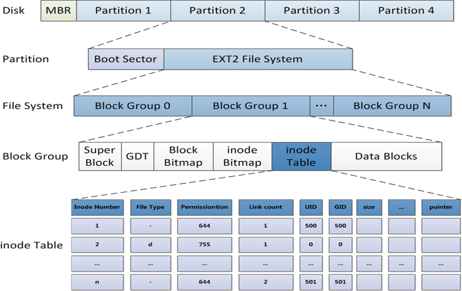
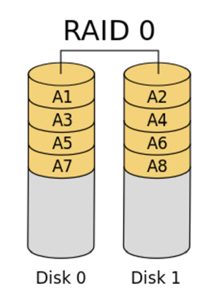
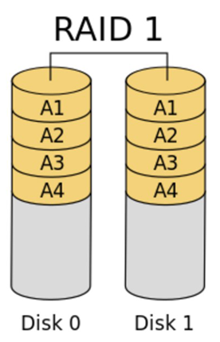
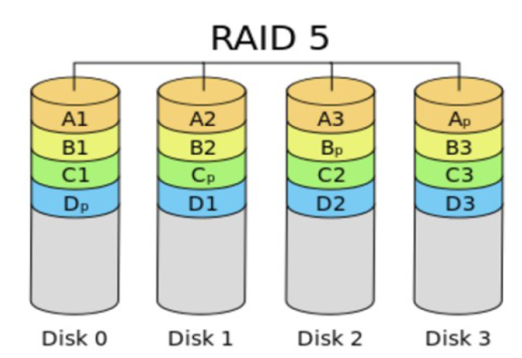
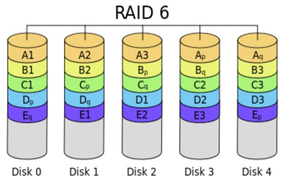
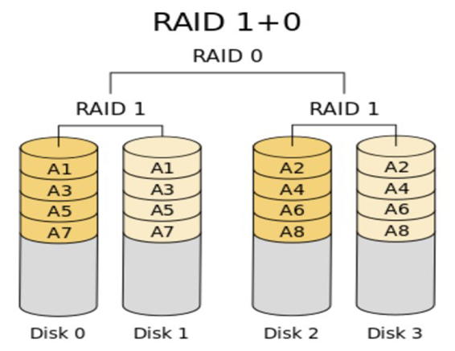
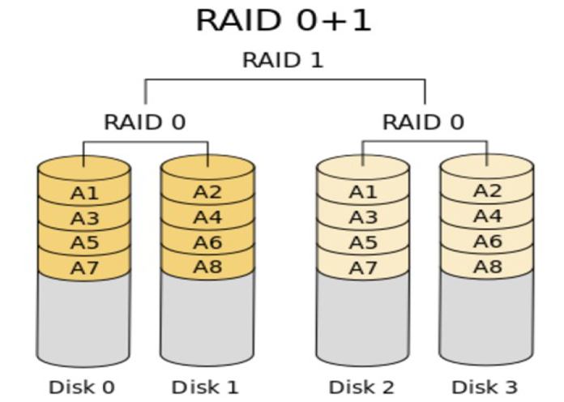
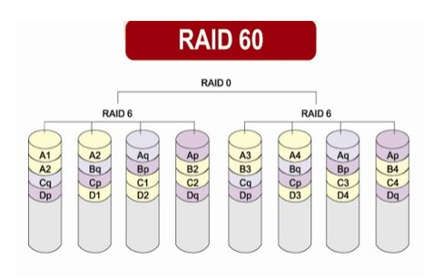
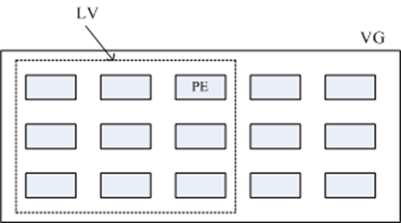
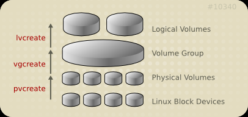

# 磁盘存储和文件系统

## 磁盘结构

### 设备文件

```bash
设备号码：
    主设备号：major number, 标识设备类型
    次设备号：minor number, 标识同一类型下的不同设备

设备类型：
    块设备：block，存取单位“块”，磁盘
    字符设备：char，存取单位“字符”，键盘

常见磁盘文件的设备名称

    /dev/sdX   # SAS,SATA,SCSI,IDE,USB 
    /dev/nvme0n#   #nvme协议硬盘，如：第一个硬盘：nvme0n1，第二个硬盘：nvme0n2

    虚拟磁盘：
    /dev/vd 
    /dev/xvd
```

## 机械硬盘
```bash
三个术语: CHS

head：磁头 磁头数=盘面数
track：磁道 磁道=柱面数
sector：扇区，512bytes
cylinder 柱面=512 * sector数/track*head数
dd | hdparm -t /dev/sda  #磁盘测速


```

## 存储管理

### 使用磁盘三个步骤
1. 创建分区
2. 格式化文件系统(也可以不分区，直接整块硬盘格式化文件系统)
3. 挂载

### 为什么分区
* 优化I/O性能
* 实现磁盘空间配额限制
* 提高修复速度
* 隔离系统和程序
* 安装多个OS
* 采用不同文件系统

###  MBR分区
MBR：Master Boot Record，1982年，使用32位表示扇区数，硬盘大小不超过2T 2^32*512/1024/1024/1024=2T

```bash
0磁道0扇区：512bytes
 446bytes: boot loader 启动相关
 64bytes：分区表，其中每16bytes标识一个分区
 2bytes: 55AA，标识位
 主分区+扩展分区=4
 逻辑分区起始号码 5

```

### gpt分区

```bash
GPT：GUID（Globals Unique Identifiers） partition table 支持128个分区，使用64位，支持8Z（
512Byte/block ）64Z （ 4096Byte/block）
使用128位UUID(Universally Unique Identifier) 表示磁盘和分区 GPT分区表自动备份在头和尾两份，
并有CRC校验位
UEFI (Unified Extensible Firmware Interface 统一可扩展固件接口)硬件支持GPT，使得操作系统可以
启动
```

### 通常组合 MBR+BIOS  GPT+UEFI

###  管理分区
```bash
lsblk 查看块设备
fdisk 管理 MBR分区
gdisk 管理GPT 分区

parted 高级分区操作，可以是交互或非交互方式, 注意：parted的操作都是实时生效的，小心使用


CentOS 7,8 同步分区表:适合于除了CentOS 6 以外的其它版本 5，7，8
partprobe

CentOS6 通知内核重新读取硬盘分区表
新增分区用
    partx -a /dev/DEVICE 
    kpartx -a /dev/DEVICE -f: force
删除分区用
    partx -d --nr M-N /dev/DEVICE


查看内核是否已经识别新的分区
cat /proc/partitions 
```
## 文件系统
> 文件系统是操作系统用于明确存储设备或分区上的文件的方法和数据结构；即在存储设备上组织文件的
方法。操作系统中负责管理和存储文件信息的软件结构称为文件管理系统，简称文件系统
从系统角度来看，文件系统是对文件存储设备的空间进行组织和分配，负责文件存储并对存入的文件进
行保护和检索的系统。具体地说，它负责为用户建立文件，存入、读出、修改、转储文件，控制文件的
存取，安全控制，日志，压缩，加密等


```bash
查看支持的文件系统

/lib/modules/`uname -r`/kernel/fs
cat /proc/filesystems
```

### 常用文件系统
```bash
Linux

    ext4：
        是 ext 文件系统的最新版。提供了很多新的特性，包括纳秒级时间戳、创建和使用巨型文件
        (16TB)、最大1EB的文件系统，以及速度的提升，可以伸缩
        EXT4是Linux系统下的日志文件系统，是EXT3文件系统的后继版本
        Ext4的文件系统容量达到1EB，而支持单个文件则达到16TB
        理论上支持无限数量的子目录
        Ext4文件系统使用64位空间记录块数量和 inode数量
        Ext4的多块分配器支持一次调用分配多个数据块
        修复速度更快

    xfs：SGI，支持最大8EB的文件系统,只能扩大不能缩小
        根据所记录的日志在很短的时间内迅速恢复磁盘文件内容
        用优化算法，日志记录对整体文件操作影响非常小
        是一个全64-bit的文件系统，最大可以支持8EB的文件系统，而支持单个文件则达到8EB
        能以接近裸设备I/O的性能存储数据

    swap
    iso9660 光盘

Windows
    fat32
    ntfs
    exfat
```

### 文件系统的组成部分
```bash
    内核中的模块：ext4, xfs, vfat
    Linux的虚拟文件系统：VFS
    用户空间的管理工具：mkfs.ext4, mkfs.xfs,mkfs.vfat

```

### 创建文件系统
```bash
mkfs命令：
    (1) mkfs.FS_TYPE /dev/DEVICE 
        ext4 
        xfs 
        btrfs 
        vfat 
     mkfs -t FS_TYPE /dev/DEVICE 
         -L 'LABEL' 设定卷标

mke2fs：ext系列文件系统专用管理工具
    -t {ext2|ext3|ext4|xfs} 指定文件系统类型
    -b {1024|2048|4096} 指定块 block 大小
    -L ‘LABEL’ 设置卷标
    -j 相当于 -t ext3， mkfs.ext3 = mkfs -t ext3 = mke2fs -j = mke2fs -t ext3
    -i  # 为数据空间中每多少个字节创建一个inode；不应该小于block大小
    -N  # 指定分区中创建多少个inode
    -I 一个inode记录占用的磁盘空间大小，128---4096
    -m  # 默认5%,为管理人员预留空间占总空间的百分比
    -O FEATURE[,...] 启用指定特性
    -O ^FEATURE 关闭指定特性

```

### 查看和管理分区信息
```bash
blkid 可以查看块设备属性信息
    -U UUID 根据指定的UUID来查找对应的设备
    -L LABEL 根据指定的LABEL来查找对应的设备

tune2fs：重新设定ext系列文件系统可调整参数的值
    -l 查看指定文件系统超级块信息；super block
    -L 'LABEL’ 修改卷标
    -m # 修预留给管理员的空间百分比
    -j 将ext2升级为ext3
    -O 文件系统属性启用或禁用, -O ^has_journal
    -o 调整文件系统的默认挂载选项，-o ^acl 
    -U UUID 修改UUID号

dumpe2fs：显示ext文件系统信息，将磁盘块分组管理

xfs_info：显示示挂载或已挂载的 xfs 文件系统信息
        xfs_info mountpoint|devname

```


## 挂载/卸载
```bash
mount [-fnrsvw] [-t vfstype] [-o options] device mountpoint

    device,要挂载的设备
    设备文件：例如:/dev/sda5
    卷标：-L 'LABEL', 例如 -L 'MYDATA'
    UUID： -U 'UUID'：例如 -U '0c50523c-43f1-45e7-85c0-a126711d406e'
    伪文件系统名称：proc, sysfs, devtmpfs, configfs


    -t fstype 指定要挂载的设备上的文件系统类型,如:ext4,xfs
    -r readonly，只读挂载
    -w read and write, 读写挂载,此为默认设置,可省略
    -n 不更新/etc/mtab，mount不可见
    -a 自动挂载所有支持自动挂载的设备(定义在了/etc/fstab文件中，且挂载选项中有
    auto功能)
    -L 'LABEL' 以卷标指定挂载设备
    -U 'UUID' 以UUID指定要挂载的设备
    -B, --bind 绑定目录到另一个目录上
    -o options：(挂载文件系统的选项)，多个选项使用逗号分隔
    async   异步模式,内存更改时,写入缓存区buffer,过一段时间再写到磁盘中，效率高，但不安全
      sync   同步模式,内存更改时，同时写磁盘，安全，但效率低下
    atime/noatime 包含目录和文件
    diratime/nodiratime 目录的访问时间戳
    auto/noauto 是否支持开机自动挂载，是否支持-a选项
    exec/noexec 是否支持将文件系统上运行应用程序
    dev/nodev 是否支持在此文件系统上使用设备文件
    suid/nosuid 是否支持suid和sgid权限
    remount 重新挂载
    ro/rw 只读、读写   
    user/nouser 是否允许普通用户挂载此设备，/etc/fstab使用
    acl/noacl 启用此文件系统上的acl功能
    loop 使用loop设备
    _netdev   当网络可用时才对网络资源进行挂载，如：NFS文件系统
    defaults 相当于rw, suid, dev, exec, auto, nouser, async


挂载规则： 
    一个挂载点同一时间只能挂载一个设备
    一个挂载点同一时间挂载了多个设备，只能看到最后一个设备的数据，其它设备上的数据将被隐藏
    一个设备可以同时挂载到多个挂载点
    通常挂载点一般是已存在空的目录


卸载
    umount 设备名|挂载点

```

### 查看挂载情况
```bash
#通过查看/etc/mtab文件显示当前已挂载的所有设备
mount
#查看内核追踪到的已挂载的所有设备
cat /proc/mounts

查看挂载点情况
findmnt   MOUNT_POINT|device


查看正在访问指定文件系统的进程
lsof MOUNT_POINT
fuser -v MOUNT_POINT

lsof | egrep vim
lsof | egrep deleted #查看被删除但是被占用的文件

终止所有在正访问指定的文件系统的进程

fuser -km MOUNT_POINT

```

## 持久挂载

```bash
/etc/fstab
    每行定义一个要挂载的文件系统,，其中包括共 6 项
    要挂载的设备或伪文件系统
    设备文件
    LABEL：LABEL="" 
    UUID：UUID="" 
    伪文件系统名称：proc, sysfs
    挂载点：必须是事先存在的目录
    文件系统类型：ext4，xfs，iso9660，nfs，none
    挂载选项：defaults ，acl，bind
    转储频率：0：不做备份 1：每天转储 2：每隔一天转储
    fsck检查的文件系统的顺序：允许的数字是0 1 2 
    0：不自检 ，1：首先自检；一般只有rootfs才用 2：非rootfs使用


mount -a 生效

sudo mount -o remount,rw /mnt  #修改已经挂载的设备 挂载参数

    
```

## swap

```bash
swapon -a  #激活所有的交换分区
swapoff -a #禁用swap分区：

free -h #free -h 查看内存

```

## 使用光盘和移动设备
```bash
在图形环境下自动启动挂载/run/media/
mount /dev/cdrom /mnt/
eject #弹出光盘
eject -t #弹入光盘

```

## 常用命令
```bash
df  文件系统空间实际真正占用等信息的查看工具 df
    -H 以10为单位
    -T 文件系统类型
    -h human-readable
    -i inodes instead of blocks
    -P 以Posix兼容的格式输出

fdisk -l /dev/sda #查看磁盘设备文件系统
lsblk -d -o  name,rota   #1表示机械，0表示SSD
lsblk -f 查看所有块设备上的文件系统
lsblk -f /dev/sda
df 只能查看挂载的设备的文件系统
dd 块拷贝
    of 输出
    if 输入
    count 块数量
    bs 块大小  默认是字节
    skip N  跳过if的N个块
    seek N 跳过of的N个块
hexdeum -Cv -n N #指定查看多少个字节的数据
du 
    -a  --all 显示所有文件和目录的大小,默认只显示目录大小
    -h human-readable
    -s   summary  
    --max-depth=#   指定最大目录层级
    -x, --one-file-system   #忽略不在同一个文件系统的目录
```


## raid

### raid 0


追求最大容量、速度,影片剪接缓存用途

```bash
冗余性  没有冗余
性能 读提升 写提升
利用率  100%
可用空间 N*min(s1,s2...)
最少几个硬盘 可以一块，但是后期必须两块 
```

### raid 1


追求最大安全性 个人、企业备份

```bash
冗余性  有  N-1块损坏
性能 读 提升 写 略微有下降
利用率 50%
可用空间： 1*min(s1,s2...)
最少几个硬盘 2
```

### raid 4


```bash
冗余性  有 允许一块损坏性能 读写性能提升
利用率  (N-1)/N
可用空间： (N-1)*min(s1,s2....)
最少几个硬盘 3
```

### raid 5


追求最大容量、最小预算个人、企业备份

```bash
冗余性  有 允许最多1块磁盘损坏
性能 读写性能提升
利用率  (N-1)*min(s1,s2)
最少几个硬盘 3
```


### raid 6


同RAID 5，但较安全个人、企业备份双份校验位,算法更复杂

```bash
冗余性  有  允许最多2块磁盘损坏
性能 读写性能提升
利用率  (N-2)*min(s1,s2)
最少几个硬盘 4
```

### raid 10


有容错能力：每组镜像最多只能坏一块

综合RAID 0/1优点，理论速度较快,大型数据库、服务器

```bash
冗余性  有  允许最多2块磁盘损坏
性能 读写性能提升
利用率  N*min(S1,S2,...)/2
最少几个硬盘 4
```     

### raid 01


多块磁盘先实现RAID0,再组合成RAID1

```bash
冗余性  有  允许最多2块磁盘损坏
性能 读写性能提升
利用率  N*min(S1,S2,...)/2
最少几个硬盘 4
```

### raid 50


多块磁盘先实现RAID5,再组合成RAID0

```bash
冗余性  有  允许最多4块磁盘损坏
性能 读写性能提升
利用率 raid5/2
最少几 6
```

### raid 60


多块磁盘先实现RAID6,再组合成RAID0

```bash
冗余性  有  允许最多6块磁盘损坏
性能 读写性能提升
利用率 Raid6/2
最少几 8
```


## LVM

>LVM: Logical Volume Manager 可以允许对卷进行方便操作的抽象层，包括重新设定文件系统的大小，
允许在多个物理设备间重新组织文件系统
LVM可以弹性的更改LVM的容量




通过交换PE来进行资料的转换，将原来LV内的PE转移到其他的设备中以降低LV的容量，或将其他设备
中的PE加到LV中以加大容量

### 实现LVM

* 将设备指定为物理卷 PV
* 用一个或者多个物理卷来创建一个卷组VG，物理卷是用固定大小的物理区域（Physical Extent，PE）来定义的
* 在卷组上创建的逻辑卷LV， 是由物理区域（PE）组成
* 可以在逻辑卷上创建文件系统并挂载





```bash
第一个逻辑卷对应设备名：/dev/dm-# 
dm: device mapper，将一个或多个底层块设备组织成一个逻辑设备的模块

软链接：
    /dev/mapper/VG_NAME-LV_NAME
    /dev/VG_NAME/LV_NAME


实现逻辑卷
   #yum -y install lvm2
PV
    创建pv
        pvcreate /dev/DEVICE
    删除pv 
        pvremove /dev/DEVICE
    显示pv
        pvdisplay

VG
    vgs
    vgdisplay

    vgcreate [-s #[kKmMgGtTpPeE]] VolumeGroupName PhysicalDevicePath [PhysicalDevicePath...]
    vgcreate -s 16M vg0 /dev/sdb /dev/sdc  #指定PE的大小,默认4M

    管理卷组
    vgextend VolumeGroupName PhysicalDevicePath [PhysicalDevicePath...]
    vgreduce VolumeGroupName PhysicalDevicePath [PhysicalDevicePath...]

    删除卷组
    先做pvmove
    再做vgremove

LV

    lvs
    Lvdisplay

    lvcreate -L #[mMgGtT] -n NAME VolumeGroup
    lvcreate -l 60%VG -n mylv testvg
    lvcreate -l 100%FREE -n yourlv testvg

    lvremove /dev/VG_NAME/LV_NAME

    重设文件系统大小
    fsadm [options] resize device [new_size[BKMGTEP]]
    resize2fs [-f] [-F] [-M] [-P] [-p] device [new_size]
    xfs_growfs /mountpoint


从PV-VG-LV-FileSystem
#创建物理卷
pvcreate /dev/sda3
#为卷组分配物理卷
vgcreate vg0 /dev/sda3
#从卷组创建逻辑卷
lvcreate  -L 256M  -n data vg0
#mkfs.xfs   /dev/vg0/data
#挂载
mount /dev/vg0/data /mnt/data


```
