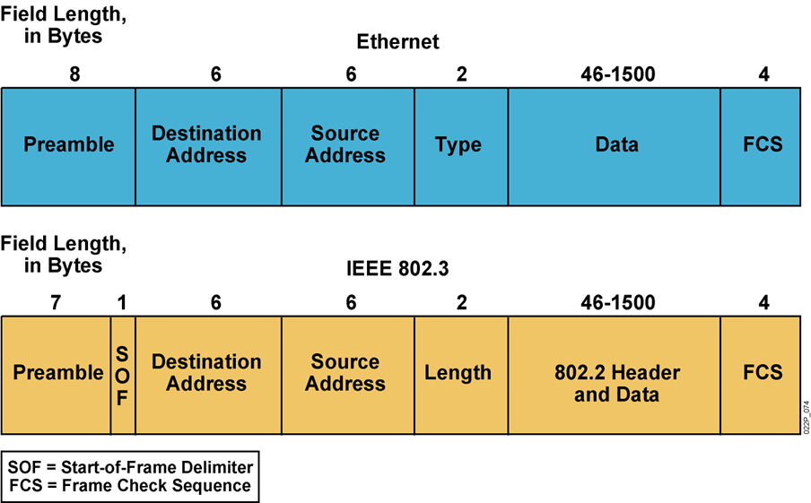
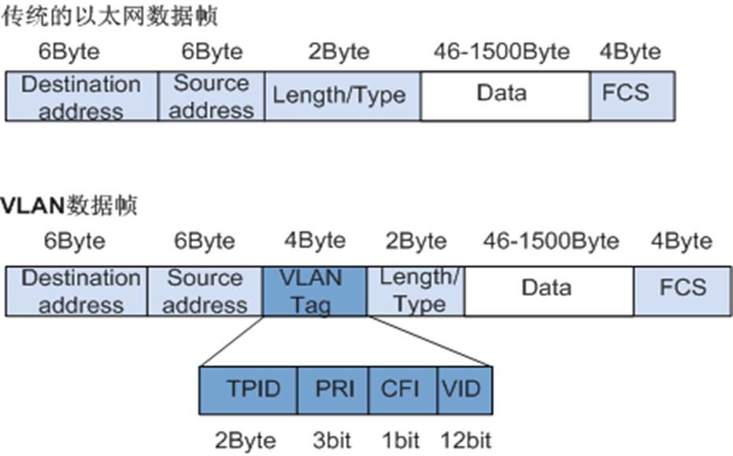
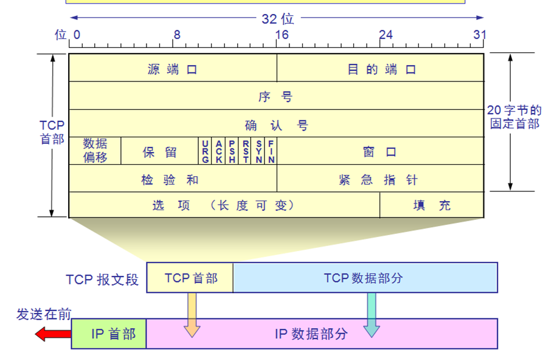
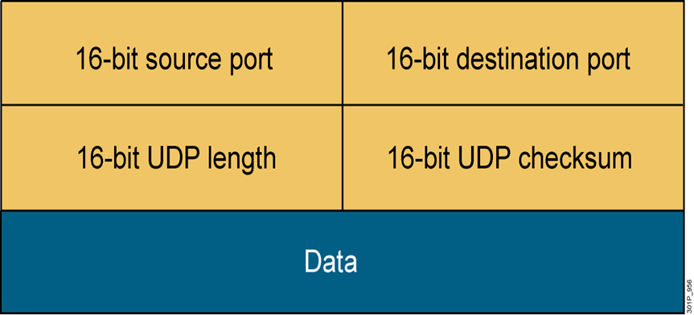
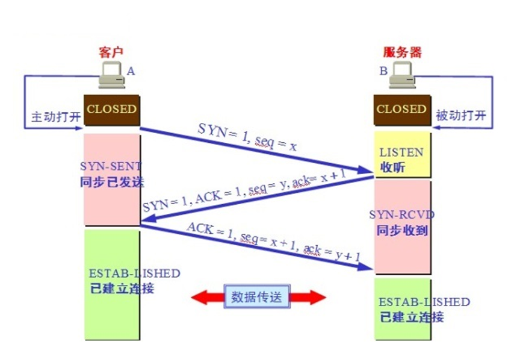
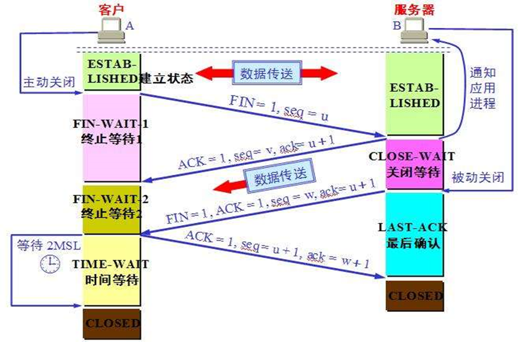
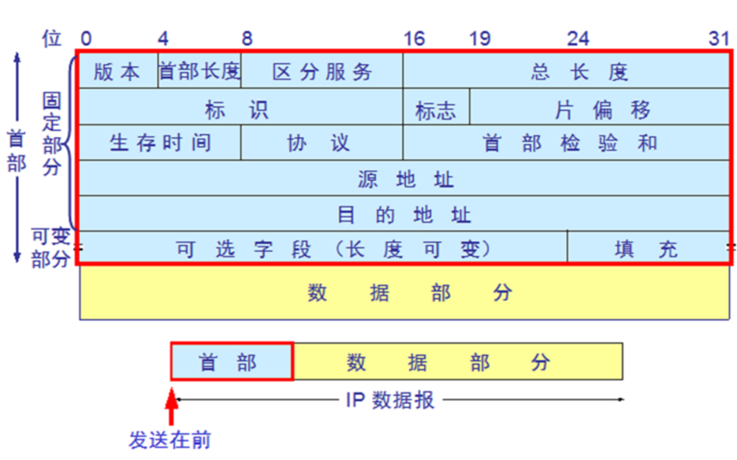
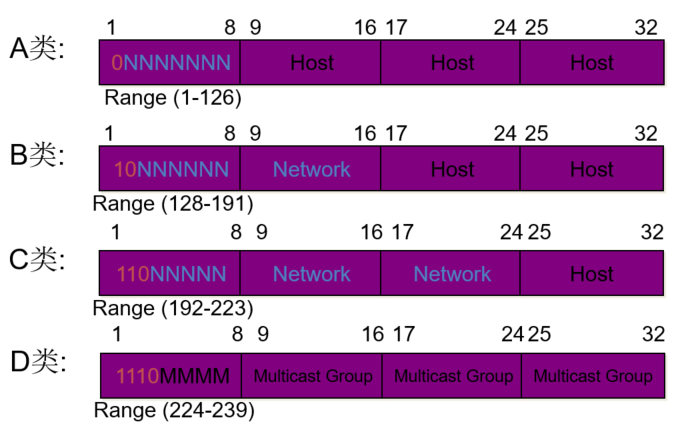
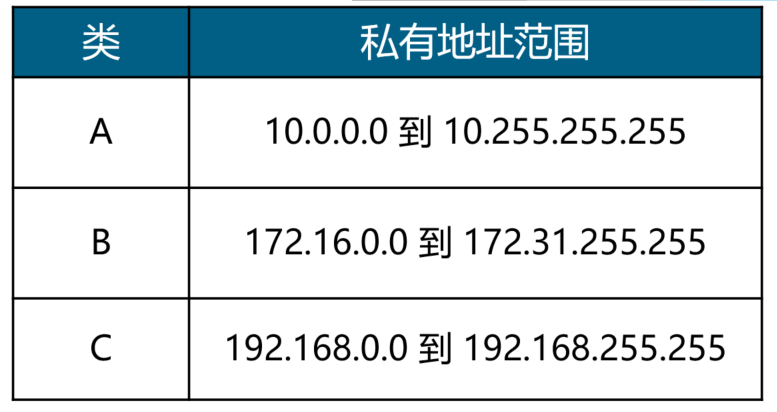

# 网络基础

## 各种网络设备特点

```bash

hub 集线器  
    一层设备  
    所有连接的计算机在一个冲突域中

switch 交换机
    二层设备 每个口是一个冲突域
    能够阻止冲突域，不能够阻止广播域

router 路由器
    三层设备  每个口在一个网段中，一个口在一个广播域中
    能够阻止广播域

计算机网卡  工作在二层， 二层处理之后的数据会交由计算机的更高层处理

VMware 的每个网络段相当于所有计算机连接在一个hub上，所以其中任何一个计算机，都可以拿到网络中所有通信的数据包
    
```

## 以太网的MAC帧序列



## VLan 帧序列 



## TCP包头


```bash
port: 0-65535
0-1023：系统端口或特权端口(仅管理员可用) ，众所周知，永久的分配给固定的系统应用使用，22/tcp(ssh), 80/tcp(http), 443/tcp(https)

1024-49151：用户端口或注册端口，但要求并不严格，分配给程序注册为某应用使用，
1433/tcp(SqlServer), 1521/tcp(oracle),3306/tcp(mysql),11211/tcp/udp (memcached)

49152-65535：动态或私有端口，客户端随机使用端口，范围定
义：/proc/sys/net/ipv4/ip_local_port_range

注意：当前6000，6665-6669/tcp等端口被Google Chrome 设为默认非安全端口，尽量避免使用

#查看非特权用户可以使用的端口
cat /proc/sys/net/ipv4/ip_unprivileged_port_start 
1024


#注意:在容器中默认起始端口为0,即非特权用户也可以使用任何端口


调整客户端的动态端口范围
echo 20000 62000 > /proc/sys/net/ipv4/ip_local_port_range


```

## UDP



## 三次握手




## 四次挥手



```bash
sysctl net.ipv4.tcp_fin_timeout
cat /proc/sys/net/ipv4/tcp_fin_timeout

```

## 内核TCP 参数优化

man 7 tcp

编辑文件 /etc/sysctl.conf 加入以下内容，然后执行 sysctl -p 让参数生效

```bash
net.ipv4.tcp_fin_timeout = 2
net.ipv4.tcp_tw_reuse = 1
net.ipv4.tcp_tw_recycle = 1
net.ipv4.tcp_syncookies = 1
net.ipv4.tcp_keepalive_time = 600
net.ipv4.ip_local_port_range = 2000 65000
net.ipv4.tcp_max_syn_backlog = 16384
net.ipv4.tcp_max_tw_buckets = 36000
net.ipv4.route.gc_timeout = 100
net.ipv4.tcp_syn_retries = 1
net.ipv4.tcp_synack_retries = 1
net.ipv4.tcp_max_orphans = 16384
net.core.somaxconn = 16384
net.core.netdev_max_backlog = 16384

net.ipv4.tcp_fin_timeout 表示套接字由本端要求关闭，这个参数决定了它保持在FIN-WAIT-2状态的时间，默认值是60秒。 该参数对应系统路径为：/proc/sys/net/ipv4/tcp_fin_timeout 60
net.ipv4.tcp_tw_reuse 表示开启重用。允许将TIME-WAIT sockets重新用于新的TCP连接，默认值为0，表示关闭。 该参数对应系统路径为：/proc/sys/net/ipv4/tcp_tw_reuse 0
net.ipv4.tcp_tw_recycle 表示开启TCP连接中TIME-WAIT sockets的快速回收。 该参数对应系统路径为：/proc/sys/net/ipv4/tcp_tw_recycle，默认为0，表示关闭。 提示：reuse和recycle这两个参数是为防止生产环境下服务器time_wait网络状态数量过多设置的。
net.ipv4.tcp_syncookies 表示开启SYN Cookies功能。当出现SYN等待队列溢出时，启用Cookies来处理，可防范少量SYN攻击，这个参数也可以不添加。 该参数对应系统路径为：/proc/sys/net/ipv4/tcp_syncookies,默认值为1
net.ipv4.tcp_keepalive_time 表示当keepalive启用时，TCP发送keepalive消息的频度。默认是2小时，建议改为10分钟。 该参数对应系统路径为：/proc/sys/net/ipv4/tcp_keepalive_time,默认为7200秒。
net.ipv4.ip_local_port_range 该选项用来设定允许系统打开的端口范围，即用于向外连接的端口范围。 该参数对应系统路径为：/proc/sys/net/ipv4/ip_local_port_range 32768 61000
net.ipv4.tcp_max_syn_backlog 表示SYN队列的长度，即半连接队列长度，默认为1024，建议加大队列的长度为8192或更多，这样可以容纳更多等待连接的网络连接数。 该参数为服务器端用于记录那些尚未收到客户端确认信息的连接请求最大值。 该参数对象系统路径为：/proc/sys/net/ipv4/tcp_max_syn_backlog
net.ipv4.tcp_max_tw_buckets 表示系统同时保持TIME_WAIT套接字的最大数量，如果超过这个数值，TIME_WAIT套接字将立刻被清除并打印警告信息。 默认为180000，对于Apache、Nginx等服务器来说可以将其调低一点，如改为5000~30000，不通业务的服务器也可以给大一点，比如LVS、Squid。 此项参数可以控制TIME_WAIT套接字的最大数量，避免Squid服务器被大量的TIME_WAIT套接字拖死。 该参数对应系统路径为：/proc/sys/net/ipv4/tcp_max_tw_buckets
net.ipv4.tcp_synack_retries 参数的值决定了内核放弃连接之前发送SYN+ACK包的数量。 该参数对应系统路径为：/proc/sys/net/ipv4/tcp_synack_retries,默认值为5
net.ipv4.tcp_syn_retries 表示在内核放弃建立连接之前发送SYN包的数量。 该参数对应系统路径为：/proc/sys/net/ipv4/tcp_syn_retries,默认值为6
net.ipv4.tcp_max_orphans 用于设定系统中最多有多少个TCP套接字不被关联到任何一个用户文件句柄上。 如果超过这个数值，孤立连接将被立即被复位并打印出警告信息。 这个限制只有为了防止简单的DoS攻击。不能过分依靠这个限制甚至认为减少这个值，更多的情况是增加这个值。 该参数对应系统路径为：/proc/sys/net/ipv4/tcp_max_orphans ，默认值8192
net.core.somaxconn 同时发起的TCP的最大连接数，即全连接队列长度，在高并发请求中，可能会导致链接超时或重传，一般结合并发请求数来调大此值。 该参数对应系统路径为：/proc/sys/net/core/somaxconn ，默认值是128
net.core.netdev_max_backlog 表示当每个网络接口接收数据包的速率比内核处理这些包的速率快时，允许发送到队列的数据包最大数。 该参数对应系统路径为：/proc/sys/net/core/netdev_max_backlog，默认值为1000

```


## ARP

```bash
arp -n #查看arp 表
#arp -s 10.0.0.6 00:0c:29:32:80:38 #arp 静态绑定

``` 


## IP 报文头


```bash
vim /etc/sysctl.conf

net.ipv6.conf.all.disable_ipv6 = 1
net.ipv6.conf.default.disable_ipv6 = 1

sysctl -p


注意:禁用IPv6可能会影响一些服务的启动,如:ssh,postfix,mysql等
vim /etc/ssh/sshd_config
#AddressFamily any 此行修改为以下行
AddressFamily inet 
重启ssh

vim /etc/postfix/main.cf
#inet_interfaces = localhost 此行修改为以下行
inet_interfaces = 127.0.0.1  
重启postfix

```

## ABCD类ip和私有iP




```bash
0.0.0.0
0.0.0.0不是一个真正意义上的IP地址。它表示所有不清楚的主机和目的网络
255.255.255.255
限制广播地址。对本机来说，这个地址指本网段内(同一广播域)的所有主机
127.0.0.1～127.255.255.254
本机回环地址，主要用于测试。在传输介质上永远不应该出现目的地址为“127.0.0.1”的 数据包
224.0.0.0到239.255.255.255
组播地址，224.0.0.1特指所有主机，224.0.0.2特指所有路由器。224.0.0.5指OSPF 路由器，地址多用于一些特定的程序以及多媒体程序
169.254.x.x
如果Windows主机使用了DHCP自动分配IP地址，而又无法从DHCP服务器获取地址，系统会为主机分配这样地址


一个网段的两个保留地址
|-----32bit---|
网络地址.000000   表示本网络
网络地址.111111  广播地址

```


## CIDR无类域间路由


```
CIDR：无类域间路由，目前的网络已不再按A，B，C类划分网段，可以任意指定网段的范围
CIDR 无类域间路由表示法：IP/网络ID位数，如：172.16.0.100/16


128     64      32      16      8       4       2       1

1       0       0       0       0       0       0       0       128
1       1       0       0       0       0       0       0       192
1       1       1       0       0       0       0       0       224
1       1       1       1       0       0       0       0       240
1       1       1       1       1       0       0       0       248
1       1       1       1       1       1       0       0       252
1       1       1       1       1       1       1       0       254
1       1       1       1       1       1       1       1       255


一个网络的最多主机数=2^主机ID位数 -2
网络段数=2^网络ID中可变的位数
网络ID= ip | netmask


判断对方主机是否在同一个网段
用自已的子网掩码分别和自已的IP及对方的IP相与，比较结果，相同则同一网络，不同则不同网段


 划分子网
划分子网：将一个大的网络（主机数多）划分成多个小的网络（主机数少），主机ID位数变少，网络ID
位数变多，网络ID位向主机ID位借n位,将划分2^n个子网

```

## 常用命令

```bash
探测网卡工作情况:(网卡带宽，网卡的工作模式和网卡是否在启用)
    yum install net-tools

    mii-tool  eth0
    mii-tool -v eth0
    ethtool  eth0
    ethtool -i eth0
    ip -a


nc 工具
yum install nc

nc -l 22  #监听tcp22端口
nc -l 22 -u  #监听udp22端口


nc 10.0.0.3 22 #连接22 端口

ss -ntlup
    -n 数字显示端口
    -t tcp
    -u udp
    -l 显示在监听的端口 
    -p 显示进程

查看端口占用程序
ss -ntlp 
lsof -i :22


判断端口是否打开
< /dev/tcp/127.0.0.1/80
echo $?


```

