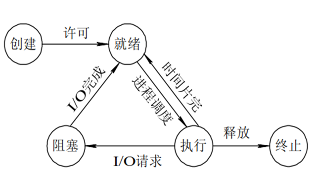
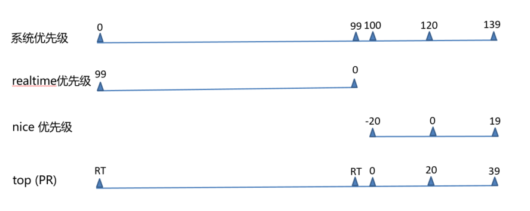
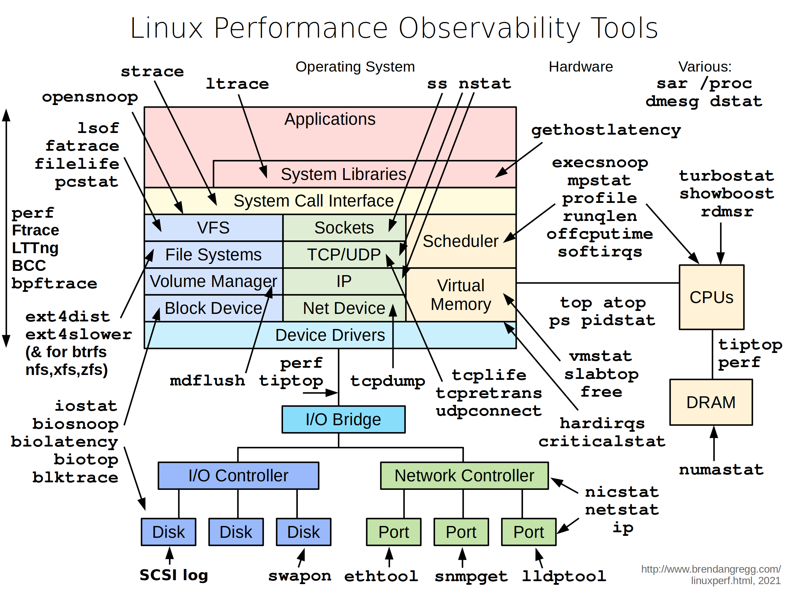

# 进程和计划任务

## 1. 进程相关概念

```bash
进程是资源分配的单位，线程是cpu调度的最小单位
UID，GID，SELINUX语境决定了对文件系统的存取和访问权限
init 是第一个进程，centos7 之后改为systemd
进程都是由父进程创建的，fork() 父子关系，cow，copy on write

```

## 2.内存常见问题

```bash
1. Memory Leak  内存泄漏，指的是分配的内存没有得到回收，即没有使用，也没有得到回收，相当于一直占用
2. Memory Overflow 内存溢出， 往申请的空间里写超过空间大小的数据，比如10M 写10M
3.OOM out of memory 内存不足，把内存用完了，此时，系统会随机挑选进程杀掉，况在java程序中比较常见
Jul 10 10:20:30 kernel: Out of memory: Kill process 9527 (java) score 88 or sacrifice child
当JVM因为没有足够的内存来为对象分配空间并且垃圾回收器也已经没有空间可回收时，就会抛出这个error，因为这个问题已经严重到不足以被应用处理

原因：
    给应用分配内存太少：比如虚拟机本身可使用的内存（一般通过启动时的VM参数指定）太少。
    应用用的太多，并且用完没释放，浪费了。此时就会造成内存泄露或者内存溢出。

使用的解决办法：
    限制java进程的max heap，并且降低java程序的worker数量，从而降低内存使用
    给系统增加swap空间
    设置内核参数（不推荐），不允许内存申请过量：
    /proc/sys/vm/overcommit_memory  #过度提交内容，过度申请内存
    0   这是缺省值，它允许overcommit，但过于明目张胆的overcommit会被拒绝，比如malloc一次性申请的内存大小就超过了系统总内存。它认为不合理就会拒绝overcommit
    1  完全允许
    2  完全禁止

```

## 3.进程状态


## 4.进程更多的状态

* 运行态：running
* 就绪态：ready
* 睡眠态：分为两种，可中断：interruptable，不可中断：uninterruptable
* 停止态：stopped，暂停于内存，但不会被调度，除非手动启动
* 僵死态：zombie，僵尸态，结束进程，父进程结束前，子进程不关闭，杀死父进程可以关闭僵死态的子进程

### 孤儿进程
```bash
如果在子进程在退出前，父进程先退出,这时子进程将成为孤儿进程，因为它的父进程已经死了。孤儿进程会被
PID=1的systemd进程收养，成为systemd的子进程.注意，孤儿进程还会继续运行，而不会随父进程退出而终止，只不过其父进程发生了改变。
```

### ps命令stat字段值
```bash
  D    uninterruptible sleep (usually IO)       #不可中断睡眠
  I    Idle kernel thread                       #空闲的内核进程
  R    running or runnable (on run queue)       #在运行或可运行
  S    interruptible sleep (waiting for an event to complete) #可终端睡眠
  T    stopped by job control signal           #被任务控制信号停止掉了
  t    stopped by debugger during the tracing  # 被debugger停止掉
  Z    defunct ("zombie") process, terminated but not reaped by its parent #僵尸进程

对于BSD格式风格，在这些状态值之上，还会有额外的修饰
 <    high-priority (not nice to other users)
 N    low-priority (nice to other users)
 L    has pages locked into memory (for real-time and custom IO) #有一部分内容被锁定到内存中，不能放到swap中
 s    is a session leader
 l    is multi-threaded (using CLONE_THREAD, like NPTL pthreads do)
 +    is in the foreground process group 


```

## IPC进程间通信
```bash
pipe
socket
Memory-maped file   文件映射,将文件中的一段数据映射到物理内存，多个进程共享这片内存
shm shared memory 共享内存
signal 信号
Lock   对资源上锁，如果资源已被某进程锁住，则其它进程想修改甚至读取这些资源，都将被阻塞，直到锁被打开
semaphore 信号量，一种计数器, 
```
不同主机 socket=ip+端口号

## 进程优先级


```bash
系统优先级：0-139, 数字越小，优先级越高,各有140个运行队列和过期队列
            这是 Linux 系统中所有进程的总优先级范围，包括实时进程和普通进程。数值越小，优先级越高。
实时优先级: 99-0   值最大优先级最高
            这是实时进程的优先级范围。实时进程通常用于需要高响应时间的任务
nice值：-20到19，对应系统优先级100-139或
        这是普通进程的优先级范围
        这是 top 命令中显示的进程优先级。对于实时进程，显示为 RT（Real Time），对于普通进程，优先级数值从 0 到 39（对应系统优先级的 100 到 139）。top 命令中的优先级（PR）是经过转换的值，以便更容易理解和管理。
```

## 进程分类
* 守护进程: daemon,在系统引导过程中启动的进程，和终端无关进程
* 前台进程：跟终端相关，通过终端启动的进程
    * 守护和前台进程可以相互转化
* CPU-Bound：CPU 密集型，非交互
* IO-Bound：IO 密集型，交互

## 进程管理和性能相关工具
[www.brendangregg.com](https://www.brendangregg.com/linuxperf.html)


### pstree
pstree 可以用来显示进程的父子关系，以树形结构显示
```bash
pstree   [OPTION] [ PID | USER ]
-p 显示PID
-T 不显示线程thread,默认显示线程
-u 显示用户切换
-H pid 高亮显示指定进程及其前辈进程
```

#### ps 
ps 即 process state，进程当前状态的快照，默认显示当前终端中的进程，Linux系统各进程的相关信息均保存在/proc/PID目录下的各文件中
```bash
a　选项包括所有终端中的进程
x　选项包括不链接终端的进程
u　选项显示进程所有者的信息
f　选项显示进程树,相当于 --forest
k|--sort 属性 对属性排序,属性前加 - 表示倒序
o　属性… 选项显示定制的信息 pid、cmd、%cpu、%mem
-C cmdlist 指定命令，多个命令用，分隔
-L 显示线程
-e 显示所有进程，相当于-A
-f 显示完整格式程序信息
-F 显示更完整格式的进程信息
-H 以进程层级格式显示进程相关信息
-u userlist 指定有效的用户ID或名称
-U userlist 指定真正的用户ID或名称
-g gid或groupname 指定有效的gid或组名称
-G gid或groupname 指定真正的gid或组名称
-p pid 显示指pid的进程
--ppid pid 显示属于pid的子进程
-t ttylist 指定tty,相当于 t
-M 显示SELinux信息，相当于Z

具体信息 man ps 
查看列  man ps, search standard format
```

### 实现进程和CPU的绑定
```bash
taskset

```

### prtstat
可以显示进程信息,来自于psmisc包
```bash
prtstat [options] PID ...
显示信息来自 /proc/进程ID/satus  文件
```    

### 设置和调整进程优先级
```bash
静态优先级：100-139
进程默认启动时的nice值为0，优先级为120
只有根用户才能降低nice值（提高优先性）

nice [OPTION] [COMMAND [ARG]...]

```

### 搜索进程
```bash
ps 选项　| grep 'pattern' 灵活

pgrep 按预定义的模式
    -u uid: effective user，生效者
    -U uid: real user，真正发起运行命令者
    -t terminal: 与指定终端相关的进程
    -l: 显示进程名
    -a: 显示完整格式的进程名
    -P pid: 显示指定进程的子进程

/sbin/pidof 按确切的程序名称查看pid
```

### uptime 负载查询
```bash
cat  /proc/uptime 包括两个值，单位 s
系统启动时长
空闲进程的总时长（按总的CPU核数计算）

uptime 和 w 显示以下内容
    当前时间
    系统已启动的时间
    当前上线人数
    系统平均负载（1、5、15分钟的平均负载，一般不会超过1，超过5时建议警报）

    系统平均负载: 指在特定时间间隔内运行队列中的平均进程数,通常每个CPU内核的当前活动进程数不大
    于3，那么系统的性能良好。如果每个CPU内核的任务数大于5，那么此主机的性能有严重问题

```

### 显示CPU相关统计 mpstat
来自于sysstat包
```bash
[root@rocky8-3 1007]# mpstat
Linux 4.18.0-348.el8.0.2.x86_64 (rocky8-3) 	05/16/2024 	_x86_64_	(2 CPU)

02:05:22 PM  CPU    %usr   %nice    %sys %iowait    %irq   %soft  %steal  %guest  %gnice   %idle
02:05:22 PM  all    0.05    0.00    0.14    0.02    0.04    0.02    0.00    0.00    0.00   99.73
各列含义：
02:05:22 PM：表示采样时间，显示统计数据的时间点。
CPU：表示 CPU 的标识符。all 表示所有 CPU 的汇总数据。当列出每个 CPU 的数据时，这一列会显示具体的 CPU 编（例如 0、1、2 等）。
%usr：表示在用户态执行的时间百分比（不包括 nice 优先级较低的进程）。即，CPU 用于执行用户空间进程的时间占总时间的百分比。
%nice：表示在用户态并且优先级较低的进程执行的时间百分比。即，CPU 用于执行被 nice 命令降低优先级的用户进程的时间占总时间的百分比。
%sys：表示在内核态执行的时间百分比。即，CPU 用于执行内核代码或内核空间进程的时间占总时间的百分比。
%iowait：表示 CPU 等待 I/O 操作完成的时间百分比。即，CPU 等待磁盘或网络 I/O 操作完成的时间占总时间的百分比。
%irq：表示 CPU 处理硬中断（硬件中断）所花费的时间百分比。即，CPU 用于处理硬件中断的时间占总时间的百分比。
%soft：表示 CPU 处理软中断（软件中断）所花费的时间百分比。即，CPU 用于处理软件中断的时间占总时间的百分比。
%steal：表示虚拟机中被其他虚拟机抢占的时间百分比。即，虚拟 CPU 被 hypervisor 强制暂停执行而等待重新分配时间的百分比。
%guest：表示在虚拟机中运行客户操作系统的时间百分比。即，CPU 用于运行虚拟机的时间占总时间的百分比。
%gnice：表示在用户态并且优先级较低的虚拟机中运行客户操作系统的时间百分比。即，CPU 用于运行优先级较低的虚拟机的时间占总时间的百分比。
%idle：表示空闲时间百分比。即，CPU 处于空闲状态的时间占总时间的百分比。

各个列数值偏高一般原因：
%usr 通常表示系统上有大量的用户进程在运行。这些进程消耗了大量的 CPU 时间，可能是由于计算密集型应用程序（如视频处理、数据分析等）或大量的用户空间任务在运行
%nice 表示系统上有很多被 nice 命令调整为低优先级的进程在运行。可能的原因是系统中有许多低优先级的批处理任务或后台任务在执行
%sys  说明系统在处理大量的内核空间任务。常见原因包括频繁的系统调用、内核模块操作、大量的网络流量处理或驱动程序操作等
%iowait 表示 CPU 大量时间在等待 I/O 操作（如磁盘或网络 I/O）完成。可能的原因是磁盘 I/O 性能瓶颈、存储系统负载过高、网络延迟或网络带宽不足等
%irq 说明系统在处理大量的硬件中断。可能的原因包括高频率的硬件设备中断（如网络适配器、磁盘控制器中断）或硬件故障导致的频繁中断
%soft  如果这个数值偏高，表示系统在处理大量的软中断。常见原因是网络数据包处理、定时器中断处理等大量需要软中断处理的任务

```
