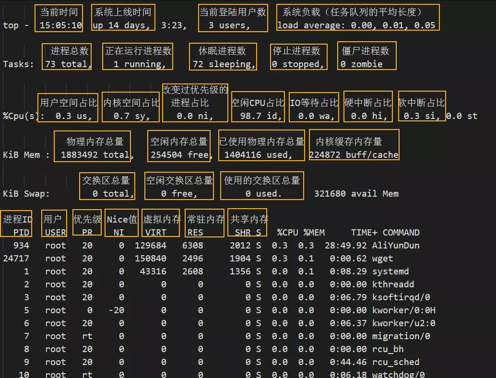
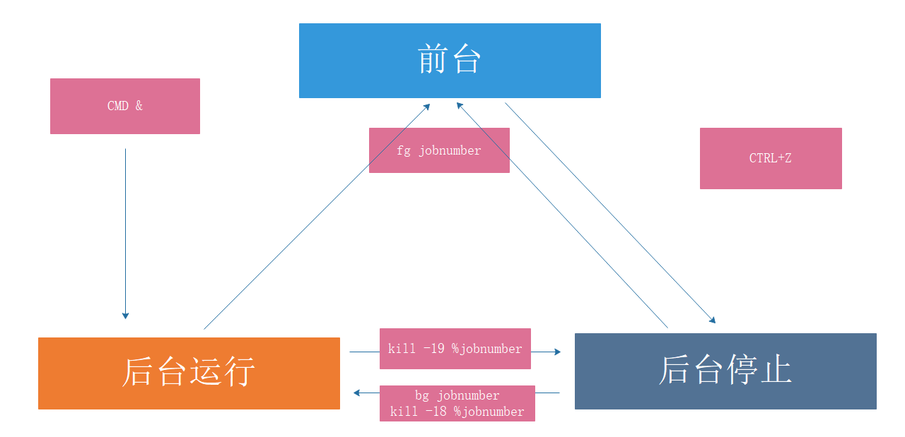

# 进程和计划任务

## 1. 进程相关概念

```bash
进程是资源分配的单位，线程是cpu调度的最小单位
UID，GID，SELINUX语境决定了对文件系统的存取和访问权限
init 是第一个进程，centos7 之后改为systemd
进程都是由父进程创建的，fork() 父子关系，cow，copy on write

```

## 2.内存常见问题

```bash
1. Memory Leak  内存泄漏，指的是分配的内存没有得到回收，即没有使用，也没有得到回收，相当于一直占用
2. Memory Overflow 内存溢出， 往申请的空间里写超过空间大小的数据，比如10M 写10M
3.OOM out of memory 内存不足，把内存用完了，此时，系统会随机挑选进程杀掉，况在java程序中比较常见
Jul 10 10:20:30 kernel: Out of memory: Kill process 9527 (java) score 88 or sacrifice child
当JVM因为没有足够的内存来为对象分配空间并且垃圾回收器也已经没有空间可回收时，就会抛出这个error，因为这个问题已经严重到不足以被应用处理

原因：
    给应用分配内存太少：比如虚拟机本身可使用的内存（一般通过启动时的VM参数指定）太少。
    应用用的太多，并且用完没释放，浪费了。此时就会造成内存泄露或者内存溢出。

使用的解决办法：
    限制java进程的max heap，并且降低java程序的worker数量，从而降低内存使用
    给系统增加swap空间
    设置内核参数（不推荐），不允许内存申请过量：
    /proc/sys/vm/overcommit_memory  #过度提交内容，过度申请内存
    0   这是缺省值，它允许overcommit，但过于明目张胆的overcommit会被拒绝，比如malloc一次性申请的内存大小就超过了系统总内存。它认为不合理就会拒绝overcommit
    1  完全允许
    2  完全禁止

```

## 3.进程状态


## 4.进程更多的状态

* 运行态：running
* 就绪态：ready
* 睡眠态：分为两种，可中断：interruptable，不可中断：uninterruptable
* 停止态：stopped，暂停于内存，但不会被调度，除非手动启动
* 僵死态：zombie，僵尸态，结束进程，父进程结束前，子进程不关闭，杀死父进程可以关闭僵死态的子进程

### 孤儿进程
```bash
如果在子进程在退出前，父进程先退出,这时子进程将成为孤儿进程，因为它的父进程已经死了。孤儿进程会被
PID=1的systemd进程收养，成为systemd的子进程.注意，孤儿进程还会继续运行，而不会随父进程退出而终止，只不过其父进程发生了改变。
```

### ps命令stat字段值
```bash
  D    uninterruptible sleep (usually IO)       #不可中断睡眠
  I    Idle kernel thread                       #空闲的内核进程
  R    running or runnable (on run queue)       #在运行或可运行
  S    interruptible sleep (waiting for an event to complete) #可终端睡眠
  T    stopped by job control signal           #被任务控制信号停止掉了
  t    stopped by debugger during the tracing  # 被debugger停止掉
  Z    defunct ("zombie") process, terminated but not reaped by its parent #僵尸进程

对于BSD格式风格，在这些状态值之上，还会有额外的修饰
 <    high-priority (not nice to other users)
 N    low-priority (nice to other users)
 L    has pages locked into memory (for real-time and custom IO) #有一部分内容被锁定到内存中，不能放到swap中
 s    is a session leader
 l    is multi-threaded (using CLONE_THREAD, like NPTL pthreads do)
 +    is in the foreground process group 


```

## IPC进程间通信
```bash
pipe
socket
Memory-maped file   文件映射,将文件中的一段数据映射到物理内存，多个进程共享这片内存
shm shared memory 共享内存
signal 信号
Lock   对资源上锁，如果资源已被某进程锁住，则其它进程想修改甚至读取这些资源，都将被阻塞，直到锁被打开
semaphore 信号量，一种计数器, 
```
不同主机 socket=ip+端口号

## 进程优先级


```bash
系统优先级：0-139, 数字越小，优先级越高,各有140个运行队列和过期队列
            这是 Linux 系统中所有进程的总优先级范围，包括实时进程和普通进程。数值越小，优先级越高。
实时优先级: 99-0   值最大优先级最高
            这是实时进程的优先级范围。实时进程通常用于需要高响应时间的任务
nice值：-20到19，对应系统优先级100-139或
        这是普通进程的优先级范围
        这是 top 命令中显示的进程优先级。对于实时进程，显示为 RT（Real Time），对于普通进程，优先级数值从 0 到 39（对应系统优先级的 100 到 139）。top 命令中的优先级（PR）是经过转换的值，以便更容易理解和管理。
```

## 进程分类
* 守护进程: daemon,在系统引导过程中启动的进程，和终端无关进程
* 前台进程：跟终端相关，通过终端启动的进程
    * 守护和前台进程可以相互转化
* CPU-Bound：CPU 密集型，非交互
* IO-Bound：IO 密集型，交互

## 进程管理和性能相关工具
[www.brendangregg.com](https://www.brendangregg.com/linuxperf.html)


### pstree
pstree 可以用来显示进程的父子关系，以树形结构显示
```bash
pstree   [OPTION] [ PID | USER ]
-p 显示PID
-T 不显示线程thread,默认显示线程
-u 显示用户切换
-H pid 高亮显示指定进程及其前辈进程
```

#### ps 
ps 即 process state，进程当前状态的快照，默认显示当前终端中的进程，Linux系统各进程的相关信息均保存在/proc/PID目录下的各文件中
```bash
a　选项包括所有终端中的进程
x　选项包括不链接终端的进程
u　选项显示进程所有者的信息
f　选项显示进程树,相当于 --forest
k|--sort 属性 对属性排序,属性前加 - 表示倒序
o　属性… 选项显示定制的信息 pid、cmd、%cpu、%mem
-C cmdlist 指定命令，多个命令用，分隔
-L 显示线程
-e 显示所有进程，相当于-A
-f 显示完整格式程序信息
-F 显示更完整格式的进程信息
-H 以进程层级格式显示进程相关信息
-u userlist 指定有效的用户ID或名称
-U userlist 指定真正的用户ID或名称
-g gid或groupname 指定有效的gid或组名称
-G gid或groupname 指定真正的gid或组名称
-p pid 显示指pid的进程
--ppid pid 显示属于pid的子进程
-t ttylist 指定tty,相当于 t
-M 显示SELinux信息，相当于Z

具体信息 man ps 
查看列  man ps, search standard format
```

### 实现进程和CPU的绑定
```bash
taskset

```

### prtstat
可以显示进程信息,来自于psmisc包
```bash
prtstat [options] PID ...
显示信息来自 /proc/进程ID/satus  文件
```    

### 设置和调整进程优先级
```bash
静态优先级：100-139
进程默认启动时的nice值为0，优先级为120
只有根用户才能降低nice值（提高优先性）

nice [OPTION] [COMMAND [ARG]...]

```

### 搜索进程
```bash
ps 选项　| grep 'pattern' 灵活

pgrep 按预定义的模式
    -u uid: effective user，生效者
    -U uid: real user，真正发起运行命令者
    -t terminal: 与指定终端相关的进程
    -l: 显示进程名
    -a: 显示完整格式的进程名
    -P pid: 显示指定进程的子进程

/sbin/pidof 按确切的程序名称查看pid
```

### uptime 负载查询
```bash
cat  /proc/uptime 包括两个值，单位 s
系统启动时长
空闲进程的总时长（按总的CPU核数计算）

uptime 和 w 显示以下内容
    当前时间
    系统已启动的时间
    当前上线人数
    系统平均负载（1、5、15分钟的平均负载，一般不会超过1，超过5时建议警报）

    系统平均负载: 指在特定时间间隔内运行队列中的平均进程数,通常每个CPU内核的当前活动进程数不大
    于3，那么系统的性能良好。如果每个CPU内核的任务数大于5，那么此主机的性能有严重问题

```

### 显示CPU相关统计 mpstat
来自于sysstat包
```bash
[root@rocky8-3 1007]# mpstat
Linux 4.18.0-348.el8.0.2.x86_64 (rocky8-3) 	05/16/2024 	_x86_64_	(2 CPU)

02:05:22 PM  CPU    %usr   %nice    %sys %iowait    %irq   %soft  %steal  %guest  %gnice   %idle
02:05:22 PM  all    0.05    0.00    0.14    0.02    0.04    0.02    0.00    0.00    0.00   99.73
各列含义：
02:05:22 PM：表示采样时间，显示统计数据的时间点。
CPU：表示 CPU 的标识符。all 表示所有 CPU 的汇总数据。当列出每个 CPU 的数据时，这一列会显示具体的 CPU 编（例如 0、1、2 等）。
%usr：表示在用户态执行的时间百分比（不包括 nice 优先级较低的进程）。即，CPU 用于执行用户空间进程的时间占总时间的百分比。
%nice：表示在用户态并且优先级较低的进程执行的时间百分比。即，CPU 用于执行被 nice 命令降低优先级的用户进程的时间占总时间的百分比。
%sys：表示在内核态执行的时间百分比。即，CPU 用于执行内核代码或内核空间进程的时间占总时间的百分比。
%iowait：表示 CPU 等待 I/O 操作完成的时间百分比。即，CPU 等待磁盘或网络 I/O 操作完成的时间占总时间的百分比。
%irq：表示 CPU 处理硬中断（硬件中断）所花费的时间百分比。即，CPU 用于处理硬件中断的时间占总时间的百分比。
%soft：表示 CPU 处理软中断（软件中断）所花费的时间百分比。即，CPU 用于处理软件中断的时间占总时间的百分比。
%steal：表示虚拟机中被其他虚拟机抢占的时间百分比。即，虚拟 CPU 被 hypervisor 强制暂停执行而等待重新分配时间的百分比。
%guest：表示在虚拟机中运行客户操作系统的时间百分比。即，CPU 用于运行虚拟机的时间占总时间的百分比。
%gnice：表示在用户态并且优先级较低的虚拟机中运行客户操作系统的时间百分比。即，CPU 用于运行优先级较低的虚拟机的时间占总时间的百分比。
%idle：表示空闲时间百分比。即，CPU 处于空闲状态的时间占总时间的百分比。

各个列数值偏高一般原因：
%usr 通常表示系统上有大量的用户进程在运行。这些进程消耗了大量的 CPU 时间，可能是由于计算密集型应用程序（如视频处理、数据分析等）或大量的用户空间任务在运行
%nice 表示系统上有很多被 nice 命令调整为低优先级的进程在运行。可能的原因是系统中有许多低优先级的批处理任务或后台任务在执行
%sys  说明系统在处理大量的内核空间任务。常见原因包括频繁的系统调用、内核模块操作、大量的网络流量处理或驱动程序操作等
%iowait 表示 CPU 大量时间在等待 I/O 操作（如磁盘或网络 I/O）完成。可能的原因是磁盘 I/O 性能瓶颈、存储系统负载过高、网络延迟或网络带宽不足等
%irq 说明系统在处理大量的硬件中断。可能的原因包括高频率的硬件设备中断（如网络适配器、磁盘控制器中断）或硬件故障导致的频繁中断
%soft  如果这个数值偏高，表示系统在处理大量的软中断。常见原因是网络数据包处理、定时器中断处理等大量需要软中断处理的任务

```

### top 和htop
#### top


```bash
top 提供动态的实时进程状态
帮助：h 或 ？ ，按 q 或esc 退出帮助
排序：
P：以占据的CPU百分比,%CPU
M：占据内存百分比,%MEM
T：累积占据CPU时长,TIME+
首部信息显示：
uptime信息：l命令
tasks及cpu信息：t命令
cpu分别显示：1 (数字)
memory信息：m命令
退出命令：q
修改刷新时间间隔：s
终止指定进程：k
保存文件：W  #注意大小写

```

htop 命令是增强版的TOP命令，来自EPEL源，比top功能更强

###  内存空间 free

### 进程对应的内存映射 pmap

### 虚拟内存信息 vmstat

###  统计CPU和设备IO信息 iostat
```bash
常用选项:
-c 只显示CPU行
-d 显示设备〈磁盘)使用状态
-k 以千字节为为单位显示输出
-t 在输出中包括时间戳
-x 在输出中包括扩展的磁盘指标


tps：该设备每秒的传输次数（Indicate the number of transfers per second that were 
issued to the device.）。"一次传输"意思是"一次I/O请求"。多个逻辑请求可能会被合并为"一次I/O
请求"。"一次传输"请求的大小是未知的。

kB_read/s：每秒从设备（drive expressed）读取的数据量；
kB_wrtn/s：每秒向设备（drive expressed）写入的数据量；
kB_read：读取的总数据量；
kB_wrtn：写入的总数量数据量；这些单位都为Kilobytes。

-x
#输出说明
r/s: 每秒合并后读的请求数
w/s: 每秒合并后写的请求数
rsec/s：每秒读取的扇区数；
wsec/：每秒写入的扇区数。
rKB/s：The number of read requests that were issued to the device per second；
wKB/s：The number of write requests that were issued to the device per second；
rrqm/s：每秒这个设备相关的读取请求有多少被Merge了（当系统调用需要读取数据的时候，VFS将请求发到
各个FS，如果FS发现不同的读取请求读取的是相同Block的数据，FS会将这个请求合并Merge）；
wrqm/s：每秒这个设备相关的写入请求有多少被Merge了。
%rrqm: The percentage of read requests merged together before being sent to the 
device.
%wrqm: The percentage of write requests merged together before being sent to the 
device.
avgrq-sz 平均请求扇区的大小
avgqu-sz 是平均请求队列的长度。毫无疑问，队列长度越短越好。
await： 每一个IO请求的处理的平均时间（单位是微秒毫秒）。这里可以理解为IO的响应时间，一般地系统
IO响应时间应该低于5ms，如果大于10ms就比较大了。这个时间包括了队列时间和服务时间，也就是说，一般
情况下，await大于svctm，它们的差值越小，则说明队列时间越短，反之差值越大，队列时间越长，说明系
统出了问题。
svctm   表示平均每次设备I/O操作的服务时间（以毫秒为单位）。如果svctm的值与await很接近，表示
几乎没有I/O等待，磁盘性能很好，如果await的值远高于svctm的值，则表示I/O队列等待太长，系统上运行
的应用程序将变慢。
%util： 在统计时间内所有处理IO时间，除以总共统计时间。例如，如果统计间隔1秒，该设备有0.8秒在处
理IO，而0.2秒闲置，那么该设备的%util = 0.8/1 = 80%，所以该参数暗示了设备的繁忙程度。一般地，
如果该参数是100%表示设备已经接近满负荷运行了（当然如果是多磁盘，即使%util是100%，因为磁盘的并
发能力，所以磁盘使用未必就到了瓶颈）。
    
```

###  监视磁盘I/O iotop
```bash
第一行：Read和Write速率总计
第二行：实际的Read和Write速率
第三行：参数如下：
    线程ID（按p切换为进程ID）
    优先级
    用户
    磁盘读速率
    磁盘写速率
    swap交换百分比
    IO等待所占的百分比

```
### 显示网络带宽使用情况 iftop

### 查看网络实时吞吐量 nload
```bash
上下方向键、左右方向键、enter键或者tab键都就可以切换查看多个网卡的流量情况
按 F2 显示选项窗口
按 q 或者 Ctrl+C 退出 nload
```

### 查看进程网络带宽的使用情况 nethogs
NetHogs是一个开源的命令行工具（类似于Linux的top命令），用来按进程或程序实时统计网络带宽使用率。
github网站: https://github.com/raboof/nethogs/


###  网络监视工具iptraf-ng
来自于iptraf-ng包,可以进网络进行监控,对终端窗口大小有要求.

### 系统资源统计 dstat
dstat由pcp-system-tools包提供，但安装dstat包即可, 可用于代替 vmstat,iostat功能


###  综合监控工具 glances

```bash
内建命令：
a Sort processes automatically     l Show/hide logs
c Sort processes by CPU%           b Bytes or bits for network I/O
m Sort processes by MEM%         w Delete warning logs
p Sort processes by name           x Delete warning and critical logs
i Sort processes by I/O rate       1 Global CPU or per-CPU stats
d Show/hide disk I/O stats         h Show/hide this help screen
f Show/hide file system stats     t View network I/O as combination
n Show/hide network stats         u View cumulative network I/O
s Show/hide sensors stats         q Quit (Esc and Ctrl-C also work)
y Show/hide hddtemp stats

常用选项：

-b: 以Byte为单位显示网卡数据速率
-d: 关闭磁盘I/O模块
-f /path/to/somefile: 设定输入文件位置
-o {HTML|CSV}：输出格式
-m: 禁用mount模块
-n: 禁用网络模块
-t #: 延迟时间间隔
-1：每个CPU的相关数据单独显示

C/S模式下运行glances命令
服务器模式：
glances -s -B IPADDR
IPADDR: 指明监听的本机哪个地址,端口默认为61209/tcp

客户端模式：
glances -c IPADDR
IPADDR：要连入的服务器端地址


注意: 不同版本不兼容


```

### 查看进程打开文件 lsof
```bash
lsof：list open files，查看当前系统文件的工具。在linux环境下，一切皆文件，用户通过文件不仅可以
访问常规数据，还可以访问网络连接和硬件如传输控制协议 (TCP) 和用户数据报协议 (UDP)套接字等，
系统在后台都为该应用程序分配了一个文件描述符
-a：列出打开文件存在的进程
-c<进程名>：列出指定进程所打开的文件
-g：列出GID号进程详情
-d<文件号>：列出占用该文件号的进程
+d<目录>：列出目录下被打开的文件
+D<目录>：递归列出目录下被打开的文件
-n<目录>：列出使用NFS的文件
-i<条件>：列出符合条件的进程(4、6、协议、:端口、 @ip )
-p<进程号>：列出指定进程号所打开的文件
-u：列出UID号进程详情
-h：显示帮助信息
-v：显示版本信息。
-n: 不反向解析网络名字

#lsof 列出当前所有打开的文件
lsof

#查看当前哪个进程正在使用此文件
lsof /var/log/messages

#查看由登陆用户启动而非系统启动的进程
lsof /dev/pts/1
lsof `tty`

#指定进程号，可以查看该进程打开的文件
lsof -p 9527

#查看指定程序打开的文件
lsof -c httpd

```

### CentOS 8 新特性 cockpit
```bash
由cockpit包提供,当前Ubuntu和CentOS7也支持此工具
Cockpit 是CentOS 8 取入的新特性，是一个基于 Web 界面的应用，它提供了对系统的图形化管理
    监控系统活动（CPU、内存、磁盘 IO 和网络流量）
    查看系统日志条目
    查看磁盘分区的容量
    查看网络活动（发送和接收）
    查看用户帐户
    检查系统服务的状态
    提取已安装应用的信息
    查看和安装可用更新（如果以 root 身份登录）并在需要时重新启动系统
    打开并使用终端窗口

    yum install cockpit
    systemctl enable --now cockpit.socket

```

## 信号发送 kill

```bash
kill：内部命令，可用来向进程发送控制信号，以实现对进程管理,每个信号对应一个数字，信号名称以SIG开头（可省略），不区分大小写
显示当前系统可用信号：
kill -l
trap -l
man 7 signal

常用信号
0) 用于健康性检查
1) SIGHUP 无须关闭进程而让其重读配置文件
2) SIGINT 中止正在运行的进程；相当于Ctrl+c
3) SIGQUIT 相当于ctrl+\
9) SIGKILL 强制杀死正在运行的进程,可能会导致数据丢失,慎用!
15) SIGTERM 终止正在运行的进程，默认信号
18) SIGCONT 继续运行
19) SIGSTOP 后台休眠

指定信号的方法 : 
信号的数字标识：1, 2, 9
信号完整名称：SIGHUP，sighup
信号的简写名称：HUP，hup

kill  -1   pid …
kill  -n 9 pid
kill  -s SIGINT pid


按名称：killall 来自于psmisc包

killall [-SIGNAL] comm

按模式：
pkill [options] pattern

-SIGNAL
-u uid: effective user，生效者
-U uid: real user，真正发起运行命令者
-t terminal: 与指定终端相关的进程
-l: 显示进程名（pgrep可用）
-a: 显示完整格式的进程名（pgrep可用）
-P pid: 显示指定进程的子进程


```


## 作业控制
```bash
Linux的作业控制
    前台作业：通过终端启动，且启动后一直占据终端
    后台作业：可通过终端启动，但启动后即转入后台运行（释放终端）


让作业运行于后台
运行中的作业： Ctrl+z #放到后台挂起，stop
尚未启动的作业： COMMAND & #放到后台，依然运行

后台作业虽然被送往后台运行，但其依然与终端相关；退出终端，将关闭后台作业。如果希望送往后台后，剥离与终端的关系

查看当前终端所有作业：
jobs

作业控制：
fg [[%]JOB_NUM]：把指定的后台作业调回前台
bg [[%]JOB_NUM]：让送往后台的作业在后台继续运行
kill [%JOB_NUM]： 终止指定的作业,作业跟终端相关，通过作业号，只能找到当前终端的作业

并发运行
利用后台执行，实现并发功能，即同时运行多个进程，提高效率
方法1
    cat all.sh
    f1.sh&
    f2.sh&
    f3.sh&

方法2
    (f1.sh&);(f2.sh&);(f3.sh&)

方法3
    f1.sh&f2.sh&f3.sh& 

多组命令实现并发
    {cmd;cmd;}&

在脚本中，如果想等待所有的后台任务完成之后，退出脚本
可以使用命令
wait
```



##  任务计划


### at指定时间点，执行一次性任务
```bash
at 工具
由包 at 提供
依赖与atd服务,需要启动才能实现at任务
at队列存放在/var/spool/at目录中,ubuntu存放在/var/spool/cron/atjobs目录下
执行任务时PATH变量的值和当前定义任务的用户身份一致

at [option] TIME
-V 显示版本信息
-t time   时间格式 [[CC]YY]MMDDhhmm[.ss] 
-l 列出指定队列中等待运行的作业；相当于atq
-d N 删除指定的N号作业；相当于atrm
-c N 查看具体作业N号任务
-f file 指定的文件中读取任务
-m 

注意：
作业执行命令的结果中的标准输出和错误以执行任务的用户身份发邮件通知给 root 
默认CentOS 8 最小化安装没有安装邮件服务,需要自行安装

at的时间格式
02:00 
02:00 2016-09-20 
06pm March 17
17:20 tomorrow
now + 5 min 
02pm + 3 day

at 任务执行方式：
交互式
输入重定向
at -f file

/etc/at.{allow,deny} 控制用户是否能执行at任务

白名单：/etc/at.allow 默认不存在，只有该文件中的用户才能执行at命令
黑名单：/etc/at.deny 默认存在，拒绝该文件中用户执行at命令，而没有在at.deny 文件中的使用者则可执行
如果两个文件都不存在，只有 root 可以执行 at 命令
```

### cron 周期性运行某任务
```bash
周期性任务计划cron相关的程序包：
cronie：主程序包，提供crond守护进程及相关辅助工具
crontabs：包含CentOS提供系统维护任务
cronie-anacron：cronie的补充程序，用于监控cronie任务执行状况，如:cronie中的任务在过去该运行的时间点未能正常运行，则anacron会随后启动一次此任务

cron 依赖于crond服务，确保crond守护处于运行状态：    


cron任务分为
系统cron任务：系统维护作业，/etc/crontab 主配置文件， /etc/cron.d/ 子配置文件, 直接就可以用vim编辑，符合cron语法就行
用户cron任务：红帽系统保存在 /var/spool/cron/USERNAME,Ubuntu 系统存放在/var/spool/cron/crontabs/USERNAME，利用 crontab 命令管理

计划任务日志：/var/log/cron


计划任务时间表示法：
(1) 特定值
 给定时间点有效取值范围内的值
(2) *
 给定时间点上有效取值范围内的所有值,表示“每...”,放在星期的位置表示不确定
(3) 离散取值
 #,#,#
(4) 连续取值
 #-#
(5) 在指定时间范围上，定义步长
 /#: #即为步长
 
(6) 特定关健字
@yearly 0 0 1 1 *
@annually 0 0 1 1 *
@monthly 0 0 1 * *
@weekly 0 0 * * 0
@daily 0 0 * * *
@hourly 0 * * * *
@reboot Run once after reboot

每个月日期和星期几字段的关系， 同时指定，是或者的关系


crond任务相关文件:
/etc/crontab 配置文件
/etc/cron.d/ 配置文件
/etc/cron.hourly/ 脚本
/etc/cron.daily/ 脚本
/etc/cron.weekly/ 脚本
/etc/cron.monthly/ 脚本


crontab命令: 
    * 每个用户都有专用的cron任务文件：/var/spool/cron/USERNAME
    * 默认标准输出和错误会被发邮件给对应的用户,如：wang创建的任务就发送至wang的邮箱
    * root能够修改其它用户的作业
    * 用户的cron 中默认 PATH=/usr/bin:/bin,如果使用其它路径,在任务文件的第一行加PATH=/path或者加入到计划任务执行的脚本中
    * 第六个字段指定要运行的命令。 该行的整个命令部分，直至换行符或“％”字符，指定的shell执行. 除非使用反斜杠（\）进行转义，否则该命令中的“％”字符将变为换行符，并且第一个％之后的所有数据将作为标准输入发送到该命令。

-l 列出所有任务
-e 编辑任务
-r 移除所有任务
-i 同-r一同使用，以交互式模式移除指定任务
-u user 指定用户管理cron任务,仅root可运行

控制用户执行计划任务：
/etc/cron.{allow,deny}


修改默认的cron的文本编辑工具

```
