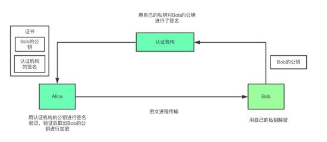
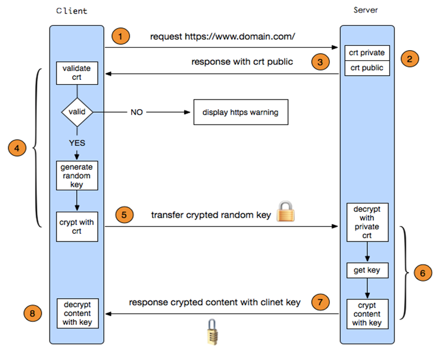
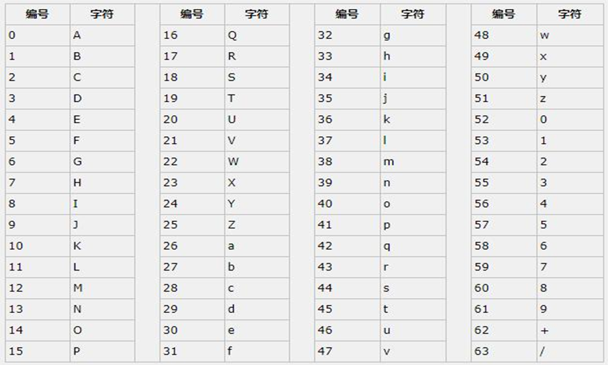

# 加密和安全

## 常见的安全攻击STRIDE
* Spoofing 假冒，钓鱼网站
* Tampering 篡改
* Repudiation 否认
* Information Disclosure 信息泄漏
* Denial of Service 拒绝服务
* Elevation of Privilege 提升权限

## 安全设计基本原则
* 使用成熟的安全系统
* 以小人之心度输入数据
* 外部系统是不安全的
* 最小授权
* 减少外部接口
* 缺省使用安全模式
* 安全不是似是而非
* 从STRIDE思考
* 在入口处检查
* 从管理上保护好你的系统

## 常用的安全技术
* 认证
* 授权
* 审计
* 安全通信


## 加密算法和协议

### 对称加密
加密和解密使用同一个密钥
```bash
特征
    加密、解密使用同一个密钥，效率高
    将原始数据分割成固定大小的块，逐个进行加密

缺陷：
    密钥过多            每一个需要加密的文件都需要重新创建一个密钥
    密钥分发            如何把密钥安全传递给其他人
    数据来源无法确认    如何确保这个加密文件的来源

常见的对称加密算法
    DES：Data Encryption Standard，56bits
    3DES：
    AES：Advanced (128, 192, 256bits)
    Blowfish，Twofish
    IDEA，RC6，CAST5
```

### 非对称加密

```bash
非对称加密：密钥是成对出现
    公钥：public key，公开给所有人，主要给别人加密使用
    私钥：secret key，private key 自己留存，必须保证其私密性，用于自已加密签名
    特点：用公钥加密数据，只能使用与之配对的私钥解密；反之亦然

功能：

    数据加密：适合加密较小数据,比如: 加密对称密钥
    数字签名：主要在于让接收方确认发送方身份

缺点：
    密钥长,算法复杂
    加密解密效率低下

常见算法：
    RSA：由 RSA 公司发明，是一个支持变长密钥的公共密钥算法，需要加密的文件块的长度也是可变的,可实现加密和数字签名
    DSA（Digital Signature Algorithm）：数字签名算法，是一种标准的 DSS（数字签名标准）
    ECC（Elliptic Curves Cryptography）：椭圆曲线密码编码学，比RSA加密算法使用更小的密钥，提供相当的或更高等级的安全

```

### 单向hash哈希

```bash
哈希算法：也称为散列算法，将任意数据缩小成固定大小的“指纹”，称为digest，即摘要

特性：
    任意长度输入，固定长度输出
    若修改数据，指纹也会改变，且有雪崩效应，数据的一点微小改变，生成的指纹值变化非大
    无法从指纹中重新生成数据，即不要逆，具有单向性

功能：用于验证数据完整性

常见算法
    md5: 128bits、sha1: 160bits、sha224 、sha256、sha384、sha512


常用工具
    md5sum | sha1sum [ --check ] file
    openssl、gpg
    rpm -V

```


## CA和证书


```bash
PKI：Public Key Infrastructure 公共密钥加密体系
签证机构：CA（Certificate Authority）
注册机构：RA
证书吊销列表：CRL
证书存取库：
X.509：定义了证书的结构以及认证协议标准
    版本号
    序列号
    签名算法
    颁发者
    有效期限
    主体名称

证书类型：
    证书授权机构的证书
    服务器证书
    用户证书

获取证书两种方法：
    自签名的证书： 自已签发自己的公钥
    使用证书授权机构：
            生成证书请求（csr）
            将证书请求csr发送给CA
            CA签名颁发证书
```

## 安全协议SSL/TLS

```bash
SSL：Secure Socket Layer，TLS: Transport Layer Security
SSL 最初是由网景公司设计和开发的，后来IETF组织将其进行标准化，命名为TLS

功能
    机密性
    认证
    完整性
    重放保护
```

## https工作的简化过程



```bash
1. 客户端发起HTTPS请求,用户在浏览器里输入一个https网址，然后连接到服务器的443端口
2. 服务端的配置采用HTTPS协议的服务器必须要有一套数字证书，可以自己制作，也可以向组织申请。区别就是自己颁发的证书需要客户端验证通过，才可以继续访问，而使用受信任的公司申请的证书则不会弹出提示页面。这套证书其实就是一对公钥和私钥
3. 传送服务器的证书给客户端证书里其实就是公钥，并且还包含了很多信息，如证书的颁发机构，过期时间等等
4. 客户端解析验证服务器证书这部分工作是由客户端的TLS来完成的，首先会验证公钥是否有效，比如：颁发机构，过期时间等等，如果发现异常，则会弹出一个警告框，提示证书存在问题。如果证书没有问题，那么就生成一个随机值。然后用证书中公钥对该随机值进行非对称加密
5. 客户端将加密信息传送服务器这部分传送的是用证书加密后的随机值，目的就是让服务端得到这个随机值，以后客户端和服务端的通信就可以通过这个随机值来进行加密解密了
6. 服务端解密信息服务端将客户端发送过来的加密信息用服务器私钥解密后，得到了客户端传过来的随机值
7. 服务器加密信息并发送信息服务器将数据利用随机值进行对称加密,再发送给客户端
8. 客户端接收并解密信息客户端用之前生成的随机值解密服务段传过来的数据，于是获取了解密后的内容
```

## base64
Base64是网络上最常见的用于传输 8Bit 字节码的编码方式之一，Base64就是一种基于64个可打印字符来表示二进制数据的方法

```bash
base64的编码过程如下：

将每3个字节放入一个24位的缓冲区中，最后不足3个字节的，缓冲区的剩余部分用0来填补。然后每次
取出6位（2的6次方为64，使用64个字符即可表示所有），将高2位用0来填充，组成一个新的字节，计
算出这个新字节的十进制值，对应上面的编码表，输出相应的字符。这样不断地进行下去，就可完成对
所有数据的编码工作。

命令：
base64 编码

echo -n "this is a test" | base64
dGhpcyBpcyBhIHRlc3Q=

base64 解码
echo -n "dGhpcyBpcyBhIHRlc3Q=" | base64 -d

例如常见的sha512密码散列，rsa私钥，等最后结果显示是base64编码之后的结果
```

## openssl
官网：https://www.openssl.org/

```bash
一套开源的加密工具包

libcrypto：用于实现加密和解密的库
libssl：用于实现ssl通信协议的安全库
openssl：多用途命令行工具


两种运行模式：
    交互模式
        openssl
            Openssl> version
    批处理模式
        openssl version

三种子命令：
    标准命令
    消息摘要命令
    加密命令


openssl命令单向哈希加密
    openssl md5  /PATH/SOMEFILE
    openssl md5 ./test.txt
    md5sum ./test.txt
    openssl sha512 ./test.txt
    sha512sum ./test.txt

 openssl 命令生成用户密码
    openssl passwd --help
        -in infile          Read passwords from file
        -noverify           Never verify when reading password from terminal
        -quiet              No warnings
        -salt val           Use provided salt
        -stdin              Read passwords from stdin
        -6                  SHA512-based password algorithm
        -5                  SHA256-based password algorithm
        -1                  MD5-based password algorithm
    openssl passwd -6  #生成密码的sha512哈希值


openssl命令实现 PKI
    生成私钥 
    openssl genrsa -out /PATH/TO/PRIVATEKEY.FILE [-aes128] [-aes192] [-aes256] [-des3] [NUM_BITS,默认2048]
    
    注意：[-aes128] [-aes192] [-aes256] [-des3]  这些选项使用，会对生成的密钥加密，使用对称密钥加密
        解密加密的私钥
        openssl rsa -in /PATH/TO/PRIVATEKEY.FILE -out /PATH/TO/PRIVATEKEY2.FILE

    生成私钥，同时设置最小权限
    (umask 777; openssl genrsa -out /data/app1.key 2048)

    从私钥中提取出公钥
    openssl rsa -in PRIVATEKEYFILE -pubout -out PUBLICKEYFILE


```

## 修改密码在centos和ubuntu通用，非交互式
```bash
echo "root:123456" | chpasswd
```

## 建立私有CA实现证书申请颁发
```bash
建立私有CA：
    OpenCA：OpenCA开源组织使用Perl对OpenSSL进行二次开发而成的一套完善的PKI免费软件
    openssl：相关包 openssl和openssl-libs

证书申请及签署步骤：
    生成证书申请请求
    RA核验
    CA签署
    获取证书


openssl-libs 的配置文件
/etc/pki/tls/openssl.cnf

三种策略：match匹配、optional可选、supplied提供
    match：要求申请填写的信息跟CA设置信息必须一致
    optional：可有可无，跟CA设置信息可不一致
    supplied：必须填写这项申请信息


创建私有CA
        1.创建CA所需要的文件（以下两个是必须的）
            #生成证书索引数据库文件
                touch /etc/pki/CA/index.txt 
            #指定第一个颁发证书的序列号
                echo 01 > /etc/pki/CA/serial 

        2.  生成CA私钥
                cd /etc/pki/CA/
                (umask 066; openssl genrsa -out private/cakey.pem 2048)
        3、生成CA自签名证书
            openssl req -new -x509 -key /etc/pki/CA/private/cakey.pem -days 3650 -out     /etc/pki/CA/cacert.pem
            选项说明：
                    -new：生成新证书签署请求
                    -x509：专用于CA生成自签证书
                    -key：生成请求时用到的私钥文件
                    -days n：证书的有效期限
                    -out /PATH/TO/SOMECERTFILE: 证书的保存路径
            
            国家代码查询 https://country-code.cl/

申请证书并颁发证书
    1.为需要使用证书的主机生成生成私钥
        (umask 066; openssl genrsa -out   /data/test.key 2048)
    2.为需要使用证书的主机生成证书申请文件
        openssl req -new -key /data/test.key -out /data/test.csr
    3.在CA签署证书并将证书颁发给请求者
        openssl ca -in /data/test.csr  -out   /etc/pki/CA/certs/test.crt -days 100
        注意：默认要求 国家，省，公司名称三项必须和CA一致
    4.查看证书中的信息：
        openssl x509 -in /PATH/FROM/CERT_FILE -noout   -text|issuer|subject|serial|dates
        #查看指定编号的证书状态
        openssl ca -status 证书编号
          
吊销证书

    1.在客户端获取要吊销的证书的编号
        openssl x509 -in /PATH/FROM/CERT_FILE   -noout   -serial  -subject
    2.在CA上，根据客户提交的serial与subject信息，对比检验是否与index.txt文件中的信息一致，吊销证书：
        openssl ca -revoke /etc/pki/CA/newcerts/证书编号.pem
    3.指定第一个吊销证书的编号,注意：第一次更新证书吊销列表前，才需要执行
        echo 01 > /etc/pki/CA/crlnumber
    4.更新证书吊销列表
        openssl ca -gencrl -out /etc/pki/CA/crl.pem
    5.查看crl文件：
        openssl crl -in /etc/pki/CA/crl.pem -noout -text
    
```

### centos7 生成证书有脚本makefile
```bash
cd /etc/pki/tls/certs

执行make 命令即可

主要因为有makefile文件存在，在此目录下，内容为：，拷贝此Makefile 到centos8或者rock8机器上也可以使用
UTF8 := $(shell locale -c LC_CTYPE -k | grep -q charmap.*UTF-8 && echo -utf8)
DAYS=365
KEYLEN=2048
TYPE=rsa:$(KEYLEN)
EXTRA_FLAGS=
ifdef SERIAL
	EXTRA_FLAGS+=-set_serial $(SERIAL)
endif

.PHONY: usage
.SUFFIXES: .key .csr .crt .pem
.PRECIOUS: %.key %.csr %.crt %.pem

usage:
	@echo "This makefile allows you to create:"
	@echo "  o public/private key pairs"
	@echo "  o SSL certificate signing requests (CSRs)"
	@echo "  o self-signed SSL test certificates"
	@echo
	@echo "To create a key pair, run \"make SOMETHING.key\"."
	@echo "To create a CSR, run \"make SOMETHING.csr\"."
	@echo "To create a test certificate, run \"make SOMETHING.crt\"."
	@echo "To create a key and a test certificate in one file, run \"make SOMETHING.pem\"."
	@echo
	@echo "To create a key for use with Apache, run \"make genkey\"."
	@echo "To create a CSR for use with Apache, run \"make certreq\"."
	@echo "To create a test certificate for use with Apache, run \"make testcert\"."
	@echo
	@echo "To create a test certificate with serial number other than random, add SERIAL=num"
	@echo "You can also specify key length with KEYLEN=n and expiration in days with DAYS=n"
	@echo "Any additional options can be passed to openssl req via EXTRA_FLAGS"
	@echo
	@echo Examples:
	@echo "  make server.key"
	@echo "  make server.csr"
	@echo "  make server.crt"
	@echo "  make stunnel.pem"
	@echo "  make genkey"
	@echo "  make certreq"
	@echo "  make testcert"
	@echo "  make server.crt SERIAL=1"
	@echo "  make stunnel.pem EXTRA_FLAGS=-sha384"
	@echo "  make testcert DAYS=600"

%.pem:
	umask 77 ; \
	PEM1=`/bin/mktemp /tmp/openssl.XXXXXX` ; \
	PEM2=`/bin/mktemp /tmp/openssl.XXXXXX` ; \
	/usr/bin/openssl req $(UTF8) -newkey $(TYPE) -keyout $$PEM1 -nodes -x509 -days $(DAYS) -out $$PEM2 $(EXTRA_FLAGS) ; \
	cat $$PEM1 >  $@ ; \
	echo ""    >> $@ ; \
	cat $$PEM2 >> $@ ; \
	$(RM) $$PEM1 $$PEM2

%.key:
	umask 77 ; \
	/usr/bin/openssl genrsa -aes128 $(KEYLEN) > $@

%.csr: %.key
	umask 77 ; \
	/usr/bin/openssl req $(UTF8) -new -key $^ -out $@

%.crt: %.key
	umask 77 ; \
	/usr/bin/openssl req $(UTF8) -new -key $^ -x509 -days $(DAYS) -out $@ $(EXTRA_FLAGS)

TLSROOT=/etc/pki/tls
KEY=$(TLSROOT)/private/localhost.key
CSR=$(TLSROOT)/certs/localhost.csr
CRT=$(TLSROOT)/certs/localhost.crt

genkey: $(KEY)
certreq: $(CSR)
testcert: $(CRT)

$(CSR): $(KEY)
	umask 77 ; \
	/usr/bin/openssl req $(UTF8) -new -key $(KEY) -out $(CSR)

$(CRT): $(KEY)
	umask 77 ; \
	/usr/bin/openssl req $(UTF8) -new -key $(KEY) -x509 -days $(DAYS) -out $(CRT) $(EXTRA_FLAGS)
```
