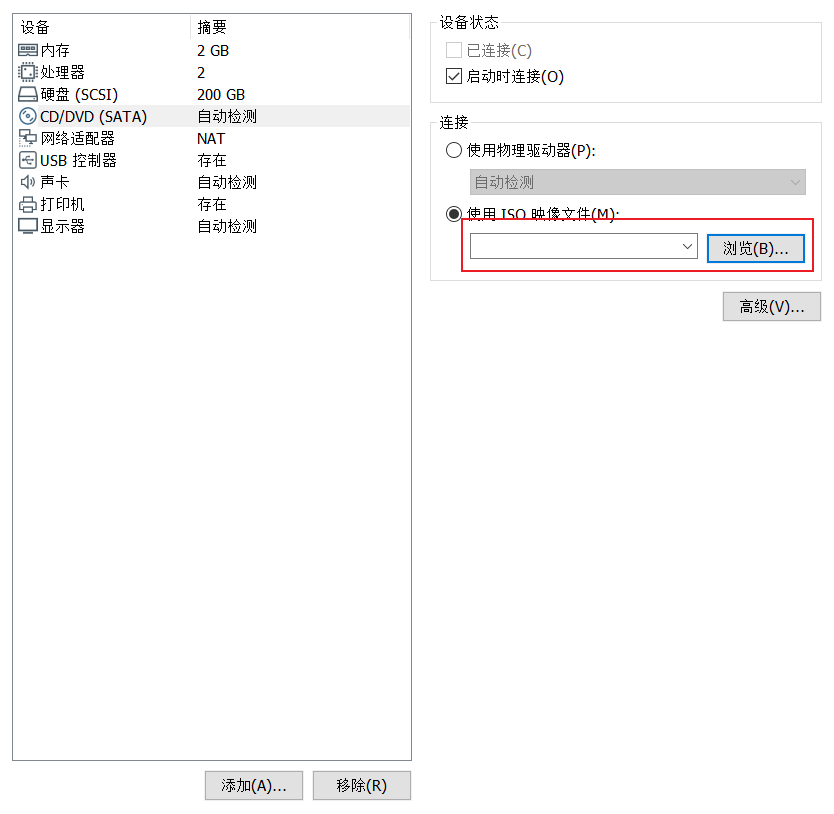

# VMWare安装Linux

### 1.获取常用的Linux发新版

#### Rocky Linux
```bash
https://rockylinux.org/download
http://mirrors.aliyun.com/rockylinux/
http://mirrors.163.com/rocky/
http://mirrors.nju.edu.cn/rocky/
https://mirrors.sjtug.sjtu.edu.cn/rocky/
```

#### CentOS
```bash
https://wiki.centos.org/Download
http://mirrors.aliyun.com
http://mirrors.sohu.com
http://mirrors.163.com
https://mirrors.tuna.tsinghua.edu.cn/centos/
#CentOS6
https://vault.centos.org/6.10/isos/x86_64/
```

#### Ubuntu
```bash
http://cdimage.ubuntu.com/releases/         #Server版
https://mirrors.tuna.tsinghua.edu.cn/ubuntu-cdimage/releases/
http://releases.ubuntu.com/           #Desktop版
http://mirrors.aliyun.com/ubuntu-releases/
https://mirrors.tuna.tsinghua.edu.cn/ubuntu-releases/
https://mirrors.tuna.tsinghua.edu.cn/ubuntu-cdimage/releases/

```

### 2.虚拟化硬件配置
* CPU：2核或更多
* 内存：1G以上，推荐2G
* 硬盘：一块硬盘，200G
* 网卡：NAT模式
* 光盘：挂载对应版本的ISO文件

#### 针对rocky8.5 安装





**关于分区挂载，这个biosboot的作用是：**

在使用 GPT (GUID Partition Table) 分区表格式的系统上，当系统使用传统的 BIOS 而非 UEFI (Unified Extensible Firmware Interface) 来启动时，可能会需要一个特殊的 "biosboot" 分区。这个分区也被称为 BIOS Boot Partition。
"biosboot" 分区主要存储的是 GRUB 引导加载程序的一部分。具体来说，它存储的是 GRUB 的 stage2 或 core.img。这些组件是 GRUB 启动过程中的关键部分，它们负责加载操作系统。在 GPT 分区表中，没有像 MBR (Master Boot Record) 那样的引导代码区域。因此，当使用 GRUB 和传统 BIOS 启动 GPT 磁盘时，GRUB 需要一个独立的分区来存储其启动代码，这就是 "biosboot" 分区的用途。这个分区充当了在 MBR 方案中由 MBR 自身承担的角色。


到了这个界面，一般按照自己的需求配置就行了


#### ubuntu 安装有几个地方需要注意


在这个界面可以选择国内的镜像，安装软件比较快


在这个界面可以选择自动化格式硬盘和挂载，也可以自定义格式化硬盘和挂载， 空格选择， 上下键选择对应菜单，enter进入


这个界面，一定要选择安装OpenSSH


