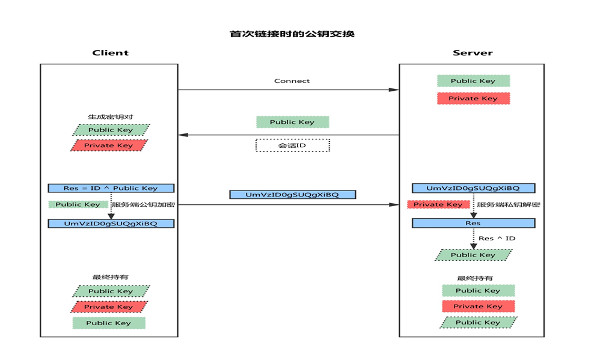
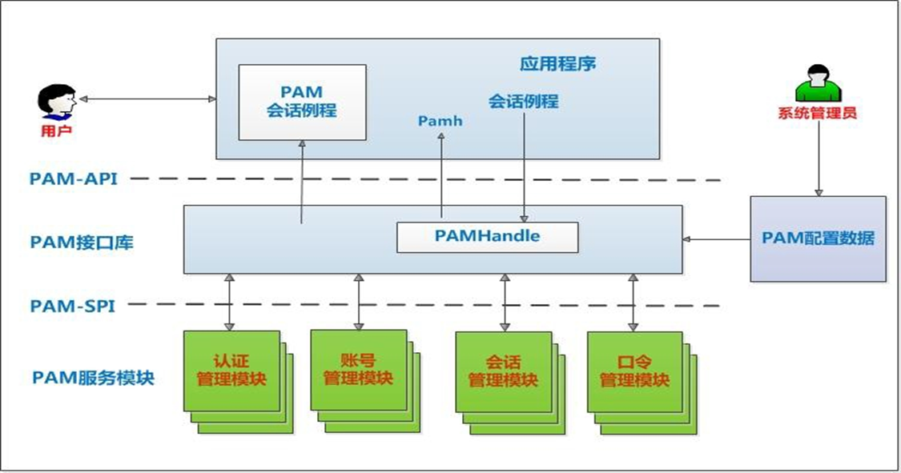
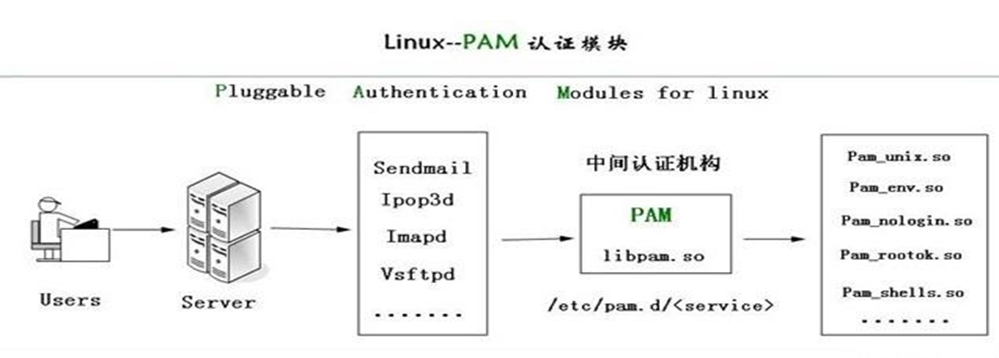
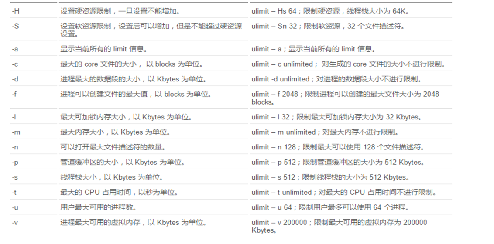

# 加密和安全2

## ssh服务
ssh: secure shell protocol, 22/tcp, 安全的远程登录，实现加密通信，代替传统的 telnet 协议

具体的软件实现：
* OpenSSH：ssh协议的开源实现，CentOS 默认安装
* dropbear：另一个ssh协议的开源项目的实现 
  
SSH 协议版本
* v1：基于CRC-32做MAC，不安全；man-in-middle
* v2：双方主机协议选择安全的MAC方式，基于DH算法做密钥交换，基于RSA或DSA实现身份认证

### 公钥交换原理


* 客户端发起链接请求
* 服务端返回自己的公钥，以及一个会话ID（这一步客户端得到服务端公钥）
* 客户端生成密钥对
* 客户端用自己的公钥异或会话ID，计算出一个值Res，并用服务端的公钥加密
* 客户端发送加密后的值到服务端，服务端用私钥解密，得到Res
* 服务端用解密后的值Res异或会话ID，计算出客户端的公钥（这一步服务端得到客户端公钥）
* 最终：双方各自持有三个秘钥，分别为自己的一对公、私钥，以及对方的公钥，之后的所有通讯都会被加密

### ssh加密通讯原理


### openssh 服务
OpenSSH是SSH （Secure SHell） 协议的免费开源实现，一般在各种Linux版本中会默认安装，基于C/S结构

Openssh软件相关包：
* openssh
* openssh-clients
* openssh-server

服务器端程序：/usr/sbin/sshd

Unit 文件：/usr/lib/systemd/system/sshd.service

客户端：
* Linux Client: ssh, scp, sftp，slogin
* Windows Client：xshell, MobaXterm,putty, securecrt, sshsecureshellclient

####  客户端 ssh命令
ssh命令是ssh客户端，允许实现对远程系统经验证地加密安全访问
当用户远程连接ssh服务器时，会复制ssh服务器/etc/ssh/ssh_host*key.pub文件中的公钥到客户机的
~/.ssh/know_hosts中。下次连接时，会自动匹配相对应的私钥，不能匹配，将拒绝连接

ssh客户端配置文件： `/etc/ssh/ssh_config`


主要配置
```bash
#StrictHostKeyChecking ask
#首次登录不显示检查提示
StrictHostKeyChecking no 
#   IdentityFile ~/.ssh/id_rsa
#   IdentityFile ~/.ssh/id_dsa
#   IdentityFile ~/.ssh/id_ecdsa
#   IdentityFile ~/.ssh/id_ed25519
#   Port 22

```

ssh 客户端命令格式
```bash
-p port #远程服务器监听的端口
-b #指定连接的源IP
-v #调试模式
-C #压缩方式
-X #支持x11转发
-t #强制伪tty分配，如：ssh -t remoteserver1 ssh -t remoteserver2   ssh   
remoteserver3
-o option   如：-o StrictHostKeyChecking=no 
-i <file>  #指定私钥文件路径，实现基于key验证，默认使用文件： ~/.ssh/id_dsa, 
~/.ssh/id_ecdsa, ~/.ssh/id_ed25519，~/.ssh/id_rsa等
```

范例
```bash
1.通过多个跳板登录远程主机10.0.0.6
[root@centos8 ~]#ssh -t 10.0.0.8 ssh -t 10.0.0.7 ssh 10.0.0.6 
root@10.0.0.8's password: 
root@10.0.0.7's password: 
root@10.0.0.6's password: 
Last login: Fri May 22 09:10:28 2020 from 10.0.0.7
[root@centos6 ~]#


2.远程执行命令
ssh 10.0.0.3  'mkdir ./test.txt'


3.在远程主机运行本地shell脚本
ssh 10.0.0.18 /bin/bash < test.sh


4.统计ssh登录失败次数最多的前十个远程IP
lastb -f btmp-test | awk '{print $3}'|sort |uniq -c|sort -nr|head


```

### 其它ssh客户端工具

scp
```bash
scp [options] SRC... DEST/
scp [options] [user@]host:/sourcefile /destpath
scp [options] /sourcefile [user@]host:/destpath
scp [options] [user@]host1:/sourcetpath [user@]host2:/destpath
-C 压缩数据流
-r 递归复制
-p 保持原文件的属性信息
-q 静默模式
-P PORT 指明remote host的监听的端口

```

rsync
```bash
rsync工具可以基于ssh和rsync协议实现高效率的远程系统之间复制文件，使用安全的shell连接做为传
输方式，比scp更快，基于增量数据同步，即只复制两方不同的文件，此工具来自于rsync包
注意：通信两端主机都需要安装 rsync 软件

rsync  -av /etc   server1:/tmp/ #复制目录和目录下文件
rsync  -av /etc/ server1:/tmp/ #只复制目录下文件

-n 模拟复制过程
-v 显示详细过程
-r 递归复制目录树
-p 保留权限
-t 保留修改时间戳
-g 保留组信息
-o 保留所有者信息
-l 将软链接文件本身进行复制（默认）
-L 将软链接文件指向的文件复制
-u 如果接收者的文件比发送者的文件较新，将忽略同步
-z 压缩，节约网络带宽
-a 存档，相当于-rlptgoD，但不保留ACL（-A）和SELinux属性（-X）
--delete 源数据删除，目标数据也自动同步删除
--progress 显示进度
--bwlimit=5120 #限速以KB为单位,5120表示5MB
rsync -auv --delete /data/test 10.0.0.7:/data
rsync -auv --progress --bwlimit=5120 --delete /data/test  10.0.0.7:/data

```

sftp
```bash
交互式文件传输工具，用法和传统的ftp工具相似，利用ssh服务实现安全的文件上传和下载
使用ls cd mkdir rmdir pwd get put等指令，可用？或help获取帮助信息

sftp [user@]host
sftp> help
```

自动登录 ssh工具 sshpass

```bash
sshpass用于非
交互SSH的密码验证，一般用在sh脚本中，无须再次输入密码（本机known_hosts文件中有的主机才能
生效）它允许你用 -p 参数指定明文密码，然后直接登录远程服务器，它支持密码从命令行、文件、环
境变量中读取。

sshpass [option] command parameters
-p password #后跟密码它允许你用 -p 参数指定明文密码，然后直接登录远程服务器
-f filename #后跟保存密码的文件名，密码是文件内容的第一行
-e #将环境变量SSHPASS作为密码


sshpass -p 123456 ssh -o StrictHostKeyChecking=no 10.0.0.7  hostname -I
sshpass -p 123456 scp -o StrictHostKeyChecking=no /data/*  10.0.0.8:/data

```

### ssh登录验证方式介绍
```bash
ssh服务登录的常用验证方式

        用户/口令 
        基于密钥

实现基于密钥的登录方式
    在客户端生成密钥对
        ssh-keygen -t rsa [-P 'password'] [-f “~/.ssh/id_rsa"]
        ssh-keygen -t rsa -P "" -f $HOME/.ssh/id_rsa
    把公钥文件传输至远程服务器对应用户的家目录
        ssh-copy-id [-i [identity_file]] [user@]host


如何实现三个主机之间互相的key验证?
1.ssh-keygen 产生本机私钥
2.ssh-copy-id  root@127.0.0.1
3.把本机的.ssh 文件拷贝到其他主机上，即可实现这几个主机的的互相key验证
```


### ssh服务器配置
```bash
服务器端：sshd
服务器端的配置文件: /etc/ssh/sshd_config
服务器端的配置文件帮助：man 5 sshd_config

常用参数：

Port  22     #生产建议修改
ListenAddress ip
LoginGraceTime 2m
PermitRootLogin yes #默认ubuntu不允许root远程ssh登录
StrictModes yes   #检查.ssh/文件的所有者，权限等
MaxAuthTries   6     #pecifies the maximum number of authentication 
attempts permitted per connection. Once the number of failures reaches half this 
value, additional failures are logged. The default is 6.
MaxSessions  10         #同一个连接最大会话
PubkeyAuthentication yes     #基于key验证
PermitEmptyPasswords no      #空密码连接
PasswordAuthentication yes   #基于用户名和密码连接
GatewayPorts no
ClientAliveInterval 10 #单位:秒
ClientAliveCountMax 3 #默认3
UseDNS yes #提高速度可改为no
GSSAPIAuthentication yes #提高速度可改为no
MaxStartups    #未认证连接最大值，默认值10
Banner /path/file
#以下可以限制可登录用户的办法：
AllowUsers user1 user2 user3
DenyUsers user1 user2 user3
AllowGroups g1 g2
DenyGroups g1 g2


设置 ssh 空闲 60s 自动注销
Vim /etc/ssh/sshd_config
ClientAliveInterval   60
ClientAliveCountMax   0
Service sshd restart
#注意：新开一个连接才有效


解决ssh登录缓慢的问题
vim /etc/ssh/sshd_config
UseDNS no
GSSAPIAuthentication no
systemctl restart sshd


在 ubuntu 上启用 root 远程ssh登录
#修改sshd服务配置文件
vim /etc/ssh/sshd_config 
#PermitRootLogin prohibit-password 注释掉此行
PermitRootLogin yes 修改为下面形式
systemctl restart sshd
```

### ssh 服务的最佳实践
```bash
建议使用非默认端口
禁止使用protocol version 1
限制可登录用户
设定空闲会话超时时长
利用防火墙设置ssh访问策略
仅监听特定的IP地址
基于口令认证时，使用强密码策略，比如：tr -dc A-Za-z0-9_ < /dev/urandom | head -c 12| xargs
使用基于密钥的认证
禁止使用空密码
禁止root用户直接登录
限制ssh的访问频度和并发在线数
经常分析日志
```

## sudo 实现授权

```bash
sudo特性：

sudo能够授权指定用户在指定主机上运行某些命令。如果未授权用户尝试使用 sudo，会提示联系管理员
sudo提供了丰富的日志，详细地记录了每个用户干了什么。它能够将日志传到中心主机或者日志服务器
sudo使用时间戳文件来执行类似的“检票”系统。当用户调用sudo并且输入它的密码时，用户获得了一张存活期为5分钟的票
sudo的配置文件是sudoers文件，它允许系统管理员集中的管理用户的使用权限和使用的主机。它所存放的位置默认是在/etc/sudoers，属性必须为0440


包：sudo 
配置文件：/etc/sudo.conf
授权规则配置文件：
    /etc/sudoers
    /etc/sudoers.d

安全编辑授权规则文件和语法检查工具
    /usr/sbin/visudo

授权编辑规则文件的工具：/usr/bin/sudoedit
执行授权命令：/usr/bin/sudo
时间戳文件：/var/db/sudo
日志文件：/var/log/secure

sudo命令
ls -l /usr/bin/sudo
sudo -i -u wang 切换身份功能和 su 相似,但不一样,sudo必须提前授权,而且要输入自已的密码
sudo [-u user] COMMAND 
-V 显示版本信息等配置信息
-u user 指定代表的用户，默认为root
-l,ll 列出用户在主机上可用的和被禁止的命令
-v 再延长密码有效期限5分钟,更新时间戳
-k 清除时间戳（1970-01-01），下次需要重新输密码
-K 与-k类似，还要删除时间戳文件
-b 在后台执行指令
-p 改变询问密码的提示符号
 示例：-p "password on %h for user %p: "


sudo 授权规则配置
    配置文件格式说明：/etc/sudoers, /etc/sudoers.d/ 
    配置文件中支持使用通配符 glob

        ? 任意单一字符
        * 匹配任意长度字符
        [wxc] 匹配其中一个字符
        [!wxc] 除了这三个字符的其它字符
        \x 转义 
        [[alpha]] 字母 


配置文件规则有两类
    1、别名定义：不是必须的
    2、授权规则：必须的
    sudoers 授权规则格式：
        用户 登入主机=(代表用户) 命令
        user host=(runas) command

        格式说明
        user: 运行命令者的身份
        host: 通过哪些主机
        (runas)：以哪个用户的身份
        command: 运行哪些命令

实战案例
    student ALL=(root)   /sbin/pidof,/sbin/ifconfig
    %wheel ALL=(ALL) NOPASSWD: ALL
sudo echo 1.2.3.4 www.test.com >> /etc/hosts
-bash: /etc/hosts: Permission denied
#用下面方式可以实现
#bash -c 将后面所有信字符串作为整体进行sudo
#注意""必须加,否则只授权 >> 前面的命令sudo 
sudo bash  -c "echo 1.2.3.4 www.test.com >> /etc/hosts"

wang 192.168.1.6,192.168.1.8=(root) /usr/sbin/,!/usr/sbin/useradd


问题
    wang   ALL=(ALL) /bin/cat /var/log/messages* 
    使用sudo， 即要查看/var/log/message* 又不能查看其他文件

```


##  PAM认证机制

PAM：Pluggable Authentication Modules，插件式的验证模块，Sun公司于1995 年开发的一种与认证
相关的通用框架机制。PAM 只关注如何为服务验证用户的 API，通过提供一些动态链接库和一套统一的
API，将系统提供的服务和该服务的认证方式分开，使得系统管理员可以灵活地根据需要给不同的服务配
置不同的认证方式而无需更改服务程序一种认证框架，自身不做认证.

PAM提供了对所有服务进行认证的中央机制，适用于本地登录，远程登录，如：telnet,rlogin,fsh,ftp,点对点协议PPP，su等应用程序中，系统管理员通过PAM配置文件来制定不同应用程序的不同认证策略；应用程序开发者通过在服务程序中使用PAM API(pam_xxxx( ))来实现对认证方法的调用；而PAM服务模块的开发者则利用PAM SPI来编写模块（主要调用函数pam_sm_xxxx( )供PAM接口库调用，将不同的认证机制加入到系统中；PAM接口库（libpam）则读取配置文件，将应用程序和相应的PAM服务模块联系起来


```bash
包名: pam 
模块文件目录：/lib64/security/*.so 
特定模块相关的设置文件：/etc/security/
应用程序调用PAM模块的配置文件
    主配置文件：/etc/pam.conf，默认不存在，一般不使用主配置
    为每种应用模块提供一个专用的配置文件：/etc/pam.d/APP_NAME
    注意：如/etc/pam.d存在，/etc/pam.conf将失效

查看程序是否支持PAM
ldd `which -a --skip-alias  sshd` | egrep pam

```

### PAM工作原理
PAM认证一般遵循这样的顺序：Service(服务)→PAM(配置文件)→pam_*.so
PAM认证首先要确定那一项服务，然后加载相应的PAM的配置文件(位于/etc/pam.d下)，最后调用认证
文件(位于/lib64/security下)进行安全认证



pam认证过程示例

1.使用者执行/usr/bin/passwd 程序，并输入密码

2.passwd开始调用PAM模块，PAM模块会搜寻passwd程序的PAM相关设置文件，这个设置文件一般是在/etc/pam.d/里边的与程序同名的文件，即PAM会搜寻/etc/pam.d/passwd此设置文件

3.经由/etc/pam.d/passwd设定文件的数据，取用PAM所提供的相关模块来进行验证

4.将验证结果回传给passwd这个程序，而passwd这个程序会根据PAM回传的结果决定下一个动作（重新输入密码或者通过验证）


### PAM 配置文件格式说明
```bash
通用配置文件/etc/pam.conf格式,此格式不使用
application type control module-path arguments

专用配置文件/etc/pam.d/ 格式
type control module-path arguments

application：指服务名，如：telnet、login、ftp等，服务名字“OTHER”代表所有没有在该文件中明确配置的其它服务
type：指模块类型，即功能
control ：PAM库该如何处理与该服务相关的PAM模块的成功或失败情况，一个关健词实现
module-path： 用来指明本模块对应的程序文件的路径名
Arguments： 用来传递给该模块的参数


模块类型（module-type）

Auth        账号的认证和授权
Account     帐户的有效性，与账号管理相关的非认证类的功能，如：用来限制/允许用户对某个服务的访问时间，限制用户的位置(例如：root用户只能从控制台登录)
Password    用户修改密码时密码复杂度检查机制等功能
Session     用户会话期间的控制，如：最多打开的文件数，最多的进程数等
-type       表示因为缺失而不能加载的模块将不记录到系统日志,对于那些不总是安装在系统上的模块有用

Control:

required ：一票否决，表示本模块必须返回成功才能通过认证，但是如果该模块返回失败，失败结果也不会立即通知用户，而是要等到同一type中的所有模块全部执行完毕，再将失败结果返回给应用程序，即为必要条件
requisite ：一票否决，该模块必须返回成功才能通过认证，但是一旦该模块返回失败，将不再执行同一type内的任何模块，而是直接将控制权返回给应用程序。是一个必要条件
sufficient ：一票通过，表明本模块返回成功则通过身份认证的要求，不必再执行同一type内的其它模块，但如果本模块返回失败可忽略，即为充分条件，优先于前面的required和requisite
optional ：表明本模块是可选的，它的成功与否不会对身份认证起关键作用，其返回值一般被忽略
include： 调用其他的配置文件中定义的配置信息


module-path:

模块文件所在绝对路径：
模块文件所在相对路径：/lib64/security目录下的模块可使用相对路径，如：pam_shells.so、pam_limits.so
有些模块有自已的专有配置文件，在/etc/security/*.conf目 录下


Arguments 
debug ：该模块应当用syslog( )将调试信息写入到系统日志文件中
no_warn ：表明该模块不应把警告信息发送给应用程序
use_first_pass ：该模块不能提示用户输入密码，只能从前一个模块得到输入密码
try_first_pass ：该模块首先用前一个模块从用户得到密码，如果该密码验证不通过，再提示用户输入新密码
use_mapped_pass 该模块不能提示用户输入密码，而是使用映射过的密码
expose_account 允许该模块显示用户的帐号名等信息，一般只能在安全的环境下使用，因为泄漏用户名会对安全造成一定程度的威胁

注意：修改PAM配置文件将马上生效
建议：编辑pam规则时，保持至少打开一个root会话，以防止root身份验证错误


PAM模块帮助
官方在线文档：http://www.linux-pam.org/Linux-PAM-html/
官方离线文档：http://www.linux-pam.org/documentation/
pam模块文档说明：/user/share/doc/pam-*
rpm -qd pam
man -k pam_
man 模块名 如：man 8 rootok
```

### 常用PAM模块

#### pam_nologin.so 模块
```bash
功能：如果/etc/nologin文件存在,将导致非root用户不能登陆,当该用户登陆时，会显示/etc/nologin文
件内容，并拒绝登陆 默认此模块可以对ssh等登录有效,但不影响su登录

```

#### pam_limits.so 模块
功能：在用户级别实现对其可使用的资源的限制，例如：可打开的文件数量，可运行的进程数量，可用内存空间


```bash
修改限制的实现方式：
    
(1) ulimit命令
    ulimit是linux shell的内置命令，它具有一套参数集，用于对shell进程及其子进程进行资源限制,ulimit的设定值是 per-process 的，也就是说，每个进程有自己的limits值，使用ulimit进行修改，立即生效。ulimit只影响shell进程及其子进程，用户登出后失效。可以在profile中加入ulimit的设置，变相的做到永久生效

    -H 设置硬件资源限制
    -S 设置软件资源限制.
    -a 显示当前所有的资源限制.
    -c size:设置core文件的最大值.单位:blocks
    -d size:设置数据段的最大值.单位:kbytes
    -f size:设置创建文件的最大值.单位:blocks
    -l size:设置在内存中锁定进程的最大值.单位:kbytes
    -m size:设置可以使用的常驻内存的最大值.单位:kbytes
    -n size:设置内核可以同时打开的文件描述符的最大值.单位:n
    -p size:设置管道缓冲区的最大值.单位:kbytes
    -s size:设置堆栈的最大值.单位:kbytes
    -t size:设置CPU使用时间的最大上限.单位:seconds
    -u size:最大用户进程数
    -v size:设置虚拟内存的最大值.单位:kbytes
    unlimited 是一个特殊值，用于表示不限制
    #说明
    查询时，若不加H或S参数，默认显示的是软限制
    修改时，若不加H或S参数，两个参数一起改变

(2) 配置文件：
    pam_limits的设定值是基于 per-process 的
        /etc/security/limits.conf
        /etc/security/limits.d/*.conf

配置文件格式：
#每行一个定义
<domain>       <type> <item> <value>

格式说明：

1.应用于哪些对象
    Username 单个用户
    @group 组内所有用户
    * 所有用户
    % 仅用于限制 maxlogins limit , 可以使用 %group 语法. 只用 % 相当于 * 对所有用户
    maxsyslogins limit限制. %group 表示限制此组中的所有用户总的最大登录数


2.限制的类型
    Soft 软限制,普通用户自己可以修改
    Hard 硬限制,由root用户设定，且通过kernel强制生效
    - 二者同时限定

3. 限制的资源
    nofile 所能够同时打开的最大文件数量,默认为1024
    nproc 所能够同时运行的进程的最大数量,默认为1024

4.指定具体值

注意：systemd 的service 资源设置需要单独配置
# /etc/security/limits.conf
#
#This file sets the resource limits for the users logged in via PAM.
#It does not affect resource limits of the system services.
在Centos7以上版本中，使用Systemd替代了之前的SysV。/etc/security/limits.conf文件的配置作
用域缩小了。/etc/security/limits.conf的配置，只适用于通过PAM认证登录用户的资源限制，它对
systemd的service的资源限制不生效。因此登录用户的限制，通过/etc/security/limits.conf
与/etc/security/limits.d下的文件设置即可

对于systemd service的资源设置，则需修改全局配置，全局配置文件放在/etc/systemd/system.conf
和/etc/systemd/user.conf，同时也会加载两个对应目录中的所有.conf文
件/etc/systemd/system.conf.d/*.conf和/etc/systemd/user.conf.d/*.conf。system.conf
是系统实例使用的，user.conf是用户实例使用的

vim /etc/systemd/system.conf
DefaultLimitNOFILE=100000
DefaultLimitNPROC=65535
或者针对指定的service添加下面行
[Service]
LimitNOFILE=100000
LimitNPROC=65535


系统的各种资源的默认值
ulimit -a


查看指定进程的资源限制
cat /proc/PID/limits


ulimit 命令修改用户打开的文件个数
ulimit -n
ulimit -n 1048576


限制用户最多打开的文件数和运行进程数，并持久保存
cat /etc/pam.d/system-auth
session     required     pam_limits.so
vim /etc/security/limits.conf  
#用户apache可打开10240个文件
apache  - nofile 10240
#用户student不能运行超过20个进程
student hard nproc 10


实际的生产案例
vim /etc/security/limits.conf  
*    -   core       unlimited
*    -   nproc       1000000
*    -   nofile      1000000
*    -   memlock     32000
*    -   msgqueue    8192000
```


