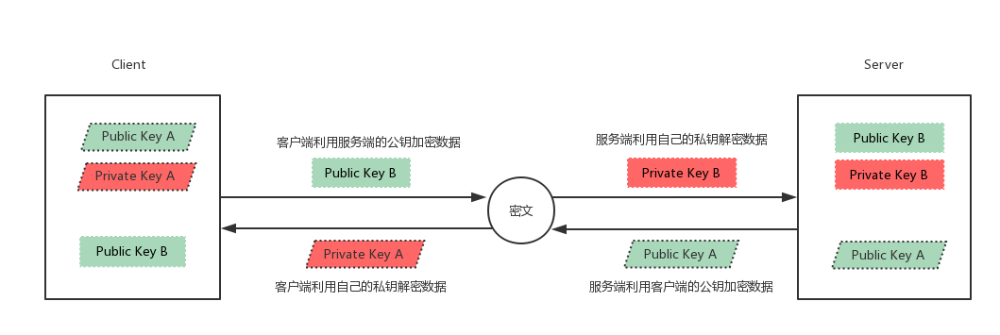

# 加密和安全2

## ssh服务
ssh: secure shell protocol, 22/tcp, 安全的远程登录，实现加密通信，代替传统的 telnet 协议

具体的软件实现：
* OpenSSH：ssh协议的开源实现，CentOS 默认安装
* dropbear：另一个ssh协议的开源项目的实现 
  
SSH 协议版本
* v1：基于CRC-32做MAC，不安全；man-in-middle
* v2：双方主机协议选择安全的MAC方式，基于DH算法做密钥交换，基于RSA或DSA实现身份认证

### 公钥交换原理


* 客户端发起链接请求
* 服务端返回自己的公钥，以及一个会话ID（这一步客户端得到服务端公钥）
* 客户端生成密钥对
* 客户端用自己的公钥异或会话ID，计算出一个值Res，并用服务端的公钥加密
* 客户端发送加密后的值到服务端，服务端用私钥解密，得到Res
* 服务端用解密后的值Res异或会话ID，计算出客户端的公钥（这一步服务端得到客户端公钥）
* 最终：双方各自持有三个秘钥，分别为自己的一对公、私钥，以及对方的公钥，之后的所有通讯都会被加密

### ssh加密通讯原理



### openssh 服务
OpenSSH是SSH （Secure SHell） 协议的免费开源实现，一般在各种Linux版本中会默认安装，基于C/S结构

Openssh软件相关包：
* openssh
* openssh-clients
* openssh-server

服务器端程序：/usr/sbin/sshd

Unit 文件：/usr/lib/systemd/system/sshd.service

客户端：
* Linux Client: ssh, scp, sftp，slogin
* Windows Client：xshell, MobaXterm,putty, securecrt, sshsecureshellclient

####  客户端 ssh命令
ssh命令是ssh客户端，允许实现对远程系统经验证地加密安全访问
当用户远程连接ssh服务器时，会复制ssh服务器/etc/ssh/ssh_host*key.pub文件中的公钥到客户机的
~/.ssh/know_hosts中。下次连接时，会自动匹配相对应的私钥，不能匹配，将拒绝连接

ssh客户端配置文件： `/etc/ssh/ssh_config`


主要配置
```bash
#StrictHostKeyChecking ask
#首次登录不显示检查提示
StrictHostKeyChecking no 
#   IdentityFile ~/.ssh/id_rsa
#   IdentityFile ~/.ssh/id_dsa
#   IdentityFile ~/.ssh/id_ecdsa
#   IdentityFile ~/.ssh/id_ed25519
#   Port 22

```

ssh 客户端命令格式
```bash
-p port #远程服务器监听的端口
-b #指定连接的源IP
-v #调试模式
-C #压缩方式
-X #支持x11转发
-t #强制伪tty分配，如：ssh -t remoteserver1 ssh -t remoteserver2   ssh   
remoteserver3
-o option   如：-o StrictHostKeyChecking=no 
-i <file>  #指定私钥文件路径，实现基于key验证，默认使用文件： ~/.ssh/id_dsa, 
~/.ssh/id_ecdsa, ~/.ssh/id_ed25519，~/.ssh/id_rsa等
```

通过多个跳板登录远程主机10.0.0.6
```bash
[root@centos8 ~]#ssh -t 10.0.0.8 ssh -t 10.0.0.7 ssh 10.0.0.6 
root@10.0.0.8's password: 
root@10.0.0.7's password: 
root@10.0.0.6's password: 
Last login: Fri May 22 09:10:28 2020 from 10.0.0.7
[root@centos6 ~]#
```


