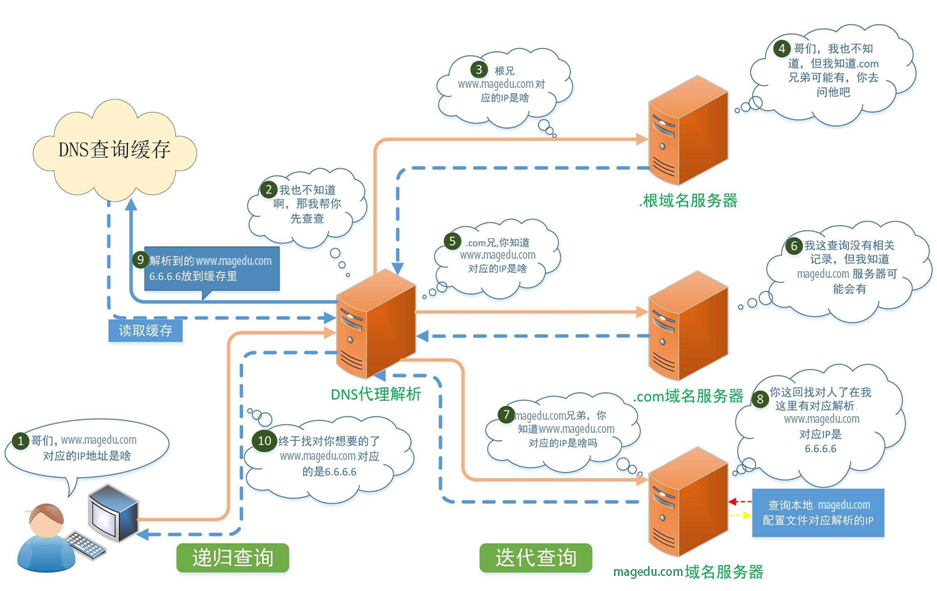

# DNS服务

## DNS服务工作原理




### 递归查询
```bash
是指DNS服务器在收到用户发起的请求时，必须向用户返回一个准确的查询结果，如果DNS服务器本地没有存储与之对应的信息，
则该服务器需要询问其他服务器，并将返回的查询结果提交给用户

一般客户机和本地DNS服务器之间属于递归查询，即当客户机向DNS服务器发出请求后,
若DNS服务器本身不能解析，则会向另外的DNS服务器发出查询请求，得到最终的肯定或否定的结果后转交给客户机。
此查询的源和目标保持不变,为了查询结果只需要发起一次查询

递归算法:客户端向LocalDNS发起域名查询-->localDNS不知道域名对应的IP-->
但它知道谁知道->他代为帮客户端去查找-->最后再返回最终结果

```

### 迭代查询
```bash
是指DNS服务器在收到用户发起的请求时，并不直接回复查询结果，而是告诉另一台DNS服务器的
地址，用户再向这台DNS服务器提交请求，这样依次反复，直到返回查询结果

一般情况下(有例外)本地的DNS服务器向其它DNS服务器的查询属于迭代查询,如：若对方不能返回
权威的结果，则它会向下一个DNS服务器(参考前一个DNS服务器返回的结果)再次发起进行查询，
直到返回查询的结果为止。此查询的源不变,但查询的目标不断变化,为查询结果一般需要发起多次查询

迭代算法︰客户端向LocalDNS发起域名查询-->localDNS不知道域名对应的IP-->但它知道谁知道并
推荐客户端应该找谁-->客户端自己去找它

```

### DNS 缓存
```bash
DNS缓存是将解析数据存储在靠近发起请求的客户端的位置，也可以说DNS数据是可以缓存在任意
位置，最终目的是以此减少递归查询过程，可以更快的让用户获得请求结果。
```

### 完整的查询请求经过的流程
```bash
client-->hosts--->client DNS service local cache-->DNS server(recursion)->DNS server cache --> DNS iteration ---> root ---> 顶级域名 ---> 二级域名DNS....
```

### 解析类型
```bash
FQDN --> IP正向解析
IP ---> FQDN 反向解析
```

## DNS概念

### DNS服务器类型
* 主DNS服务器
* 从DNS服务器
* 缓存DNS服务器(转发器)

### 区域传输
传输解析库

### 解析答案
* 肯定答案  存在对应的查询结果
* 否定答案 请求的条目不存在等原因导致无法返回结果
* 权威答案 直接由存在此查询结果的DNS服务器（权威服务器）返回的答案
* 非权威答案 由其他非权威服务器返回的查询答案

### 各种资源记录
区域解析库 由众多资源记录RR（Resource Record）组成
* SOA 起始授权记录，一个区域解析库有且仅能有一个SOA记录，必须位于解析库的第一条记录
* A     FQDN-->IPv4
* AAAA  FQDN--->IPv6
* PTR   IP--->FQDN
* NS    Name Server 专用于标明当前区域的DNS服务器
* CNAME  别名记录
* MX    MAil eXchanger  邮件交换器
* TXT  对域名进行标识和说明的一种方式，一般做验证记录时候会使用此项

### 资源记录定义
```bash
name [TTL]  IN  rr_type  value 

区域名字  time to live 生存值  资源记录类型  值
TTL 可以全局继承
@符合可以引用当前区域的域名
同一个名字可以通过多条记录定义多个不同的值；此时DNS服务器会以轮询方式响应
. 同一个值也可能有多个不同的定义名字；通过多个不同的名字指向同一个值进行定义；此仅表示通过多个不同的名字可以找到同一个主机

```

###区域解析库示例，假定域名example.com
```bash
$TTL 86400    ; 默认的TTL值（1天）
@   IN  SOA  ns1.example.com. admin.example.com. (
            2024053101 ; 序列号
            3600       ; 刷新时间（1小时）
            900        ; 重试时间（15分钟）
            604800     ; 过期时间（1周）
            86400      ; 最小TTL（1天）
            )
        IN  NS      ns1.example.com.
        IN  NS      ns2.example.com.

; A 记录
@       IN  A       192.0.2.1
www     IN  A       192.0.2.2

; AAAA 记录
@       IN  AAAA    2001:db8::1
www     IN  AAAA    2001:db8::2

; PTR 记录（假设反向域名为1.2.0.192.in-addr.arpa和1.db8.0.2001.ip6.arpa）
1.2.0.192.in-addr.arpa.  IN  PTR example.com.
2.2.0.192.in-addr.arpa.  IN  PTR www.example.com.
1.0.0.0.0.0.0.0.0.0.0.0.0.0.0.1.0.0.0.0.0.0.0.0.0.0.0.8.b.d.0.1.0.0.2.ip6.arpa. IN PTR example.com.
2.0.0.0.0.0.0.0.0.0.0.0.0.0.0.1.0.0.0.0.0.0.0.0.0.0.0.8.b.d.0.1.0.0.2.ip6.arpa. IN PTR www.example.com.

; NS 记录
ns1     IN  A       192.0.2.1
ns2     IN  A       192.0.2.2

; CNAME 记录
alias   IN  CNAME   www.example.com.

; MX 记录
@       IN  MX 10   mail.example.com.
mail    IN  A       192.0.2.3

; TXT 记录
@       IN  TXT     "v=spf1 include:example.com ~all"

```
