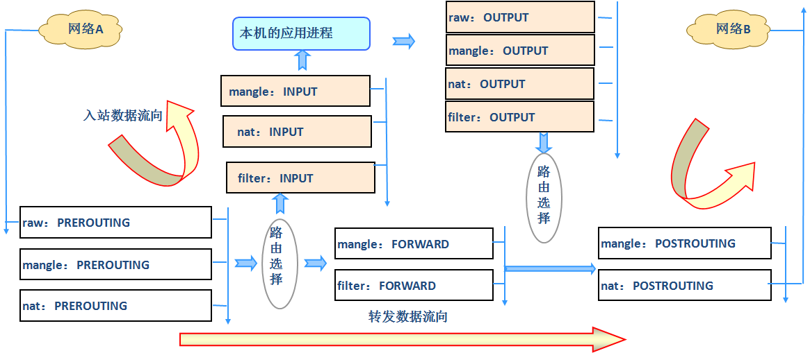

# Linux 防火墙

## 概念
    Linux防火墙是由Netfilter组件提供的，NetFilter工作在内核空间，集成在Linux内核中，
    而iptables只是一个工作在用户空间的一个命令行工具，用来编写规则，写好的规则被送往netfilter，
    告诉内核如何去处理信息包

## 数据包过滤匹配流程



## netfilter的5表和5链
### netfilter 提供了五种表，每种表用于处理不同类型的数据包决策：(优先级从上到下增加)
* Filter Table：最常用的表，用于决定数据包的命运，如允许或阻止数据包通过。
* NAT Table：用于网络地址转换，如源NAT（SNAT）和目标NAT（DNAT）。
* Mangle Table：用于修改数据包的服务质量（QoS）标记和其他包头信息。
* Raw Table：用于设置不需要由连接跟踪系统处理的数据包。
* Security Table：用于设置强制访问控制（MAC）安全规则，通常与 SELinux 安全策略配合使用
### 五链,每个表包含几个预定义的链(内置链)，数据包根据其流向和处理需求经过不同的链：
* INPUT：处理到达本机的数据包。
* OUTPUT：处理由本机发出的数据包。
* FORWARD：处理穿过本机（路由）的数据包。
* PREROUTING：用于在路由决策之前处理进入的数据包（主要用在 NAT 表）。
* POSTROUTING：用于在路由决策之后处理即将离开的数据包（主要用在 NAT 表）。

## iptables 查看规则
```bash
iptables -S #查看更加详细的配置信息
iptables -vnL -t filter  #默认filter
iptables -vnL  -t filter  --line-numbers #显示规则行号
```

## iptables设置规则
数据包从PREROUTING 流入，POSTROUTING 流出，中间经过链条，按照链条所属的表优先级从高到低处理
在每个表内，例如filter表，INPUT链，那么按照filter表的INPUT链上的规则从上到下匹配处理，符合匹配，
就处理，不匹配就继续往下匹配规则，直到规则走完

### 基本匹配(不需要使用额外模块)
```bash
iptables   [-t table]   SUBCOMMAND   chain   [-m matchname [per-match-options]]   -j targetname [per-target-options]
            -t 哪个表   管理命令      那条链    哪个模块       具体匹配条件和选项      处理动作      
 管理命令 ：
        -N：new, 自定义一条新的规则链
        -E：重命名自定义链；引用计数不为0的自定义链不能够被重命名，也不能被删除
        -X：delete，删除自定义的空的规则链
        -P：Policy，设置默认策略；对filter表中的链而言，其默认策略有：ACCEPT：接受, DROP：丢弃
            范例：
                iptables -N test-chain  -t filter
                iptables -E test-chain  test1-chain
                iptables -X test1-chain

                #往自定义链条添加规则
                iptables -t filter  -A web -s 10.0.0.3   -j DROP 

                #在内置链条上引用自定义链
                iptables -A INPUT -j web
        
        -A：append，追加
        -I：insert, 插入，要指明插入至的规则编号，默认为第一条
        -D：delete，删除
            (1) 指明规则序号
            (2) 指明规则本身
        -R：replace，替换指定链上的指定规则编号
        -F：flush，清空指定的规则链
        -Z：zero，置零
            iptables的每条规则都有两个计数器
                (1) 匹配到的报文的个数
                (2) 匹配到的所有报文的大小之和

基本条件
    [!] -s, --source address[/mask][,...]：源IP地址或者不连续的IP地址
    [!] -d, --destination address[/mask][,...]：目标IP地址或者不连续的IP地址
    [!] -p, --protocol protocol：指定协议，可使用数字如0（all）
        protocol: tcp, udp, icmp, icmpv6, udplite,esp, ah, sctp, mh or“all“
        参看：/etc/protocols
    [!] -i, --in-interface name：报文流入的接口；只能应用于数据报文流入环节，只应用于INPUT、FORWARD、PREROUTING链
    [!] -o, --out-interface name：报文流出的接口；只能应用于数据报文流出的环节，只应用于FORWARD、OUTPUT、POSTROUTING链
    iptables -A INPUT -s 10.0.0.6,10.0.0.10 -d 10.0.0.100,10.0.0.200  ! -p icmp -i eth0 -j REJECT

```

### 扩展匹配
```bash
隐式扩展模块

    iptables 在使用-p选项指明了特定的协议时，无需再用-m选项指明扩展模块的扩展机制，不需要手动加载扩展模块
    tcp 协议的扩展选项
        [!] --source-port, --sport port[:port]：匹配报文源端口,可为端口连续范围
        [!] --destination-port,--dport port[:port]：匹配报文目标端口,可为连续范围
        [!] --tcp-flags mask comp
             mask 需检查的标志位列表，用,分隔 , 例如 SYN,ACK,FIN,RST
            comp 在mask列表中必须为1的标志位列表，无指定则必须为0，用,分隔tcp协议的扩展选项
        范例：
            --tcp-flags SYN,ACK,FIN,RST SYN      #表示要检查的标志位为SYN,ACK,FIN,RST四个，其中SYN必须为1，余下的必须为0，第一次握手
            --tcp-flags SYN,ACK,FIN,RST SYN,ACK  #第二次握手

            #错误包
                --tcp-flags ALL ALL  
                --tcp_flags ALL NONE

    udp 协议的扩展选项
        [!] --source-port, --sport port[:port]：匹配报文的源端口或端口范围
        [!] --destination-port,--dport port[:port]：匹配报文的目标端口或端口范围

    icmp 协议的扩展选项
        [!] --icmp-type {type[/code]|typename}
                type/code
                0/0   echo-reply icmp应答
                8/0   echo-request icmp请求 
        iptables -A INPUT -s 10.0.0.6 -p icmp --icmp-type 8 -j REJECT 

显式扩展及相关模块
    显示扩展即必须使用-m选项指明要调用的扩展模块名称，需要手动加载扩展模块

    multiport扩展
        以离散方式定义多端口匹配,最多指定15个端口
        [!] --source-ports,--sports port[,port|,port:port]...
        [!] --destination-ports,--dports port[,port|,port:port]...
        [!] --ports port[,port|,port:port]...
        iptables -A INPUT -s 172.16.0.0/16 -d 172.16.100.10 -p tcp -m multiport --dports 20:22,80 -j ACCEPT

    iprange扩展
        [!] --src-range from[-to] 源IP地址范围
        [!] --dst-range from[-to] 目标IP地址范围
        iptables -A INPUT -d 172.16.1.100 -p tcp --dport 80 -m iprange --src-range  172.16.1.5-172.16.1.10 -j DROP

    
    mac扩展
        iptables -A INPUT -s 172.16.0.100 -m mac  --mac-source 00:50:56:12:34:56 -j ACCEPT

    string扩展
        对报文中的应用层数据做字符串模式匹配检测
            --algo {bm|kmp} 字符串匹配检测算法
                 bm：Boyer-Moore
                kmp：Knuth-Pratt-Morris
                --from offset 开始偏移
                --to offset   结束偏移
                [!] --string pattern 要检测的字符串模式
                [!] --hex-string pattern 要检测字符串模式，16进制格式
        
    iptables -A OUTPUT -p tcp --sport 80 -m string --algo kmp --from 62  --string   "google" -j REJECT
```

##  iptables规则保存
使用iptables命令定义的规则，手动删除之前，其生效期限为kernel存活期限


```bash
持久保存
    CentOS 7,8
    iptables-save > /PATH/TO/SOME_RULES_FILE

    CentOS 6 
    #将规则覆盖保存至/etc/sysconfig/iptables文件中
    service iptables save 

加载规则
    CentOS 7,8 重新载入预存规则文件中规则：
    iptables-restore < /PATH/FROM/SOME_RULES_FILE
    iptables-restore选项
        -n, --noflush：不清除原有规则
        -t, --test：仅分析生成规则集，但不提交

    CentOS 6：
    #会自动从/etc/sysconfig/iptables 重新载入规则
    service iptables  restart  


开机自动加载
    1.脚本写到 /etc/rc.d/rc.local 执行
    2.定义Unit File, CentOS 7，8 可以安装 iptables-services 实现iptables.service
        [root@centos8 ~]#yum -y install iptables-services
        [root@centos8 ~]#cp /etc/sysconfig/iptables{,.bak}
        #保存现在的规则到文件中方法1
        [root@centos8 ~]#/usr/libexec/iptables/iptables.init save
        #保存现在的规则到文件中方法2
        [root@centos8 ~]#iptables-save > /etc/sysconfig/iptables
        #开机启动
        [root@centos8 ~]#systemctl enable iptables.service    
        [root@centos8 ~]#systemctl mask firewalld.service nftables.service
```

## NAT
NAT: network address translation，支持PREROUTING，INPUT，OUTPUT，POSTROUTING四个链

### SNAT
source NAT ，支持POSTROUTING, INPUT，让本地网络中的主机通过某一特定地址访问外部网络，实现地址伪装,请求报文：修改源IP
```bash
iptables -t nat -A POSTROUTING -s 10.0.0.0/24 ! -d 10.0.0.0/24 -j MASQUERADE  #公网不固定
iptables -t nat -A POSTROUTING -s 10.0.0.0/24 ! -d 10.0.0.0/24  -j SNAT --to-source 192.168.0.8 #公网固定

#查看转换状态信息
cat /proc/net/nf_conntrack
```

### DNAT
destination NAT 支持PREROUTING , OUTPUT，把本地网络中的主机上的某服务开放给外部网络访问(发布服务和端口映射)，但隐藏真实IP,请求报文：修改目标IP
```bash
iptables -t nat -A PREROUTING -d 192.168.0.8 -p tcp --dport 80 -j  DNAT --to-destination 10.0.0.7:8080

```


### REDIRECT
本机重定向，将发往本机的数据包，从一个端口从定向到另一个端口
```bash
iptables -t nat -A PREROUTING -p tcp --dport 80 -j REDIRECT  --to-port 8080
```

