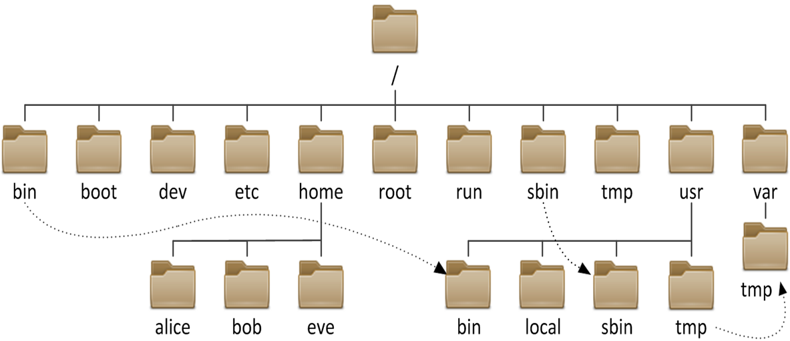

# 4.文件管理和IO重定向



## 1.常用目录结构
```bash
/boot 引导文件存放目录，内核文件(vmlinuz)、引导加载器(bootloader, grub)都存放于此目录
/bin 所有用户使用的基本命令；不能关联至独立分区，OS启动即会用到的程序
/sbin 管理类的基本命令；不能关联至独立分区，OS启动即会用到的程序
/etc 配置文件目录
/root 管理员的家目录
/home 普通用户家目录
/dev 设备文件存放在此
    b: block device，随机访问
    c: character device，线性访问
/usr 
    bin 就是/bin
    sbin 就是 /sbin
    lib 32位使用的库文件
    lib64 64位使用的库文件
    include  C程序的头文件(header files)
    share  结构化独立的数据，例如doc, man等
    local 自己本地安装的程序
        bin, sbin, lib, lib64, etc, share
/srv  统上运行的服务用到的数据
/lib 32为的库文件
/opt  第三方应用程序的安装位置
/lib64 64位的库文件
/mnt  临时文件系统挂载点    
/media 便携式设备挂载点
/run  软件运行起来产生的文件
/sys 用于输出当前系统上硬件设备相关信息虚拟文件系统，在内存中
/proc  用于输出内核与进程信息相关的虚拟文件系统,在内存中
/var variable data files
         cache: 应用程序缓存数据目录
        lib: 应用程序状态信息数据
        local：专用于为/usr/local下的应用程序存储可变数据
        lock: 锁文件
        log: 日志目录及文件
        opt: 专用于为/opt下的应用程序存储可变数据
        run: 运行中的进程相关数据,通常用于存储进程pid文件
        spool: 应用程序数据池
        tmp: 保存系统两次重启之间产生的临时数据
/tmp  临时文件存储位置
```


## 2. 常用文件分类位置
```bash
二进制程序：/bin, /sbin, /usr/bin, /usr/sbin, /usr/local/bin, /usr/local/sbin
库文件：/lib, /lib64, /usr/lib, /usr/lib64, /usr/local/lib, /usr/local/lib64
配置文件：/etc, /etc/DIRECTORY, /usr/local/etc
帮助文件：/usr/share/man, /usr/share/doc, /usr/local/share/man, /usr/local/share/doc
```

## 3.Linux下的文件类型
* \- 普通文件
* d 目录文件directory
* l 符号链接文件link
* b 块设备block 
* c 字符设备character
* p 管道文件pipe
* s 套接字文件socket

## 4.通配符
通配符主要用来匹配文件名中的字符，不是用来匹配文本里面的字符

```bash
*  零个或任意多个字符
?  任意一个字符

[ang] 指定范围内的单个字符
[^ang] 取反
[:digit:]
[:alpha:]
[:upper:]
[:lower:]
[:alnum:]
[a-z] 表示的是a A b B c C d D这样的顺序，不是a，b，c，d这样的顺序

{} 花括号扩展
{1..3} 1,2,3
{001..004} 001,002,003,004
{10..1..2} 10 8 6 4 2
{1,4} 1 4
注意： 通配符是匹配，而{} 是扩展，两者有些区别

```

## 文本处理命令

```bash
stat 
hexdump -C  win.txt   查看文本文件的二进制用16进制呈现 同时对照的有对应的字符
unix下和win下的文本转换
yum install -y dos2unix
dos2unix  
unix2dos
转换文件字符集编码
iconv

tr 字符串的转换功能非常强大,从标准输入读取数据，
tr [OPTION]... SET1 [SET2]
-d --delete：删除所有属于第一字符集的字符
-s --squeeze-repeats：把连续重复的字符以单独一个字符表示,即去重
-t 转换
set集合还支持转义字符 和通配符

tr -d "asdfa"  #如果串中含有asdfa其中任何一个字母 删除
tr -s "abc" #如果输入中含有abc任何一个重复出现压缩
tr -t "abc" "ABC"  #如果输入中含有abc 替换

tee 命令可以从标准输入读，然后将结果输出到标准输出上，同时还可以把结果输出到指定的文件中去
```


