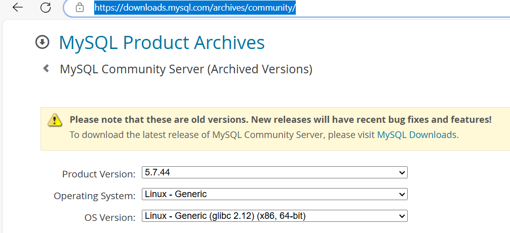

# MySQL安装和基本使用

## 常用数据库
* MySQL: MySQL, MariaDB, Percona Server
* PostgreSQL: 简称为pgsql，EnterpriseDB
* Oracle
* MSSQL Server
* DB2

### 版本演变
```bash
MySQL：5.1 --> 5.5 --> 5.6 --> 5.7 -->8.0
MariaDB：5.1 -->5.5 -->10.0--> 10.1 --> 10.2 --> 10.3 --> 10.4 --> 10.5
```

### 特点
```bash
MySQL  ==> MariaDB
MyISAM ==> Aria 
InnoDB ==> XtraDB
单进程，多线程
诸多扩展和新特性    
提供了较多测试组件
```

###  数据库排名
https://db-engines.com/en/ranking


### 数据库三范式
* 无重复的列，每一列都是不可分割的基本数据项，存在主键
* 在1的基础上，非主键字段要完全依赖主键不能部分依赖
* 在2的基础上，非主键字段要直接依赖主键不能间接依赖


## MySQL组成和常用工具
```bash
客户端程序
    mysql: 基于mysql协议交互式或非交互式的CLI工具
    mysqldump：备份工具，基于mysql协议向mysqld发起查询请求，并将查得的所有数据转换成insert等写操作语句保存文本文件中
    mysqladmin：基于mysql协议管理mysqld
    mysqlimport：数据导入工具


MyISAM存储引擎的管理工具：
    myisamchk：检查MyISAM库
    myisampack：打包MyISAM表，只读


服务器端程序
    mysqld_safe
    mysqld
    mysqld_multi 多实例 ，示例：mysqld_multi --example


用户账号
    'USERNAME'@'HOST'
    wang@'10.0.0.100'
    wang@'10.0.0.%'
    wang@'%
    HOST限制此用户可通过哪些远程主机连接mysql服务器,支持使用通配符：
    % 匹配任意长度的任意字符
    _ 匹配任意单个字符


 mysql 客户端命令，本地执行，每个命令都完整形式和简写格式
    msyql -v
    \h,help
    \u,use   #选择数据库
    \s,status
    \!,system  #在mysql交互中执行shell命令

服务端命令：通过mysql协议发往服务器执行并取回结果，命令末尾都必须使用命令结束符号，默认为分号
SELECT VERSION();
select database();  
select user(); 

mysql 使用方式
    交互式
    脚本方式 cat my.sql | mysql -uroot -p123456


mysql 客户端配置文件
    /etc/my.cnf  #是总的配置文件，通过指明配置选项来配置客户端和服务器端  

    [mysql]
    prompt="\\R:\\m:\\s(\\u@\\h) [\\d]>\\_"
    
    [client]
    user=root
    password=1234567890   #免密登录


mysql 服务端配置文件
    /etc/my.cnf  #是总的配置文件，通过指明配置选项来配置客户端和服务器端  

客户端和服务端所有配置选项

[mysqld]        服务端
[mysqld_safe]   这个选项组用于配置mysqld_safe脚本的选项
[mysqld_multi]  这个选项组用于配置mysqld_multi工具的选项
[mysql]         这个选项组用于配置MySQL客户端
[mysqladmin]    这个选项组用于配置mysqladmin工具的选项
[mysqldump]     这个选项组用于配置mysqldump工具的选项
[server]        这个选项组通常用于配置通用的服务器选项
[client]        这个选项组用于配置所有MySQL客户端工具的通用选项


 mysqladmin
    #查看mysql服务是否正常，如果正常提示mysqld is alive
    mysqladmin -uroot -pcentos   ping
    #关闭mysql服务，但mysqladmin命令无法开启
    mysqladmin -uroot -pcentos shutdown
    #创建数据库testdb
    mysqladmin -uroot -pcentos   create testdb 
    #删除数据库testdb
    mysqladmin -uroot -pcentos   drop testdb
    #修改root密码
    mysqladmin -uroot -pcentos password 'magedu'
    #日志滚动,生成新文件/var/lib/mysql/mariadb-bin.00000N
    mysqladmin -uroot -pcentos flush-logs


socket 连接说明
    服务器监听的两种 socket 地址：
        ip socket: 监听在tcp的3306端口，支持远程通信 ，侦听3306/tcp端口可以在绑定有一个或全部接口IP上
        unix sock: 监听在sock文件上，仅支持本机通信, 如：/var/lib/mysql/mysql.sock) 
        说明：host为localhost 时自动使用unix sock
    show variables like 'port';

    关闭mysqld网络连接
    vim /etc/my.cnf
    [mysqld]
    skip-networking=1
    bind_address=127.0.0.1

```


## 安装方式

### yum 安装
 [MySQL清华镜像源](https://mirrors.tuna.tsinghua.edu.cn/help/mysql/)  
[MySQL官方源](https://dev.mysql.com/downloads/repo/yum/)
[MariaDB官方源](https://mariadb.org/download/?t=repo-config)
[MariaDB清华源](https://mirrors.tuna.tsinghua.edu.cn/help/mariadb/)

```bash
red hat:

yum install mariadb-server -y 
yum install mysql-server -y

ubuntu:
apt install mysql-server


初始化脚本提高安全性
mysql_secure_installation
设置数据库管理员root口令
禁止root远程登录
删除anonymous用户帐号
删除test数据库


如果有初始密码，查找初始密码方法：
grep password /var/log/mysqld.log
alter user root@'localhost' identified by 'Magedu0!';  #初始密码登录，修改密码，需要mysql初始密码登录进去
mysqladmin -uroot -p'pe%b#S8ah)j-' password 'Magedu0!' #方法二
```

### 通用二进制包安装
[官方下载地址](https://downloads.mysql.com/archives/community/)


安装过程 参考:[二进制安装MySQL](../Scripts/binary_mysql_install.sh)

然后跟yum安装一样，执行  初始化脚本提高安全性，及其后续修改密码过程

### docker 安装
```bash
docker run --name mysql -d -p 3306:3306 -e  MYSQL_ROOT_PASSWORD=123456 mysql:5.7.30

mysql -uroot -p123456 -h127.0.0.1
```


### mysql 多实例
```bash
所谓多实例，就是在一台机器上，跑多个MySQL实例，也就是说通过一个MySQL版本程序，
开多个MySQL的进程，每个进程端口号不同，配置文件不同，数据库文件不同

#安装完成后
bash /data/mysql/3306/bin/mysqld  start   #启动实例 
bash /data/mysql/3306/bin/mysqld  stop    #关闭数据库，需要手动输入root的密码，在脚本中已经配置了，见启动脚本
bash /data/mysql/3306/bin/mysqld  restart
mysql -h127.0.0.1 -P3308 -uroot -p #连接服务
mysql -uroot -S /mysqldb/3306/socket/mysql.sock

执行安全脚本
mysql_secure_installation -S /mysqldb/3306/socket/mysql.sock

```

具体操作见脚本 [多实例](../Scripts/muti-install/multi_binary_mysql_install.sh)


