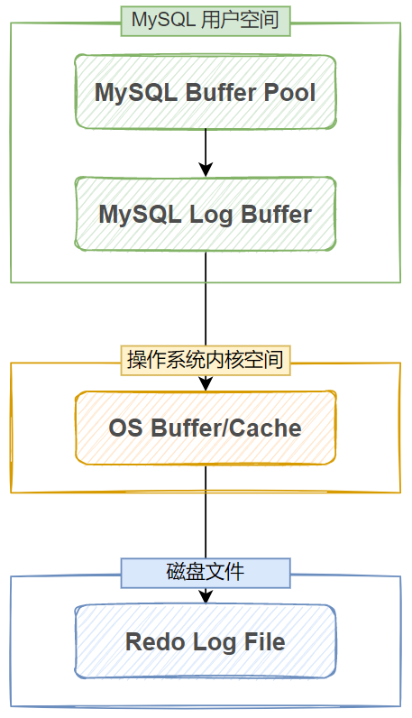

# MySQL性能优化和日志管理


## 服务器选项和系统变量
* https://dev.mysql.com/doc/refman/8.0/en/server-option-variable-reference.html
* https://dev.mysql.com/doc/refman/5.7/en/server-option-variable-reference.html
* https://mariadb.com/kb/en/variables-and-modes/

### 文档中表格标题说明：
- Cmd-Line      是否能在命令行下设置，就是在MySQL启动时候，放到命令行参数上的，例如: msyqld --basedir=/usr
- Option File   是否能写配置文件
- System Var    是否是系统变量
- Status Var    是否是状态变量
- Var Scope     变量作用范围
- Dynamic       是否能动态修改

### 额外说明：

- Cmd-Line 和 Opton File 列的值如果是 Yes，则表示该项是服务器选项
- System Var 列的值如果是 Yes，则表示该项是系统变量
- Status Var 列的值如果是 Yes，则表示该项是状态变量,状态变量一般用来读的，readonly
- Option File 指配置文件
- 服务器选项通常在命令行后面添加或在配置文件中设置
- 状态变量表示的是当前的一个状态值
- 变量生效范围有三种，分别是全局，会话，全局和会话，Var Scope 列对应的值分别是 Global，Session，Both
- Dynamic 列表示是否可以动态修改，如果该列值为 No，则表示不可修改，状态变量都不可修改，部份系统变量也不可修改
- 一个配置项可以同时是服务器选项，系统变量，状态变量这三种中的两种，但不会同时是三种角色

### 查看变量和设置变量

```bash
show variables like "%max%";
select @@sql_log_bin;
set sql_log_bin=0;  #session 变量
select @@log_bin;
select global 全局变量=值;
全局变量对所有会话生效
会话变量只对当前会话生效

具体可以设置哪些值可以查看官方文档
```


## index 索引
```bash
查看表索引
    show index from students \G

查看查询有没有使用索引
    explain select * from students where StuID=23 \G

创建索引
    create index index_name on students(name(10))
    create idnex index_age on students(age)

删除索引
    drop index index_age on students;
    drop index index_name on students;
```

### index失效和原理
```bash
index索引失效：
    使用LIKE操作符：如果LIKE操作符的模式以通配符开始，如LIKE '%abc'，索引通常会失效。
    NULL值的查询：某些情况下，对包含NULL值的列进行查询可能不会有效地使用索引
    使用OR条件：当查询使用OR条件连接不同的列时，如果这些列不都是同一个复合索引的一部分，索引可能失效。例如，SELECT * FROM table WHERE a = 10 OR b = 20;

index原理
    为某些字段创建索引，事实上，是为这些字段单独维护一个索引树，通过在索引树上进行查询，可以快速查找到目标值，然而，
    索引本身也不是没有成本的，它们需要占用额外的存储空间，且在插入、删除和更新数据时需要维护
```


## 事务

* 事务 Transactions：一组原子性的 SQL语句，或一个独立工作单元
* 事务日志：记录事务信息，实现undo,redo等故障恢复功能

### 事务特性(ACID)
* A：atomicity 原子性；整个事务中的所有操作要么全部成功执行，要么全部失败后回滚
* C：consistency一致性；数据库总是从一个一致性状态转换为另一个一致性状态
* I：Isolation隔离性；一个事务所做出的操作在提交之前，是不能为其它事务所见；隔离有多种隔离级别，实现并发
* D：durability持久性；一旦事务提交，其所做的修改会永久保存于数据库中


## 显示的事务管理
```bash
begin; #开启事务
commit; #提交事务
rollback; #回滚事务

只有mysql的innodb存储引擎的DML语句支持事务


查看当前进行的事务：
SELECT * FROM INFORMATION_SCHEMA.INNODB_TRX;

杀掉为完成的事务
    先查看进行的事务，找到事务线程id
    rx_mysql_thread_id: 11
    mysql> kill 11;
    Query OK, 0 rows affected (0.00 sec)

MySQL中，每次写操作都是一个事务操作，批量写时，可以将多次提交合并成一次提交，以加快执行速度
```

### 事务隔离级别

|隔离级别|脏读|不可重复读|幻读|加读锁|
|-------|----|---------|----|-----|
|读未提交|Y|Y|Y|N|
|读已提交|N|Y|Y|N|
|可重复读|N|N|Y|N|
|序列化|N|N|N|Y|

### MVCC和事务的隔离级别

MVCC（多版本并发控制机制）只在 READ COMMITTED 和 REPEATABLE READ 两个隔离级别下工作。
其他两个隔离级别都和 MVCC 不兼容，因为 READ UNCOMMITTED总是读取最新的数据行，而不是符
合当前事务版本的数据行。而SERIALIZABLE则会对所有读取的行都加锁


## 日志管理

### 事务日志
```bash
InnoDB 引擎使用 force log at commit 机制实现事务的持久性，即在事务提交的时候，必须先将与其相
关的日志写到磁盘上的 redo log file 和 undo log file 文件中进行持久化。
事务日志是连续的磁盘空间，因此IO是顺序的，性能比较高，可以保证数据及时写入事务日志。InnoDB 
引擎使用日志来减少提交事务时的开销。

redo log （重做日志）
    InnoDB 引擎对数据更新时，先将更新记录写入到 redo log 的 buffer 中，而后在系统空闲的时候或者是
    按照设定的更新策略再将日志中的内容更新到磁盘之中。然后再将 commit 的事务的相关数据落盘，也
    就是说，先写日志，再去修改对应的 MySQL 中的数据文件，这就是所谓的预写式技术（Write Ahead 
    logging）。如果事务在 commit 之后数据落盘时失败，则下次启动 MySQL 时，可以根据己经保存的 
    redo log 再次进行操作，保证 commit 提交成功。当然，如果 redo log 也写失败了，那么这段时间内的
    commit 就丢失了。redo log 通常是物理日志，用来保证事务的原子性，持久性。
    Redo log 是固定大小的，由一组文件组成（称为log file group），这些文件循环使用。文件名通常为ib_logfile0, ib_logfile1等

undo log（回滚日志）
    保存与执行的操作相反的操作，即记录某数据被修改前的值，可以用来在事务失败时进行回滚到某行记
    录的某个版本，其具体流程与 redo log 相似，也要先于 commit 数据落盘，更改对应的 MySQL 数据文
    件之前保存。undo log 通常是逻辑日志，用来保证事务的原子性， 帮助事务回滚以及MVCC功能。
    undo 日志文件也是反复循环使用的

查看redolog位置
show variables like '%innodb_log%';
| Variable_name                      | Value    |
|-------------------------------------|--------|
| innodb_log_file_size               | 50331648 | #每个事务日志大小48M
| innodb_log_files_in_group          | 2        | #两个事务日志
| innodb_log_group_home_dir          | ./       | #事务日志位置，这里表示datadir

更改位置redolog位置： 服务器选项
[mysqld]
innodb_log_group_home_dir=/ib_log/
```
#### 事务日志性能优化
    redo log 包含日志缓冲（redo log buffer）和磁盘上的日志文件（redo logfile）两部分
    MySQL 每执行新一条 DML 语句都会先将日志记录在 redo log buffer 中，然后再根据不同的配置项，
    使用不同的规则将 redo log buffer 中的数据落盘（写入到 redo log file）但是，redo log buffer 
    是用户空间的数据，无法直接写入磁盘，中间必须经过操作系统缓冲区（OS Buffer），因此，从 redo log buffer 
    到 redo log file，实际上会先写 OS Buffer，再调用 fsync() 将其刷入到 redo log file 中。


MySQL 通过 innodb_flush_log_at_trx_commit (服务器选项) 配置来控制 redo log 的落盘规则

- 0：延迟写，事务提交时会将数据写到 Log Buffer，但不会立即写 OS Buffer 和 Log File，而是每隔1S，批量的将数据写到 OS Buffer 并调用 fsync() 写磁盘文件。如果系统崩溃则会丢失 1S 的数据。
- 1：实时写，每次提交事务后都会将数据写入 OS Buffer 再写磁盘文件，这种方式几乎不会丢失数据，但性能较差
- 2：实时写，延时落盘，每次提交事务都会将数据写入 OS Buffer，但写磁盘也是 1S 执行一次，这是一个相对折中的方案。
### 错误日志

### 通用日志

### 慢查询日志

### 二进制日志

### 中继日志
