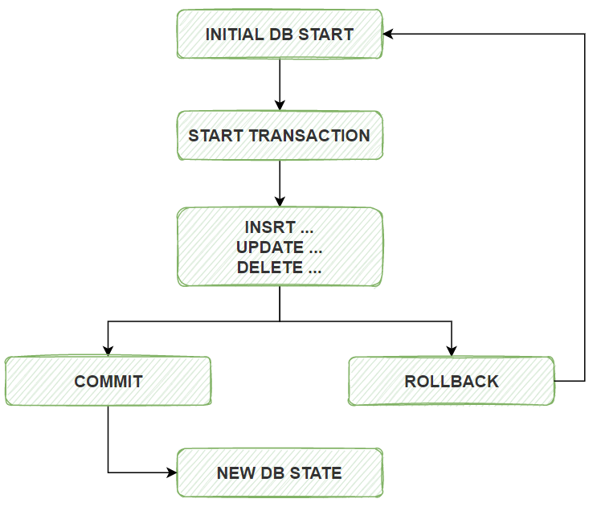

# MySQL性能优化和日志管理


## 服务器选项和系统变量
* https://dev.mysql.com/doc/refman/8.0/en/server-option-variable-reference.html
* https://dev.mysql.com/doc/refman/5.7/en/server-option-variable-reference.html
* https://mariadb.com/kb/en/variables-and-modes/

### 文档中表格标题说明：
- Cmd-Line      是否能在命令行下设置，就是在MySQL启动时候，放到命令行参数上的，例如: msyqld --basedir=/usr
- Option File   是否能写配置文件
- System Var    是否是系统变量
- Status Var    是否是状态变量
- Var Scope     变量作用范围
- Dynamic       是否能动态修改

### 额外说明：

- Cmd-Line 和 Opton File 列的值如果是 Yes，则表示该项是服务器选项
- System Var 列的值如果是 Yes，则表示该项是系统变量
- Status Var 列的值如果是 Yes，则表示该项是状态变量,状态变量一般用来读的，readonly
- Option File 指配置文件
- 服务器选项通常在命令行后面添加或在配置文件中设置
- 状态变量表示的是当前的一个状态值
- 变量生效范围有三种，分别是全局，会话，全局和会话，Var Scope 列对应的值分别是 Global，Session，Both
- Dynamic 列表示是否可以动态修改，如果该列值为 No，则表示不可修改，状态变量都不可修改，部份系统变量也不可修改
- 一个配置项可以同时是服务器选项，系统变量，状态变量这三种中的两种，但不会同时是三种角色

### 查看变量和设置变量

```bash
show variables like "%max%";
select @@sql_log_bin;
set sql_log_bin=0;  #session 变量
select @@log_bin;
select global 全局变量=值;
全局变量对所有会话生效
会话变量只对当前会话生效

具体可以设置哪些值可以查看官方文档
```


## index 索引
```bash
查看表索引
    show index from students \G

查看查询有没有使用索引
    explain select * from students where StuID=23 \G

创建索引
    create index index_name on students(name(10))
    create idnex index_age on students(age)

删除索引
    drop index index_age on students;
    drop index index_name on students;
```

### index失效和原理
```bash
index索引失效：
    使用LIKE操作符：如果LIKE操作符的模式以通配符开始，如LIKE '%abc'，索引通常会失效。
    NULL值的查询：某些情况下，对包含NULL值的列进行查询可能不会有效地使用索引
    使用OR条件：当查询使用OR条件连接不同的列时，如果这些列不都是同一个复合索引的一部分，索引可能失效。例如，SELECT * FROM table WHERE a = 10 OR b = 20;

index原理
    为某些字段创建索引，事实上，是为这些字段单独维护一个索引树，通过在索引树上进行查询，可以快速查找到目标值，然而，
    索引本身也不是没有成本的，它们需要占用额外的存储空间，且在插入、删除和更新数据时需要维护
```


## 事务

* 事务 Transactions：一组原子性的 SQL语句，或一个独立工作单元
* 事务日志：记录事务信息，实现undo,redo等故障恢复功能

### 事务特性(ACID)
* A：atomicity 原子性；整个事务中的所有操作要么全部成功执行，要么全部失败后回滚
* C：consistency一致性；数据库总是从一个一致性状态转换为另一个一致性状态
* I：Isolation隔离性；一个事务所做出的操作在提交之前，是不能为其它事务所见；隔离有多种隔离级别，实现并发
* D：durability持久性；一旦事务提交，其所做的修改会永久保存于数据库中



## 显示的事务管理
```bash
begin; #开启事务
commit; #提交事务
rollback; #回滚事务

只有mysql的innodb存储引擎的DML语句支持事务


查看当前进行的事务：
SELECT * FROM INFORMATION_SCHEMA.INNODB_TRX;

杀掉为完成的事务
    先查看进行的事务，找到事务线程id
    rx_mysql_thread_id: 11
    mysql> kill 11;
    Query OK, 0 rows affected (0.00 sec)


```

## 事务隔离级别
|隔离级别|脏读|不可重复读|幻读|加读锁|
|-------|----|---------|----|-----|
|读未提交|Y|Y|Y|N|
|读已提交|N|Y|Y|N|
|可重复读|N|N|Y|N|
|序列化|N|N|N|Y|
