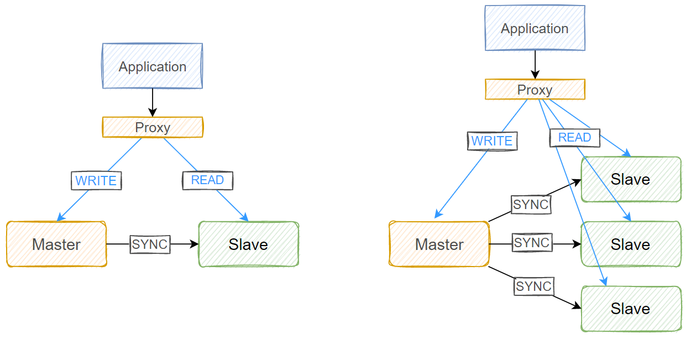
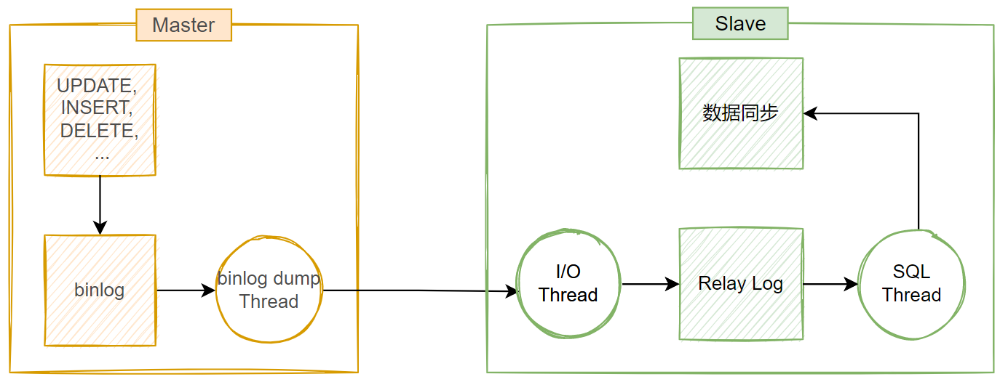
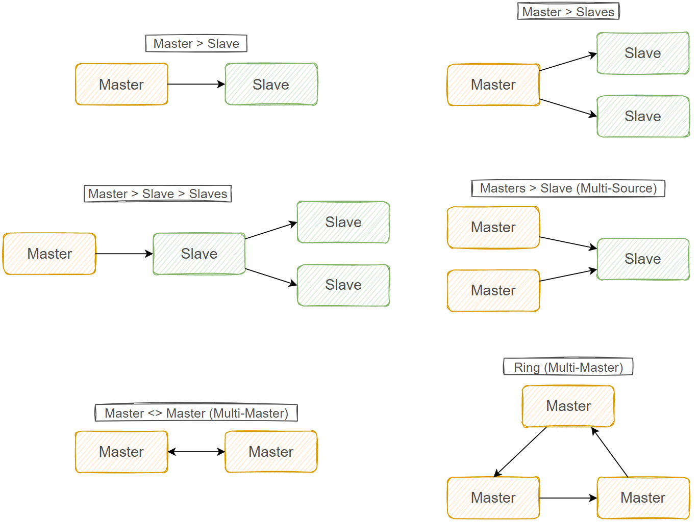
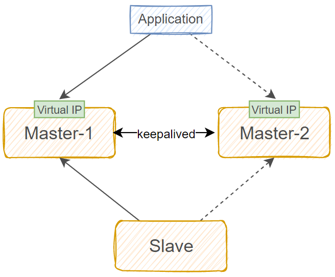
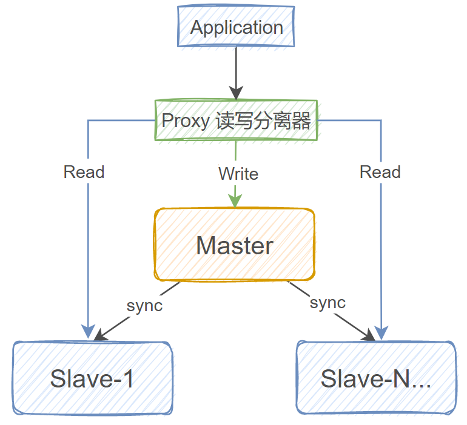
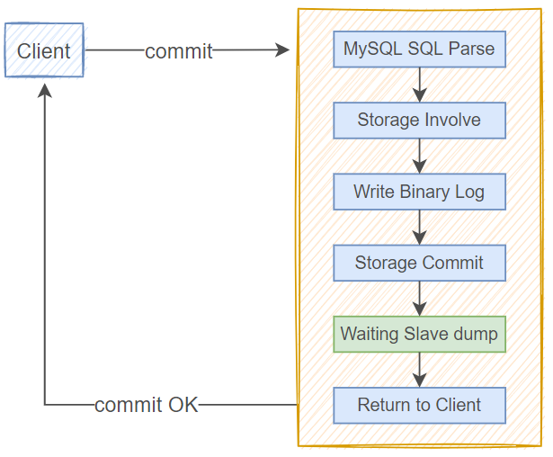
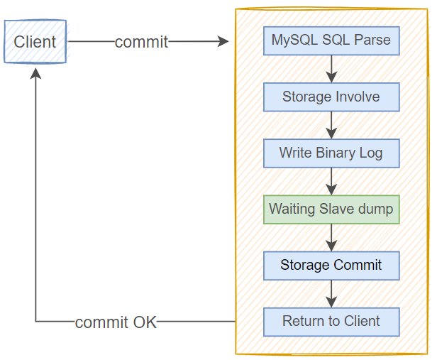

# MySQL备份还原和主从复制集群

## mysqldump备份

```bash
InnoDB建议备份策略
mysqldump -uroot -p123456 -A -F -E -R --triggers --single-transaction --master-data=2 --flush-privileges --default-character-set=utf8mb4 --hex-blob > backup.sql

#新版8.0.26以上
mysqldump -uroot -p123456 -A -F -E -R --triggers --single-transaction --source-data=2 --flush-privileges --default-character-set=utf8mb4 --hex-blob > backup.sql

-A #备份所有数据库
-F #刷新日志
-E #导出事件
-R #导出存储过程以及自定义函数
--triggers #导出触发器
--single-transaction #以开启事务的方式备份数据
--master-data=2 #备份文件中记录二进制日志信息的备份点，默认注释掉，适合单机
--source-data=1 #备份文件中记录二进制日志信息的备份点，不会注释掉，适合主从
--flush-privileges #导出后刷新权限
--default-character-set=utf8mb4 #设置字符集
--hex-blob #使用十六进制转储二进制

MyISAM建议备份策略
mysqldump -uroot -p123456 -A -F -E -R -x --master-data=1 --flush-privileges --triggers --default-character-set=utf8mb4 --hex-blob > backup.sql
#选项说明
-uroot #MySQL用户名
-p123456 #MySQL密码
-A #备份所有数据库
-F #刷新日志
-E #导出事件
-R #导出存储过程以及自定义函数
-x #加全局读锁，备份完会自动解锁
--triggers #导出触发器
--master-data=2 #备份日志信息
--flush-privileges #导出后刷新权限
--default-character-set=utf8 #设置字符集
--hex-blob #使用十六进制转储二进制

还原数据库
mysql -uroot -p123456 < backup.sql

在备份日志中记录备份时的二进制日志信息，后续通过此备份进行恢复，还是会缺少一部份数据，这一部份数据，则可以通过当前的二进制日志与备份文件中的二进制信息进行对比得到
```

## xtrabackup 备份工具
https://www.percona.com/downloads

XtraBackup8.0 适配 MySQL8.0 及以后的版本，XtraBackup2.4 适配 MySQL5.7 及以前的版本，要根据MySQ L的版本不同选择不同版本的 XtraBackup 来进行备份。

- 备份还原过程快速、可靠
- 备份过程不会打断正在执行的事务
- 能够基于压缩等功能节约磁盘空间和流量
- 自动实现备份检验
- 开源，免费

#### xtrabackup 实现完全备份和还原
```bash
#在需要备份的机器上
mkdir /backup/
xtrabackup -uuser1 -p123456 --backup --target-dir=/backup/base
#拷贝文件到远程主机上
rsync -r /backup root@10.0.0.164:/root/
#远程主机需要安装相同版本的xtrabackup，相同版本的MySQL

#执行还原前的整理，将备份时没提交的事务进行回滚
xtrabackup --prepare --target-dir=/root/backup/base

#mysql服务不能开启，数据目录不能有数据
systemctl is-active mysqld.service

#还原
xtrabackup --copy-back --target-dir=/root/backup/base --datadir=/var/lib/mysql


#修改权限
chown -R mysql.mysql /var/lib/mysql/*

#启动服务检查
systemctl start mysqld.service

还原前需要整理的原因是需要回滚部份不完整的事务
----|-----------|---------------|-------------|-------------------->
 备份开始     事务开始 备份结束 事务结束
================================|-------------|-------------------->
备份的数据中只有事务的开始，没有事务的结束，所以，如果直接还原，则是还原到了一个事务的中间状态，因此需要整理

#备份的文件夹里可以查看备份的相关信息
cat /backup/base/xtrabackup_info

uuid = 00cefafe-8d9a-11ed-a151-000c29b13f86
name =
tool_name = xtrabackup #备份工具 
tool_command = -uuser1 -p=... --backup --target-dir=/backup/base #参数，密码被替换
tool_version = 8.0.30-23 #备份工具版本
ibbackup_version = 8.0.30-23 #备份工具版本
server_version = 8.0.30 #MySQL版本
start_time = 2023-01-06 16:13:27 #开始备份时间
end_time = 2023-01-06 16:13:29 #结束时间
lock_time = 0 #锁表时长
binlog_pos = filename 'binlog.000007', position '157' #binlog文件和
pos位置信息
innodb_from_lsn = 0 #开始lsn号
innodb_to_lsn = 223560262 #结束lsn号
partial = N #不是部份备份
incremental = N #不是增量备份
format = file #以文件形式备份
compressed = N #不是压缩格式
encrypted = N #不加密


#检查点相关信息
cat /backup/base/xtrabackup_checkpoints

backup_type = full-backuped #完全备份
from_lsn = 0 #备份开始lsn号
to_lsn = 223560262 #备份结束lsn号
last_lsn = 223560262 #备份结束时最大
lsn号
flushed_lsn = 223560262 #
redo_memory = 360
redo_frames = 1

```

####  xtrabackup 实现增量备份和还原
```bash
#完全备份
-------|--------------|-------------|------------------->
 事务开始 备份结束 事务结束
#完全备份的数据
======================|-------------|--------------------->
#第一次增量备份
----------------------x------|-----------|-------------|---------->
 事务开始 备份结束 事务结束
  
#第一次增量备份的数据,包含了第完全备份没结束的事务 
----------------------x==================|-------------|---------->
#第二次增量备份
----------------------x------------------x-----|-------------|-------------|---->
 事务开始 备份结束 事务结束
#第二次增量备份的数据,包含了第一次增量备份没结束的事务
----------------------x------------------x===================|-------------|---->


数据还原时注意，还原顺序一定要正确，先还原完全备份的数据，再还原第一次增量备份的数据，再还
原第二次增量备份的数据，如果有多个增量备份，也是按照此规则进行还原。另外，在还原时，只有最
后一次的备份文件还原时需要进行事务回滚，之前的都不用回滚。


#完全备份
xtrabackup -uuser1 -p123456 --backup --target-dir=/backup/base

#第一次增量备份，基于/backup/base 做增量备份
xtrabackup -uuser1 -p123456 --backup --target-dir=/backup/inc1  --incremental-basedir=/backup/base

#第二增量备份，基于上一次的增量备份数据进行
xtrabackup -uuser1 -p123456 --backup --target-dir=/backup/inc2   --incremental-basedir=/backup/inc1

#拷贝远程主机还原

#整理全量备份数据，不回滚
xtrabackup --prepare --apply-log-only --targetdir=/root/backup/base
#整理第一次增量备份数据，不回滚
xtrabackup --prepare --apply-log-only --targetdir=/root/backup/base --incremental-dir=/root/backup/inc1

#整理第二次增量备份数据，需要回滚
xtrabackup --prepare --target-dir=/root/backup/base --incremental-dir=/root/backup/inc2

systemctl stop mysqld.service
rm -rf /var/lib/mysql/*
xtrabackup --copy-back --target-dir=/root/backup/base --datadir=/var/lib/mysql/
chown -R mysql.mysql /var/lib/mysql/*
systemctl start mysqld.service

```

#### xtrabackup 实现单表备份和还原
```bash
xtrabackup -uuser1 -p123456 --backup --target-dir=/backup/testdb_t1 --include='testdb.t1'
```

## MySQL集群

#### 主从复制架构

在主从复制架构中，将 MySQL 服务器分为主服务器(Master)和从服务器(Slave)两种角色，主服务器负
责数据写入(insert，update，delete，create 等)，从服务器负责提供查询服务(select 等)。

###### 主从复制的优点

* 负载均衡读操作：将读操作进行分流，由另外一台或多台服务器提供查询服务，降低 MySQL 负载，提升响应速度
* 数据库备份：主从节点上都有相同的数据集，从而也实现了数据库的备份
* 高可用和故障切换：主从架构由两个或多个服务节点构成，在某个节点不可用的情况下，可以进行转移和切换，保证服务可用
* MySQL升级：当 MySQL 服务需要升级时，由于主从架构中有多个节点，可以逐一升级，而不停止服务


###### 主从复制的缺点
* 数据延时：主节点上的数据需要经过复制之后才能同步到从节点上，这个过程需要时间，从而会造成主从节点之间的数据不一致
* 性能消耗：主从复制需要开启单独线程，会消耗一定资源
* 数据不对齐：如果主从复制服务终止，而且又没有第一时间恢复，则从节点的数据一直无法更新



###### 主从复制工作原理
1. MySQL 的主从复制架构中主要有三个线程：Master 节点上的 binlog dump thread 线程，Slave 节点上的 I/O thread 线程和 SQL thread 线程
2. Master 节点上会为每一个 Slave 节点上的 I/O thread 启动一个 dump thread，用来向其提供本机的二进制日志
3. Slave 节点上的 I/O thread 线程向 Master 节点请求该节点上的二进制日志，并将得到的内容写到当前节点上的 relay log 中
4. Slave 节点上的 SQL thread 实时监测 replay log 内容是否有更新，如果更新，则将该文件中的内容解析成SQL语句，还原到 Slave 节点上的数据库中去，这样来保证主从节点之间的数据同步
5. 总结起来 三个线程，两个日志



###### 各种复制架构


- Master > Slave 一主一从
- Master > Slaves 一主多从
- Master > Slave > Slaves 主>从>从 级联复制
- Masters > Slave 多主一从，分别从不同的主节点同步不同的数据库到从节点，要保证同一个库或表的数据只有一个来源。
- Master <> Master 双主架构互为主从，要保证不同的库或表在不同的节点上，即两个节点不要同时写一个库，双主加构一般配置为只写一个节点，这种架构的好处是可以随时将另一个节点设为主节点
- Ring 环状复制，使用较少

#### 主从复制配置过程
https://dev.mysql.com/doc/refman/8.0/en/replication-configuration.html  

https://dev.mysql.com/doc/refman/5.7/en/replication-configuration.html 

https://mariadb.com/kb/en/setting-up-replication/ 


```bash
master机器
    [mysqld]
    log_bin=/data/logbin/mysql-bin #启用二进制日志 
    server-id=N #N一般用ip的主机地址

    查看从二进制日志的文件和位置开始进行复制
    show master status;

    创建有复制权限的用户账号
    GRANT REPLICATION SLAVE ON *.* TO 'repluser'@'HOST' IDENTIFIED BY 'replpass';
    #MySQL8.0 分成两步实现
    mysql> create user repluser@'10.0.0.%' identified by '123456';
    mysql> grant replication slave on *.* to repluser@'10.0.0.%';


slave机器

    [mysqld]
    server_id=N #为当前节点设置一个全局惟的ID号
    log-bin #开启从节点二进制日志
    read_only=ON #设置数据库只读，针对supper user无效
    relay_log=relay-log #relay log的文件路径，默认值hostname-relay-bin
    relay_log_index=relay-log.index #默认值hostname-relay-bin.index

    使用有复制权限的用户账号连接至主服务器，并启动复制线程
    以下信息可以在mysql交互中help change master to; 查看
    #在从节点上执行下列SQL语，提供主节点地址和连接账号，用户名，密码，开始同步的二进制文件和位置等。
    CHANGE MASTER TO MASTER_HOST='masterhost', #指定master节点
    MASTER_USER='repluser', #连接用户
    MASTER_PASSWORD='replpass', #连接密码
    MASTER_LOG_FILE='mariadb-bin.xxxxxx', #从哪个二进制文件开始复制
    MASTER_LOG_POS=123; #指定同步开始的位置
    #MASTER_DELAY = interval; #可指定延迟复制实现防止误操作,单位秒，这里可以用作延时同步，一般用于备份


    START SLAVE [IO_THREAD|SQL_THREAD]; #启动同步线程
    STOP SLAVE #停止同步
    RESET SLAVE ALL #清除同步信息
    SHOW SLAVE STATUS; #查看从节点状态
    SHOW RELAYLOG EVENTS in 'relay-bin.00000x'; #查看relaylog 事件


    #可以利用 MASTER_DELAY 参数设置从节点延时同步，用作主从备份，比如设置一小时的延时，则主节点上
    的误操作，要一小时后才会同步到从服务器，可以利用时间差保存从节点数据

```

###### 现有数据一主一从实现
如果数据库在运行了一段时间后，己经产生了大量数据，或者重置了二进制日志，刷新了二进制日志的
情况下，我们要配置主从，则要保证将己有的数据先备份出来，导入到从节点之后，再开启主从同步


###### 级联复制实现
主从复制架构中，从节点从中继日志中读取到数据写入数据库后，该数据并不会写入到从节点的二进制
日志中，但是在级联同步架构中，有一个中间节点的角色，该节点从主节点中同步数据，并充当其它节
点的数据源，所以在此情况下，我们需要保证中间节点从主节点中同步过来的数据，同样也要写二进制
日志，否则后续节点无法获取数据。
在此架构中，中间节点要开启 log_slave_updates 选项，保证中间节点复制过来的数据也能写入二进制
日志，为其它节点提供数据源。

###### 主主复制实现
在双主模型中，两个节点互为主备，两个节点都要开启二进制日志，都要有写权限
双主架构在实际生产环境中，并不会配置为两个节点都去写数据，前端应用只会写一个节点，另一个节
点作为备份节点，如果当前使用的节点出问题，则IP地址会立即转移到另一个节点上，起到一个高可用
的作用，此时，如果有slave节点，在 slave 上要重新执行同步操作。


###### 半同步复制实现

mysql中的复制,应用程序或客户端向主节点写入数据，主节点给客户端返回写入成功或失败状态，从节点同步数据，这
几个事件的步骤和执行顺序不一样，意味着不同的同步策略，从而对MySQL的性能和数据安全性有着不
同的影响

**异步复制**

默认情况下，MySQL 中的复制是异步的，当客户端程序向主节点中写入数据后，主节点中数据落盘，写
入binlog日志，然后将binlog日志中的新事件发送给从节点 ，便向客户端返回写入成功，而并不验证从
节点是否接收完毕，也不等待从节点返回同步状态，这意味着客户端只能确认向主节点的写入是成功
的，并不能保证刚写入的数据成功同步到了从节点。此复制策略下，如果主从同步出现故障，则有可能
出现主从节点之间数据不一致的问题。甚至，如果在主节点写入数据后没有完成同步，主节点服务当
机，则会造成数据丢失。
异步复制不要求数据能成功同步到从节点，只要主节点完成写操作，便立即向客户端返回结果

**同步复制**

当客户端程序向主节点中写入数据后，主节点中数据落盘，写入binlog日志，然后将binlog日志中的新
事件发送给从节点 ，等待所有从节点向主节点返回同步成功之后，主节点才会向客户端返回写入成功。
此复制策略能最大限度的保证数据安全和主从节点之间的数据一致性，但此复制策略性能不高，需要在
所有从节点上完成数据同步之后，客户端才能获得返回结果。
此同步策略又称为全同步复制。

**半同步复制**

当客户端程序向主节点中写入数据后，主节点中数据落盘，写入binlog日志，然后将binlog日志中的新
事件发送给从节点 ，等待所有从节点中有一个从节点返回同步成功之后，主节点就向客户端返回写入成
功。此复制策略尽可能保证至少有一个从节点中有同步到数据，也能尽早的向客户端返回写入状态。
但此复制策略并不能百分百保证数据有成功的同步至从节点，因为可以在此策略下设至同步超时时间，
如果超过等待时间，即使没有任何一个从节点返回同步成功的状态，主节点也会向客户端返回写入成
功

MySQL5.5 版本为了保证主从数据的一致性问题，加入了半同步复制的组件(插件)，可以控制从库IO线程
是否将relaylog落盘，一旦落盘通过插件返回ACK给主库ACK_REC。接受到ACK之后，主库的事务才能提
交成功。在默认情况下，如果超过10秒没有返回ACK，此次复制行为会切换为异步复制

MySQL5.7 之前的半同步复制默认策略
`rpl_semi_sync_master_wait_point=after_commit`




在此半同步策略配置中，可能会出现下列问题：

1. 幻读：当客户端提交一个事务，该事务己经写入 redo log 和 binlog，但该事务还没有写入从节点，此时处在 Waiting Slave dump 处，此时另一个用户可以读取到这条数据，而他自己却不能。
2. 数据丢失：一个提交的事务在 Waiting Slave dump 处 crash后，主库将比从库多一条数据。

MySQL5.7 以及之后的半同步复制
`rpl_semi_sync_master_wait_point=after_sync`



在此半同步策略配置中，客户端的写操作先不提交事务，而是先写二进制日志，然后向从库从步数据，
由于在主节点上的事务还没提交，所以此时其它进程查不到当前的写操作，不会出现幻读的问题，而且
主节点要确认至少有一个从节点的数据同步成功了，再会提交事务，这样也保证了主从之间的数据一致
性，不会存在丢失数据的情况

###### 在 MySQL8.0 中实现半同步复制
```bash
#在 master节点上安装 master 插件
mysql> INSTALL PLUGIN rpl_semi_sync_master SONAME 'semisync_master.so';
Query OK, 0 rows affected, 1 warning (0.01 sec)

#查看是否成功 
show plugins;

#修改配置文件，开启插件
rpl_semi_sync_master_enabled
rpl_semi_sync_master_timeout=3000 #可以不写此项，默认10s超长


slave 节点配置
 INSTALL PLUGIN rpl_semi_sync_slave SONAME 'semisync_slave.so';
Query OK, 0 rows affected, 1 warning (0.01 sec)

#配置文件添加
rpl_semi_sync_slave_enabled

#其他配置跟主从配置一样

#信息查看
show global variables like '%semi%';
show global status like '%semi%';
```


###### 复制过滤器

复制过滤器是指让从节点仅复制指定的数据库，或指定数据库的指定表。

复制过滤器的实现有两种方式：

- 在 master 节点上使用服务器选项配置来实现：在 master 节点上配置仅向二进制日志中写入与特定数据库相关的事件
- 在 slave 节点上使用服务器选项或者是全局变量配置来实现：在 slave 节点上配置在读取 relay log 时仅处理指定的数据库或表

```bash
在 master 节点上配置实现

    优点：只需要在 master 节点上配置一次即可，不需要在 salve 节点上操作；减小了二进制日志中的数据量，能减少磁盘IO和网络IO。
    缺点：二进制日志中记录的数据不完整，如果当前节点出现故障，将无法使用二进制还原

    binlog-do-db=db1 #数据库白名单列表，不支持同时指定多个值，如果想实现多个数据库需多行实现
    binlog-do-db=db2
    binlog-ignore-db=db3 #数据库黑名单列表，不支持同时指定多个值，如果想实现多个数据库需多行实现
    binlog-ignore-db=db4


在 slave 节点上配置实现

    优点：master 节点中的所有数据都是全量写二进制日志，可以使用二进制日志恢复数据
    缺点：对于 slave 节点不需要保存的数据，也会通过网络传输过来，这样会对磁盘IO和网络IO都有影响，而且，在有多个 slave节点时，每一个 slave 节点都需要配置

    replicate-do-db=db1 #指定复制库的白名单，每行指定一个库，多个库写多行
    replicate-do-table=tab1 #指定复制表的白名单，每行指定一个表，多个表写多行
    replicate-ignore-db=db1 #指定复制表的黑名单，每行指定一个库，多个库写多行
    replicate-ignore-table=tab1 #指定复制表的黑名单，每行指定一个表，多个表写多行
    replicate-wild-do-table=foo%.bar% #指定复制表的白名单，支持通配符，每行指定一个规则，多个规则写多行 
    replicate-wild-ignore-table=foo%.bar%   #指定复制表的黑名单，支持通配符，每行指定一个规则，多个规则写多行

```

###### GTID 复制
GTID（global transaction ID）：全局事务ID
GTID 是一个己提交的事务的编号，由当前 MySQL 节点的 server-uuid 和每个事务的 transacton-id 联
合组成，每个事务的 transacton-id 唯一，但仅只在当前节点唯一，server-uuid 是在每个节点自动随机
生成，能保证每个节点唯一。基于此，用 server-uuid 和 transacton-id 联合的 GTID 也能保证全局唯一

开启 GTID 功能可以支持多 DUMP 线程的并发复制，而且 MySQL5.6 实现了基于库级别多 SQL 线程并
发。在 MySQL5.7 利用 GTID 的 Logic clock 逻辑时钟。保证了同库级别下的事务顺序问题。即可以实现
基于事务级别的并发回放。从而大大减少了同步的延迟。

利用 GTID 复制不像传统的复制方式（异步复制、半同步复制）需要找到 binlog 文件名和 POS 点，只
需知道 master 节点的 IP、端口、账号、密码即可。开启 GTID 后，执行 change master to 
master_auto_postion=1 即可，它会自动寻找到相应的位置开始同步

MySQL5.6 版本出现没有默认开启，5.7 中即使不开启也有匿名的 GTID 记录


**GTID 优点：**

* GTID 使用 master_auto_position=1 代替了基于 binlog 和 position 号的主从复制搭建的方式，更便于主从复制的搭建
* GTID 可以知道事务在最开始是在哪个实例上提交的，保证事务全局统一
* 截取日志更加方便。跨多文件，判断起点终点更加方便
* 传输日志，可以并发传输。SQL 回放可以更高并发
* 判断主从工作状态更加方便

```bash
主节点：
    gtid_mode=ON #gtid模式
    enforce_gtid_consistency=ON #保证GTID安全


从节点
        gtid_mode=ON #gtid模式
        enforce_gtid_consistency=ON 
        replica_parallel_type=LOGICAL_CLOCK
        replica_parallel_workers = N  #并发线程数


从节点change_master_to为以下：
CHANGE MASTER TO
  MASTER_HOST='10.0.0.3',
  MASTER_USER='replication',
  MASTER_PASSWORD='123456',
  MASTER_PORT=3306,
  MASTER_AUTO_POSITION=1;
```

###### [参考使用GTID和半同步复制的脚本](../Scripts/config-mysql-master-slave/config_mysql_master_slave.sh)


#### 主从复制的监控和维护

###### 清理日志或重置slave配置
```bash
PURGE { BINARY | MASTER } LOGS { TO 'log_name' | BEFORE datetime_expr }
RESET MASTER TO N #mysql 不支持
RESET SLAVE [ALL]
```

###### 查看同步状态
```bash
SHOW MASTER STATUS
SHOW BINARY LOGS
SHOW BINLOG EVENTS
SHOW SLAVE STATUS
SHOW PROCESSLIST
```

###### 从服务器是否落后于主服务
```bash
mysql> show slave status\G
Seconds_Behind_Master：0
```

###### 如何确定主从节点数据是否一致
```bash
第三方工具 percona-toolkit
https://www.percona.com/software/database-tools/percona-toolkit
```

###### 数据不一致如何修复
```bash
重置主从关系，从新复制
```

####  主从复制中常见问题和解决方案

###### 数据损坏或丢失
- 如果是 slave 节点的数据损坏或丢失，重置数据库，重新同步复制即可
- 如果要防止 master 节点的数据损坏或丢失，则整个主从复制架构可以用 MHA+半同步来实现，在master 节点不可用时，提升一个 salve 节点为新的 master 节点

###### 在环境中出现了不唯一的 server-id

可手动修改 server-id 至唯一，再次重新复制

###### 主从复制出现延迟
- 升级到 MySQL5.7 以上版本(5.7之前的版本，没有开 GTID 之前，主库可以并发事务，但是 dump 传输时是串行)利用 GTID( MySQL5.6需要手动开启，MySQL5.7 以上默认开启)支持并发传输 binlog 及并行多个 SQL 线程。
- 减少大事务，将大事务拆分成小事务
- 减少锁
- sync_binlog=1 加快 binlog 更新时间，从而加快日志复制
- 需要额外的监控工具的辅助
- 多线程复制：对多个数据库复制
- 一从多主：Mariadb10 版后支持

###### 主从节点数据不一致

**常见原因**

- 主库 binlog 格式为 Statement，同步到从库执行后可能造成主从不一致。
- 主库执行更改前有执行set sql_log_bin=0，会使主库不记录 binlog，从库也无法变更这部分数据。
- 从节点未设置只读，误操作写入数据
- 主库或从库意外宕机，宕机可能会造成 binlog 或者 relaylog 文件出现损坏，导致主从不一致
- 主从实例版本不一致，特别是高版本是主，低版本为从的情况下，主数据库上面支持的功能，从数据库上面可能不支持该功能
- 主从 sql_mode 不一致
- MySQL 自身 bug 导致

**解决方案**

- 将从库重新实现：虽然这是一种解决方法，但此方案恢复时间较慢，而且有时候从库也是承担一部分的查询操作的，不能贸然重建。
- 使用 percona-toolkit 工具辅助：PT 工具包中包含 pt-table-checksum 和 pt-table-sync 两个工具，主要用于检测主从是否一致以及修复数据不一致情况。这种方案优点是修复速度快，不需要停止主从辅助，缺点是需要会使用该工具，关于使用方法，可以参考下面链接：https://www.cnblogs.com/feiren/p/7777218.html
- 手动重建不一致的表：在从库发现某几张表与主库数据不一致，而这几张表数据量也比较大，手工比对数据不现实，并且重做整个库也比较慢，这个时候可以只重做这几张表来修复主从不一致。这种方案缺点是在执行导入期间需要暂时停止从库复制，不过也是可以接受的。


