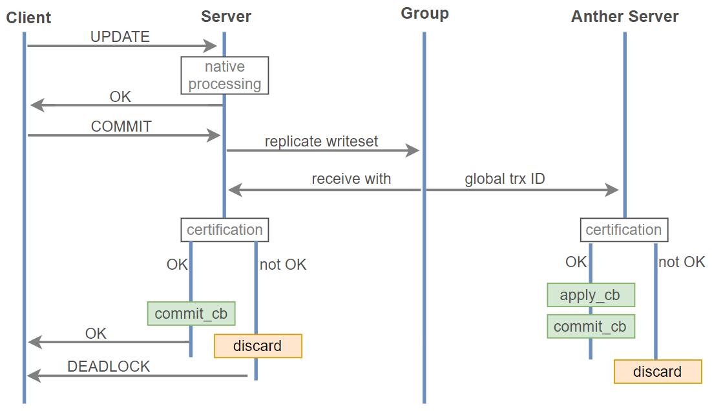

# MySQL读写分离和高可用集群

## mycat 

需要注意: 在生产环境中, Mycat 节点最好使用双节点, 即双机热备环境, 防止Mycat这一层出现单点故障

可以使用的高可用集群方式有:

* Keepalived+Mycat+Mysql
* Keepalived+LVS+Mycat+Mysql
* Keepalived+Haproxy+Mycat+Mysql

##### mycat安装和配置

```bash
#!/bin/bash

set -u
set -e

#################注意#####################
#需要在主服务器上创建mycat的连接管理账号
#################注意#####################
#mycat 端口和数据库设置可以在  ./schema.xml 和 ./server.xml 修改


#MASTER=10.0.0.8
#mysql -uroot  -h $MASTER -e "create user root@'10.0.0.%' identified by '123456' "
#mysql -uroot  -h $MASTER -e "grant all on *.* to root@'10.0.0.%'"

MYCAT=Mycat-server-1.6.7.6-release-20210303094759-linux
DIR=/apps/
yum install -y java

[ -e $DIR ] && rm -rf $DIR 
mkdir -p $DIR

tar xf ${MYCAT}.tar.gz  -C $DIR
echo "PATH+=:${DIR}/mycat/bin" > /etc/profile.d/mycat.sh
source /etc/profile.d/mycat.sh

cat > ${DIR}/mycat/conf/server.xml  ./server.xml
cat > ${DIR}/mycat/conf/schema.xml  ./schema.xml
mycat start

```

[具体详见脚本](../Scripts/config_mycat/)


## ProxySQL 实现 MySQL 读写分离


## MHA 主节点高可用


**MHA工作原理**


- MHA利用 SELECT 1 As Value 指令判断 master 服务器的健康性，一旦 master 宕机，MHA 从宕 机崩溃的 master 保存二进制日志事件（binlog events）
- 识别含有最新更新的 slave
- 应用差异的中继日志（relay log）到其他的 slave
- 应用从 master 保存的二进制日志事件（binlog events）到所有 slave 节点
- 提升一个 slave 为新的 master
- 使其他的 slave 连接新的 master 进行复制
- 故障服务器自动被剔除集群(masterha_conf_host)，将配置信息去掉
- 旧的 Master的 VIP 漂移到新的 master上，用户应用就可以访问新的 Master
- MHA 是一次性的高可用性解决方案，Manager 会自动退出


##### 选举新的 Master
- 如果设定权重(candidate_master=1)，按照权重强制指定新主，但是默认情况下如果一个 slave 落后 master 二进制日志超过 100M 的relay logs，即使有权重，也会失效，如果设置check_repl_delay=0，即使落后很多日志，也强制选择其为新主
- 如果从库数据之间有差异，最接近于 Master 的 slave 成为新主
- 如果所有从库数据都一致,按照配置文件顺序最前面的当新主

##### 数据恢复
- 当主服务器的 SSH 还能连接，从库对比主库 position 或者 GTID 号，将二进制日志保存至各个从节点并且应用(执行save_binary_logs 实现)
- 当主服务器的 SSH 不能连接，对比从库之间的 relaylog 的差异(执行apply_diff_relay_logs[实现])

注意：为了尽可能的减少主库硬件损坏宕机造成的数据丢失，因此在配置 MHA 的同时建议配置成 MySQL 的半同步复制

##### MHA 实现 MySQL 高可用

```bash
1.下载manager 和 node 软件（manager 只能安装在centos7 node可以安装在centos8）
https://github.com/yoshinorim/mha4mysql-manager/releases/tag/v0.58
https://github.com/yoshinorim/mha4mysql-node/releases/tag/v0.58

mha-manager 节点上安装 manager 包和 node 包

在所有 mysql 节点上安装 node 包


在所有节点实现基于 ssh-key 的免密登录


在 mha-manager 节点创建相关配置文件
[root@manager ~]# cat /etc/mastermha/app1.cnf 
[server default]
check_repl_delay=0
manager_log=/data/mastermha/app1/manager.log
manager_workdir=/data/mastermha/app1
master_binlog_dir=/var/lib/mysql/
master_ip_failover_script=/usr/local/bin/master_ip_failover.sh
password=123456
ping_interval=1
remote_workdir=/data/mastermha/app1/
repl_password=123456
repl_user=replication
report_script=/usr/local/bin/sendmail.sh
ssh_user=root
user=root


[server1]
candidate_master=1
hostname=10.0.0.8

[server2]
candidate_master=1
hostname=10.0.0.7

[server3]
hostname=10.0.0.9


#告警消息脚本（需要安装yum install mailx postfix 配置邮件发送）
[root@manager ~]# cat /usr/local/bin/sendmail.sh 
echo "mha is failover" | mail -s "MHA Warning" "shayzhu@126.com"
#给执行权限


#配置失败转义脚本
[root@manager ~]# cat /usr/local/bin/master_ip_failover.sh 
#!/usr/bin/env perl

#  Copyright (C) 2011 DeNA Co.,Ltd.
#
#  This program is free software; you can redistribute it and/or modify
#  it under the terms of the GNU General Public License as published by
#  the Free Software Foundation; either version 2 of the License, or
#  (at your option) any later version.
#
#  This program is distributed in the hope that it will be useful,
#  but WITHOUT ANY WARRANTY; without even the implied warranty of
#  MERCHANTABILITY or FITNESS FOR A PARTICULAR PURPOSE.  See the
#  GNU General Public License for more details.
#
#  You should have received a copy of the GNU General Public License
#   along with this program; if not, write to the Free Software
#  Foundation, Inc.,
#  51 Franklin Street, Fifth Floor, Boston, MA  02110-1301  USA

## Note: This is a sample script and is not complete. Modify the script based on your environment.

use strict;
use warnings FATAL => 'all';

use Getopt::Long;
use MHA::DBHelper;

my (
  $command,        $ssh_user,         $orig_master_host,
  $orig_master_ip, $orig_master_port, $new_master_host,
  $new_master_ip,  $new_master_port,  $new_master_user,
  $new_master_password
);
my $vip = '10.0.0.250/24';   ##这个地方是VIP，修改为自己的
my $key = "1";
my $ssh_start_vip = "/sbin/ifconfig eth0:$key $vip";
my $ssh_stop_vip = "/sbin/ifconfig eth0:$key down";

GetOptions(
  'command=s'             => \$command,
  'ssh_user=s'            => \$ssh_user,
  'orig_master_host=s'    => \$orig_master_host,
  'orig_master_ip=s'      => \$orig_master_ip,
  'orig_master_port=i'    => \$orig_master_port,
  'new_master_host=s'     => \$new_master_host,
  'new_master_ip=s'       => \$new_master_ip,
  'new_master_port=i'     => \$new_master_port,
  'new_master_user=s'     => \$new_master_user,
  'new_master_password=s' => \$new_master_password,
);

exit &main();

sub main {
  if ( $command eq "stop" || $command eq "stopssh" ) {

    # $orig_master_host, $orig_master_ip, $orig_master_port are passed.
    # If you manage master ip address at global catalog database,
    # invalidate orig_master_ip here.
    my $exit_code = 1;
    eval {

      # updating global catalog, etc
      $exit_code = 0;
    };
    if ($@) {
      warn "Got Error: $@\n";
      exit $exit_code;
    }
    exit $exit_code;
  }
    elsif ( $command eq "start" ) {

        # all arguments are passed.
        # If you manage master ip address at global catalog database,
        # activate new_master_ip here.
        # You can also grant write access (create user, set read_only=0, etc) here.
        my $exit_code = 10;
        eval {
            print "Enabling the VIP - $vip on the new master - $new_master_host \n";
            &start_vip();
            &stop_vip();
            $exit_code = 0;
        };
        if ($@) {
            warn $@;
            exit $exit_code;
        }
        exit $exit_code;
    }
    elsif ( $command eq "status" ) {
        print "Checking the Status of the script.. OK \n";
        `ssh $ssh_user\@$orig_master_host \" $ssh_start_vip \"`;
        exit 0;
    }
    else {
        &usage();
        exit 1;
    }
}


sub start_vip() {
    `ssh $ssh_user\@$new_master_host \" $ssh_start_vip \"`;
}
# A simple system call that disable the VIP on the old_master 
sub stop_vip() {
   `ssh $ssh_user\@$orig_master_host \" $ssh_stop_vip \"`;
}


sub usage {
  print
"Usage: master_ip_failover --command=start|stop|stopssh|status --orig_master_host=host --orig_master_ip=ip --orig_master_port=port --new_master_host=host --new_master_ip=ip --new_master_port=port\n";
}

chmod a+x /usr/local/bin/master_ip_failover

#在 master 节点配置 VIP，此IP会在不同 MySQL 节点上漂移
ifconfig eth0:1 10.0.0.100/24


#接着配置mysql的主从节点，配置跟之前一样


mha-manager 节点上检查环境
masterha_check_ssh --conf=/etc/mastermha/app1.cnf
masterha_check_repl --conf=/etc/mastermha/app1.cnf
masterha_check_status --conf=/etc/mastermha/app1.cnf


启动MHA
#开启MHA,默认是前台运行,生产环境一般为后台执行
nohup masterha_manager --conf=/etc/mastermha/app1.cnf --remove_dead_master_conf --ignore_last_failover &> /dev/null 

#测试环境：
masterha_manager --conf=/etc/mastermha/app1.cnf --remove_dead_master_conf --ignore_last_failover

#如果想停止后台执行的MHA,可以执行下面命令
masterha_stop --conf=/etc/mastermha/app1.cnf 

#查看状态
masterha_check_status --conf=/etc/mastermha/app1.cnf 
```

[具体配置参见脚本](../Scripts/config-mha-master-slave/)


##### 修复主从

```bash
修复故障的主库,保证数据同步
修复主从,手动将新故障库加入新的主,设为为从库
修复manager的配置文件
清理相关目录
检查ssh互信和replication的复制是否成功
检查VIP,如果有问题,重新配置VIP
重新运行MHA,查询MHA状态,确保运行正常
```


##### 如果再次运行MHA,需要先删除下面文件

```bash
MHA只能漂移一次，如果多次使用必须删除以下文件，要不MHA不可重用

[root@mha-manager ~]#rm -rf /data/mastermha/app1/       #mha_master自己的工作路径
[root@mha-manager ~]#rm -rf /data/mastermha/app1/manager.log     #mha_master自己的日志文件
[root@master ~]#rm -rf /data/mastermha/app1/     #每个远程主机即三个节点的的工作目录
```


##  Galera Cluster

Galera Cluster：集成了 Galera 插件的 MySQL 集群，是一种新型的，数据不共享的，高度冗余的高可
用方案，目前 Galera Cluster 有两个版本，分别是 Percona Xtradb Cluster 及 MariaDB Cluster，
Galera 本身是具有多主特性的，即采用 multi-master 的集群架构，是一个既稳健，又在数据一致性、
完整性及高性能方面有出色表现的高可用解决方案

#### Galera Cluster 特点


- 多主架构：真正的多点读写的集群，在任何时候读写数据，都是最新的
- 同步复制：改善了主从复制延迟问题，基本上达到了实时同步
- 并发复制：从节点APPLY数据时，支持并行执行，更好的性能
- 故障切换：在出现数据库故障时，因支持多点写入，切换容易
- 热插拔：在服务期间，如果数据库挂了，只要监控程序发现的够快，不可服务时间就会非常少。在节点故障期间，节点本身对集群的影响非常小
- 自动节点克隆：在新增节点，或者停机维护时，增量数据或者基础数据不需要人工手动备份提供，
- Galera Cluster会自动拉取在线节点数据，最终集群会变为一致
- 对应用透明：集群的维护，对应用程序是透明的

#### Galera Cluster 缺点

- 任何更新事务都需要全局验证通过，才会在其他节点执行，则集群性能由集群中最差性能节点决定（一般集群节点配置都是一样的）
- 新节点加入或延后较大的节点重新加入需全量拷贝数据 (SST，State Snapshot Transfer)，作为donor ( 贡献者，如： 同步数据时的提供者) 的节点在同步过程中无法提供读写
- 只支持 innodb 存储引擎的表

#### Galera Cluster 复制工作原理

Galera复制是一种基于验证的复制，基于验证的复制使用组通信和事务排序技术实现同步复制。它通过
广播并发事务之间建立的全局总序来协调事务提交。简单说就是事务必须以相同的顺序应用于所有实
例。事务在本节点乐观执行，然后在提交时运行一个验证过程以保证全局数据一致性。所谓乐观执行是
指，事务在一个节点提交时，被认为与其它节点上的事务没有冲突，首先在本地执行，然后再发送到所
有节点做冲突检测，无冲突时在所有节点提交，否则在所有节点回滚




#### Galera Cluster 包括两个组件

- Galera replication library (galera-3)
- WSREP：MySQL extended with the Write Set Replication

WSREP 实现

- PXC：Percona XtraDB Cluster，是 Percona 对 Galera 的实现
- MariaDB Galera Cluster

注意：两者都需要至少三个节点，不能安装 mysql server 或 mariadb-server

#### PXC 最常使用如下4个端口号：

- 3306：数据库对外服务的端口号
- 4444：请求SST的端口号
- 4567：组成员之间进行沟通的端口号
- 4568：用于传输IST的端口号


## MySQL 压力测试

### 使用 mysqlslap 进行压力测试

mysqlslap 来自于 mysql 或 mariadb 包，测试的过程默认生成一个 mysqlslap 的 schema，生成测试
表 t1，查询和插入测试数据，
mysqlslap 库自动生成，如果已经存在则先删除。用 --only-print 来打印实际的测试过程，整个测试完
成后不会在数据库中留下痕迹

```bash
mysqlslap [OPTIONS]
#常用选项
-?|--help #显示帮助
-V|--version #显示版本信息
-h|--host=name #服务器地址
-p|--password[=name] #连接密码
-P|--port=N #端口
-a|--auto-generate-sql #自行生成测试表和数据，测试结束后会被删除
-x|--number-char-cols=N #自动生成的测试表中包含多少个字符类型的列，默认1
-y|--number-int-cols=N #自动生成的测试表中包含多少个数字类型的列，默认1
-q|--query=sql #执行自定义SQL语句
-S|--socket=name #指定连接使用的socket文件
-c|--concurrency=N #表示并发量，即模拟多少个客户端同时执行
select，可指定多个值， #以逗号或者--delimiter参数指定值做为分隔符,如
--concurrency=100,200,500
-i|--iterations=N #测试执行的迭代次数，代表要在不同并发环境下，各自运行测试多少次
-e|--engine=name #要测试的引擎，可以有多个，用分隔符隔开。例如 --
engines=myisam,innodb


-C|--compress #如果服务器和客户端都支持压缩，则压缩信息
--print-defaults #在终端输出默认选项和参数
--only-print #只打印测试语句而不实际执行
--commint=N #多少次DML后提交一次事务
--detach=N #执行N条语句后断开重连
--no-drop #测试完成后不删除测试库
--create-schema=name #自定义测度库名称
--number-of-queries=N #总的测试查询次数(并发客户数乘以每客户查询次数)
--auto-generate-sql-add-autoincrement #在测试数据表中增加 auto_increment 列，从mysql 5.1.18版本开始支持
--auto-generate-sql-load-type=name #测试类型 mixed|update|write|key, 默认为mixed

```