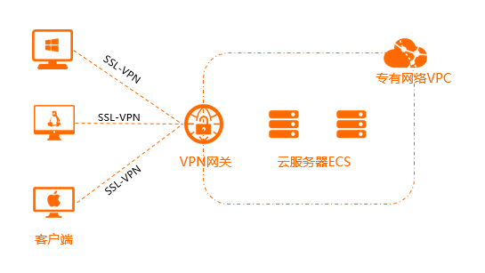
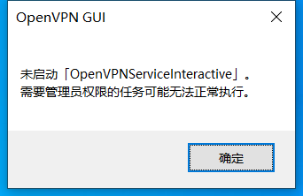
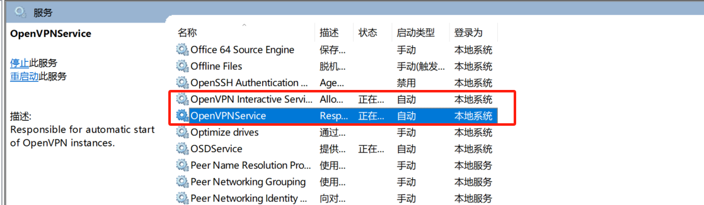

# OpenVPN 安装和配置

Virtual Private Network，虚拟私有网络，或称为虚拟专用网络，常用于在公用网络上实现专用网络功
能，为了安全通常需要进行加密通讯。此方式在企业网络中有广泛应用。VPN网关通过对数据包的加密
和数据包目标地址的转换实现远程访问。VPN功能可通过服务器、网络硬件、软件等多种方式实现


OpenVPN 是一个基于 OpenSSL 库的应用层 VPN 实现。和传统 VPN 相比，它的优点是简单易用

https://openvpn.net/  openvpn 官网

https://openvpn.net/community-downloads/   openpn windown客户端社区版下载

## VPN 常见应用模式

### 点对站点 peer to site



### 站点对站点 site to site


## OPEN VPN 部署

```bash
#!/bin/bash

set -u
set -e


PUSH_INNER_NET="192.168.10.0 255.255.255.0"
VPN_NET="10.8.0.0 255.255.255.0"
HOST_IP=10.0.0.3

setup_server()
{

    #安装openvpn客户端
    yum -y install openvpn easy-rsa
    #拷贝easy-rsa的证书颁发的相关模板文件目录到openvpn的配置文件目录下
    cp -r /usr/share/easy-rsa/3/ /etc/openvpn/easy-rsa
    cp /usr/share/doc/easy-rsa/vars.example  /etc/openvpn/easy-rsa/vars
    #ca 证书有效年100年，等下需要用vars这个文件里面定义的变量值来生成证书申请文件
    sed -ri "s/^#(set_var EASYRSA_CA_EXPIRE).*/\1      36500/" /etc/openvpn/easy-rsa/vars
    #服务器证书默为为825天,可适当加长,比如:3650天
    sed -ri "s/^#(set_var EASYRSA_CERT_EXPIRE).*/\1   3650/" /etc/openvpn/easy-rsa/vars
    cd /etc/openvpn/easy-rsa
    #初始化PKI生成PKI相关目录和文件，PKI 公共密码体系
    ./easyrsa init-pki
    #创建 CA 机构证书环境,生成自签名ca证书
    ./easyrsa build-ca nopass <<EOF

EOF

#创建服务端证书申请，其中server是文件前缀
./easyrsa gen-req server nopass <<EOF

EOF


#颁发服务端证书
#第一个server表示证书的类型,第二个server表示请求文件名的前缀
./easyrsa sign server server <<EOF
yes
EOF
    # 创建 Diffie-Hellman 密钥
    ./easyrsa  gen-dh
    #将CA和服务器证书相关文件复制到服务器相应的目录
    cp /etc/openvpn/easy-rsa/pki/ca.crt /etc/openvpn/server/
    cp /etc/openvpn/easy-rsa/pki/issued/server.crt  /etc/openvpn/server
    cp /etc/openvpn/easy-rsa/pki/private/server.key /etc/openvpn/server
    cp /etc/openvpn/easy-rsa/pki/dh.pem /etc/openvpn/server
#配置 OpenVPN 服务器并启动服务
#cp /usr/share/doc/openvpn/sample/sample-config-files/server.conf /etc/openvpn/
cat > /etc/openvpn/server.conf <<EOF
port 1194
proto tcp
dev tun
ca  /etc/openvpn/server/ca.crt
cert /etc/openvpn/server/server.crt
key /etc/openvpn/server/server.key  # This file should be kept secret
dh /etc/openvpn/server/dh.pem
server ${VPN_NET}
push "route ${PUSH_INNER_NET}"
keepalive 10 120
cipher AES-256-CBC
compress lz4-v2
push "compress lz4-v2"
max-clients 2048
user openvpn
group openvpn
status       /var/log/openvpn/penvpn-status.log
log-append   /var/log/openvpn/openvpn.log
verb 3
mute 20
EOF

#把日志文件夹创建出来，并修改相对应的权限
    mkdir -p /var/log/openvpn/
    chown openvpn:openvpn -R /var/log/openvpn/

#红帽8系列需要增加service文件，7版本里面带的有，不需要加
cat > /lib/systemd/system/openvpn@.service <<EOF
[Unit]
Description=OpenVPN Robust And Highly Flexible Tunneling Application On %I
After=network.target

[Service]
Type=notify
PrivateTmp=true
ExecStart=/usr/sbin/openvpn --cd /etc/openvpn/ --config %i.conf

[Install]
WantedBy=multi-user.target
EOF

systemctl daemon-reload 
systemctl enable --now openvpn@server.service  #注意，启动和停止用的service文件是openvpn@server.server这个文件

}


#下面是为客户端申请证书和创建客户端的配置文件，然后打包之后，需要发给客户端

setup_client()
{
    cd  /etc/openvpn/easy-rsa/
    read -r -p "客户端名字(字母组合): " NAME
    read -r -p "客户端证书过期时间(单位:天): " CLIENT_EXPIRE

    #准备客户端证书环境
    # 修改客户端证书有效期
    sed -ri "s/^(set_var EASYRSA_CERT_EXPIRE).*/\1   $CLIENT_EXPIRE/" /etc/openvpn/easy-rsa/vars
#创建客户端证书申请
/etc/openvpn/easy-rsa/easyrsa gen-req $NAME  nopass <<EOF

EOF


# 颁发客户端证书
/etc/openvpn/easy-rsa/easyrsa sign client $NAME <<EOF
yes
EOF

#将客户端私钥与证书相关文件复制到服务器相关的目录
mkdir -p /etc/openvpn/client/$NAME/
find /etc/openvpn/easy-rsa/ \( -name "$NAME.crt" -o -name "$NAME.key" -o -name "ca.crt" \)  -exec cp {} /etc/openvpn/client/$NAME/ \;

#准备 OpenVPN 客户端配置文件
cat  > /etc/openvpn/client/$NAME/client.ovpn <<EOF

client
dev tun
proto tcp
remote $HOST_IP  1194
resolv-retry infinite
nobind
ca ca.crt
cert ${NAME}.crt
key ${NAME}.key
remote-cert-tls server
cipher AES-256-CBC
verb 3
compress lz4-v2

EOF

mkdir -p ../client-tar/$NAME/
tar zcf  ../client-tar/$NAME/${NAME}.tar.gz   ../client/${NAME}/ 
}

MENU="
配置VPN服务器
产生客户端配置
退出
"
PS3="请选择: "
select item in  $MENU; do 
    case $(tr -d " " <<<"$REPLY") in
        1)
            setup_server
            ;;
        2)
            setup_client
            ;;
        3) 
            exit
            ;;
        *) 
            echo "无对应操作"
            ;;
    esac
done

```

### tun 设备 和 tap 设备

###### TUN 设备：
* 类型：网络层虚拟网络设备。
* 传输数据：IP 数据包。
* 应用场景：创建路由/点对点的 IP 隧道，通常用于连接两个或多个远程网络。
* 优点：相对于 TAP 来说，处理的数据量更少，效率更高，因为它仅仅需要处理 IP 层及以上的数据。
* 示例应用：构建虚拟私人网络（VPN），其中客户端只需要访问远程网络的特定服务或应用。


###### TAP 设备：

* 类型：数据链路层虚拟网络设备。
* 传输数据：以太网帧。
* 应用场景：模拟完整的以太网环境，包括广播和多播功能。可以用来创建桥接网络。
* 优点：能够携带所有网络协议（不仅仅是 IP），支持广播和多播，适合于需要模拟实体网络设备的场景。
* 示例应用：在两个或多个远程地点之间创建一个单一的广播域，例如，多个办公室的局域网互联。


###### 选择 TUN 还是 TAP？

* 性能考量：如果你不需要模拟一个完整的以太网环境，使用 TUN 通常会更高效，因为它只处理 IP 数据包，减少了额外的网络层处理。
* 网络需求：如果你的应用依赖于网络广播或多播，例如一些旧的网络游戏或者某些特定的服务发现协议，那么使用 TAP 设备可能是必须的。


## openvpn windows 客户端配置


#### 如果遇到启动如下图所示的无法启动


可以 window + x  进入计算机管理 --> 服务管理，把 openvpn 的两个服务启动，即可



