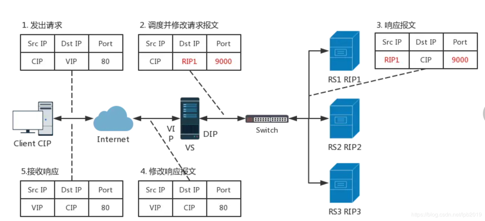

# 企业级调度器lvs 


## 什么是集群以及集群的分类

Cluster：集群,为解决某个特定问题将多台计算机组合起来形成的单个系统


#### Cluster 分为三种类型：

* LB：Load Balancing，负载均衡，多个主机组成，每个主机只承担一部分访问请求
* HA：High Availiablity，高可用，避免SPOF（single Point Of failure）
  * MTBF:Mean Time Between Failure 平均无故障时间，正常时间
  * MTTR:Mean Time To Restoration（ repair）平均恢复前时间，故障时间
  * A = MTBF /（MTBF+MTTR） (0,1)：99%,99.5%,99.9%,99.99%,99.999%
  * 停机时间又分为两种，一种是计划内停机时间，一种是计划外停机时间

#### [High-performance computing](https://www.top500.org/)


## 分布式和集群的区别


#### 集群
同一个业务系统部署在多台服务器上。集群中每一台服务器实现的功能没有差别，数据和代码都是一样的

#### 分布式

一个业务被拆成多个子业务，或者本身就是不同的业务，部署在多台服务器上。分布式中，每
一台服务器实现的功能是有差别的，数据和代码也是不一样的，分布式每台服务器功能加起来，才是完
整的业务


分布式是以缩短单个任务的执行时间来提升效率的，而集群则是通过提高单位时间内执行的任务数来提
升效率


## LVS

LVS：Linux Virtual Server，负载调度器，内核集成， 阿里的四层SLB(Server Load Balance)是基于LVS+keepalived实现，
LVS 是全球最流行的四层负载均衡开源软件，可以实现LINUX平台下的负载均衡 

[LSV官网](http://www.linuxvirtualserver.org/)


### LVS 工作原理以及查看内核是否支持LVS

VS根据请求报文的目标IP和目标协议及端口将其调度转发至某RS，根据调度算法来挑选RS。LVS是内核
级功能，工作在INPUT链的位置，将发往INPUT的流量进行“处理”


```bash
#查看内核编译配置选项是否支持lvs
egrep -i  ipvs  /boot/config-`uname -r`

#直接查看lvs模块
modinfo ip_vs
```


###  LVS 集群类型中的术语

* VS：Virtual Server，Director Server(DS), Dispatcher(调度器)，Load Balancer
* RS：Real Server(lvs), upstream server(nginx), backend server(haproxy)
* CIP：Client IP
* VIP：Virtual server IP VS外网的IP
* DIP：Director IP VS内网的IP
* RIP：Real server IP 
* 访问流程：CIP <--> VIP == DIP <--> RIP


### LVS 相关程序和命令

#### 程序包

**ipvsadm**

* Unit File: ipvsadm.service
* 主程序：/usr/sbin/ipvsadm
* 规则保存工具：/usr/sbin/ipvsadm-save
* 规则重载工具：/usr/sbin/ipvsadm-restore
* 配置文件：/etc/sysconfig/ipvsadm-config
* ipvs调度规则文件：/etc/sysconfig/ipvsadm

#### Ubuntu系统保存规则和开机加载规则
```bash
#保存规则
    #方法1
    [root@ubuntu2204 ~]#service ipvsadm save
    * Saving IPVS configuration...           [ OK ]
    [root@ubuntu2204 ~]#cat /etc/ipvsadm.rules
    # ipvsadm.rules
    -A -t 192.168.10.100:80 -s wlc
    -a -t 192.168.10.100:80 -r 10.0.0.7:80 -g -w 1
    -a -t 192.168.10.100:80 -r 10.0.0.17:80 -g -w 1
    #方法2
    [root@ubuntu2004 ~]#ipvsadm-save -n > /etc/ipvsadm.rules


#开机自启
[root@ubuntu2004 ~]#vim /etc/default/ipvsadm
AUTO="true"
```


#### 红帽系统保存规则和开机加载规则
```bash
#保存规则
[root@rocky8 ~]#ipvsadm-save -n > /etc/sysconfig/ipvsadm


#开机自启
[root@rocky8 ~]#systemctl enable ipvsadm.service
```

#### ipvsadm 命令


###### 集群服务管理：增、删、改
```bash
ipvsadm -A|E -t|u|f service-address [-s scheduler] [-p [timeout]]  #增加修改
ipvsadm -D -t|u|f service-address  #删除
-A 添加  -E 修改 -D 删除

-t tcp  集群服务使用tcp端口,TCP协议的端口，VIP:TCP_PORT 如: -t 10.0.0.100:80
-u udp    UDP协议的端口，VIP:UDP_PORT
-f  firewall MARK，标记，一个数字

[-s scheduler]：指定集群的调度算法，默认为wlc

比如：

添加 
ipvsadm -A -t 10.0.0.100:80 -s wrr  #创建一个集群，集群对外ip和监听tcp端口是10.0.0.100 端口80  使用wrr调度算法

删除
ipvsadm -D -t 10.0.0.100:80 -s wrr

修改
ipvsadm -E -t 10.0.0.100:80 -s rr
```


###### 集群服务的RS管理：增、删、改
```bash
ipvsadm -a|e -t|u|f service-address -r server-address [-g|i|m] [-w weight]   #增加和修改
ipvsadm -D -t|u|f service-address     #删除

server-address：
     rip[:port] 如省略port，不作端口映射
选项：
lvs类型：
    -g: gateway, dr类型，默认
    -i: ipip, tun类型
    -m: masquerade, nat类型        
-w weight：权重

比如：
ipvsadm -a -t 10.0.0.100:80 -r 10.0.0.8:8080 -m -w 3

```

###### 查看
```bash
ipvsadm -L|l [options]
--numeric, -n：以数字形式输出地址和端口号
--exact：扩展信息，精确值     
--connection，-c：当前IPVS连接输出
--stats：统计信息
--rate ：输出速率信息


ipvsadm -Ln  #常用选项
```


###### 从文件加载规则和保存规则到文件
```bash
清空定义的所有内容：
ipvsadm -C

清空计数器：
ipvsadm -Z [-t|u|f service-address]

保存规则
ipvsadm-save > /PATH/TO/IPVSADM_FILE

重载规则
ipvsadm-restore < /PATH/FROM/IPVSADM_FILE

建议保存至 /etc/sysconfig/ipvsadm  #因为这个文件是默认规则保存和加载的文件
```

### LVS 调度算法
ipvs scheduler：根据其调度时是否考虑各RS当前的负载状态
分为两种：静态方法和动态方法


#### 静态方法
仅根据算法本身进行调度

* 轮询算法RR：roundrobin，轮询,较常用
* 加权轮询算法WRR：Weighted RR，较常用
* 源地址哈希算法SH：Source Hashing，实现session sticky，源IP地址hash；将来自于同一个IP地址的请求始终发往第一次挑中的RS，从而实现会话绑定
* 目标地址哈希算法DH：Destination Hashing；目标地址哈希，第一次轮询调度至RS，后续将发往同一个目标地址的请求始终转发至第一次挑中的RS，典型使用场景是正向代理缓存场景中的负载均衡,如: Web缓存


#### 动态方法

主要根据每RS当前的负载状态及调度算法进行调度Overhead=value 较小的RS将被调度 

1、最少连接算法LC：least connections 适用于长连接应用
```bash
Overhead=activeconns*256+inactiveconns
```

2、加权最少连接算法WLC：Weighted LC，默认调度方法,较常用
```bash
Overhead=(activeconns*256+inactiveconns)/weight
```

3、最短期望延迟算法SED：Shortest Expection Delay，初始连接高权重优先,只检查活动连接,而不考虑非活动连接
```bash
Overhead=(activeconns+1)*256/weight
```
最少队列算法NQ：Never Queue，第一轮均匀分配，后续SED

基于局部的最少连接算法LBLC：Locality-Based LC，动态的DH算法，使用场景：根据负载状态实现
正向代理,实现Web Cache等

带复制的基于局部的最少连接算法LBLCR：LBLC with Replication，带复制功能的LBLC，解决LBLC
负载不均衡问题，从负载重的复制到负载轻的RS,,实现Web Cache等


###  LVS 集群的工作模式 和相关配置

####  lvs-nat：修改请求报文的目标IP,多目标IP的DNAT
lvs-nat：本质是多目标IP的DNAT，通过将请求报文中的目标地址和目标端口修改为某挑出的RS的RIP和PORT实现转发
* RIP和DIP应在同一个IP网络，且应使用私网地址；RS的网关要指向DIP
* 请求报文和响应报文都必须经由Director转发，Director易于成为系统瓶颈
* 支持端口映射，可修改请求报文的目标PORT
* VS必须是Linux系统，RS可以是任意OS系统




具体配置

```bash
注意：lvs服务器需要打开ip_forward 内核参数
net.ipv4.ip_forward = 1

且ss -nutl  看不到lvs机器上的相关端口打开，因为lvs是内核功能，ss 只能看到应用程序打开的端口
```


#### lvs-dr：操纵封装新的MAC地址

LVS-DR：Direct Routing，直接路由，LVS默认模式,应用最广泛,通过为请求报文重新封装一个MAC首部
进行转发，源MAC是DIP所在的接口的MAC，目标MAC是某挑选出的RS的RIP所在接口的MAC地址；源IP/PORT，以及目标IP/PORT均保持不变

** DR模式的特点：**
* Director和各RS都配置有VIP
* 确保前端路由器将目标IP为VIP的请求报文发往Director
  * 在前端网关做静态绑定VIP和Director的MAC地址
  * 在RS上使用arptables工具
  * 在RS上修改内核参数以限制arp通告及应答级别
* RS的RIP可以使用私网地址，也可以是公网地址；RIP与DIP在同一IP网络；RIP的网关不能指向DIP，以确保响应报文不会经由Director
* RS和Director要在同一个物理网络
* 请求报文要经由Director，但响应报文不经由Director，而由RS直接发往Client
* 不支持端口映射（端口不能修改）
*  无需开启 ip_forward
*  RS可使用大多数OS系统


具体配置

```bash
lvs rs 服务器在一个网段内，中间没有路由器

lvs 服务器
lo 网卡上绑定一个地址vip，10.0.0.2
ifconfig lo:1 10.0.0.2/32
另一个出口网卡绑定另一个地址 10.0.0.3
gw 指向路由器

rs服务器配置
lo 网卡上绑定vip 10.0.0.2
另一个网卡绑定其他地址 10.0.0.4
echo 1 >   /proc/sys/net/ipv4/conf/all/arp_ignore
echo 2 >   /proc/sys/net/ipv4/conf/all/arp_announce 
echo 1 >   /proc/sys/net/ipv4/conf/lo/arp_ignore
echo 2 >   /proc/sys/net/ipv4/conf/lo/arp_announce 
ifconfig lo:1 10.0.0.2/32

注意
1.lvs 服务除了配置vip，一定要配另一个本网段的地址
2.lvs 服务器GW一定要配置，可以随便指向，因为没有网关，如果不是本网段的数据包，会被Linux丢弃，哪怕用不到GW
3.lo网卡上配置地址，子网掩码写/32  不要写/24, 因为lo网卡特性，/24 会认为这个网段的所有地址都是lo可用地址
4.一定要关闭rs 上 lo网卡的arp响应和免费arp，将vip 私自保留 


限制响应级别：arp_ignore
0：默认值，表示可使用本地任意接口上配置的任意地址进行响应
1：仅在请求的目标IP配置在本地主机的接收到请求报文的接口上时，才给予响应


限制通告级别：arp_announce
0：默认值，把本机所有接口的所有信息向每个接口的网络进行通告
1：尽量避免将接口信息向非直接连接网络进行通告
2：必须避免将接口信息向非本网络进行通告

```

#### lvs-tun：在原请求IP报文之外新加一个IP首部
转发方式：不修改请求报文的IP首部（源IP为CIP，目标IP为VIP），而在原IP报文之外再封装一个IP首部
（源IP是DIP，目标IP是RIP），将报文发往挑选出的目标RS；RS直接响应给客户端（源IP是VIP，目标IP是CIP）

**TUN模式特点:**
* RIP和DIP可以不处于同一物理网络中，RS的网关一般不能指向DIP,且RIP可以和公网通信。也就是说集群节点可以跨互联网实现。DIP, VIP, RIP可以是公网地址
* RealServer的tun接口上需要配置VIP地址，以便接收director转发过来的数据包，以及作为响应的报文源IP
* Director转发给RealServer时需要借助隧道，隧道外层的IP头部的源IP是DIP，目标IP是RIP，而RealServer响应给客户端的IP头部是根据隧道内层的IP头分析得到的，源IP是VIP，目标IP是CIP
* 请求报文要经由Director，但响应不经由Director,响应由RealServer自己完成
* 不支持端口映射
* RS的OS须支持隧道功能

**应用场景:**
一般来说，TUN模式常会用来负载调度缓存服务器组，这些缓存服务器一般放置在不同的网络环境，可以就近
折返给客户端。在请求对象不在Cache服务器本地命中的情况下，Cache服务器要向源服务器发送请求，将结
果取回，最后将结果返回给用户。
LAN环境一般多采用DR模式，WAN环境虽然可以用TUN模式，但是一般在WAN环境下，请求转发更多的被
haproxy/nginx/DNS等实现。因此，TUN模式实际应用的很少,跨机房的应用一般专线光纤连接或DNS调度


配置方法

```bash
lvs服务器
#开启tunnel网卡并配置VIP 
ifconfig tunl0 10.0.0.100 netmask 255.255.255.255 up
如果rs不在同一个网段，另外一个ip可以不用配置，否则需要在物理网卡上配置另一个IP

Rs服务器配置
#开启tunnel网卡并配置VIP
ifconfig tunl0 10.0.0.100 netmask 255.255.255.255 up 
#修改内核参数 (rs私自保留vip)
echo "1" > /proc/sys/net/ipv4/conf/tunl0/arp_ignore        
echo "2" > /proc/sys/net/ipv4/conf/tunl0/arp_announce
echo "1" > /proc/sys/net/ipv4/conf/all/arp_ignore
echo "2" > /proc/sys/net/ipv4/conf/all/arp_announce
```


#### lvs-fullnat：修改请求报文的源和目标IP,默认内核不支持

通过同时修改请求报文的源IP地址和目标IP地址进行转发

CIP --> DIP 
VIP --> RIP

**fullnat模式特点：**
* VIP是公网地址，RIP和DIP是私网地址，且通常不在同一IP网络；因此，RIP的网关一般不会指向DIP
* RS收到的请求报文源地址是DIP，因此，只需响应给DIP；但Director还要将其发往Client
* 请求和响应报文都经由Director
* 相对NAT模式，可以更好的实现LVS-RealServer间跨VLAN通讯
* 支持端口映射


#### 总结
```bash
NAT 多目标的DNAT，四层，支持端口修改，请求报文和响应报文都要经过LVS
DR 默认模式，二层，只修改MAC，不支持端口修改，性能好，LVS负载比小，LVS和RS并在同一网段，请求报文经过LVS，响应报文不经过LVS
TUNNEL 三层，添加一个新的IP头，支持LVS和RS并在不在同一网段，不支持端口修改，请求报文经过LVS，响应报文不经过LVS
FULLNAT 多目标的SNAT+DNAT，四层，支持端口修改，请求报文和响应报文都要经过LVS
```


### 防火墙标记

借助于防火墙标记来分类报文，而后基于标记定义集群服务；可将多个不同的应用使用同一个集群服务
进行调度


在Director主机打标记：

```bash
iptables -t mangle -A PREROUTING -d $vip -p $proto -m multiport --dports $port1,$port2,… -j MARK --set-mark NUMBER 

iptables -t mangle -A PREROUTING -d 172.16.0.100 -p tcp -m  multiport --dports 80,443 -j MARK --set-mark 10 
```

在Director主机基于标记定义集群服务：

```bash
ipvsadm -A -f NUMBER [options] 
ipvsadm -A -f 10 -s rr
```