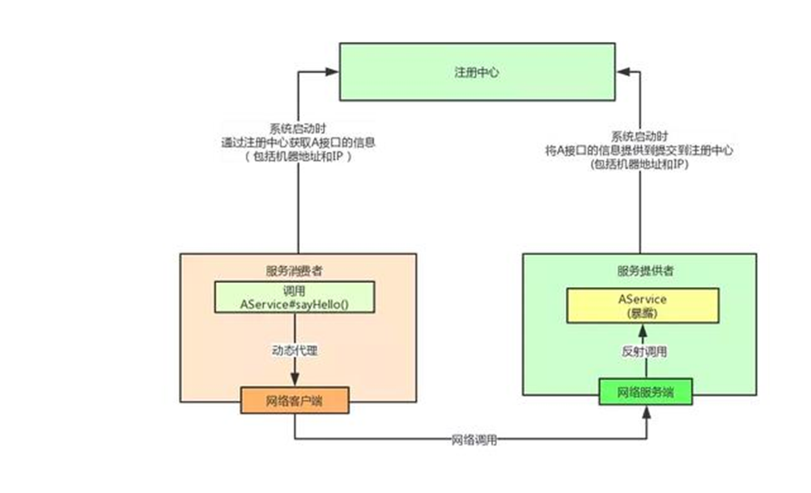
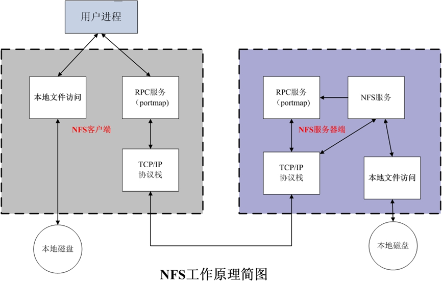
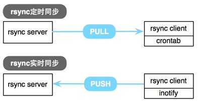

# 网络文件共享服务

### 存储类型分为三种
* 直连式存储：Direct-Attached Storage，简称 DAS
* 存储区域网络：Storage Area Network，简称 SAN
* 网络附加存储：Network-Attached Storage，简称 NAS


### 三种存储架构的应用场景
* DAS虽然比较古老了，但是还是很适用于那些数据量不大，对磁盘访问速度要求较高的中小企业
* NAS多适用于文件服务器，用来存储非结构化数据，虽然受限于以太网的速度，但是部署灵活，成本低
* SAN则适用于大型应用或数据库系统，缺点是成本高、较为复杂

### NFS 工作原理


NFS：Network File System 网络文件系统，基于内核的文件系统。Sun 公司开发，通过使用 NFS，用
户和程序可以像访问本地文件一样访问远端系统上的文件，基于RPC（Remote Procedure Call 
Protocol 远程过程调用）实现

RPC采用C/S模式，客户机请求程序调用进程发送一个有进程参数的调用信息到服务进程，然后等待应答
信息。在服务器端，进程保持睡眠状态直到调用信息到达为止。当一个调用信息到达，服务器获得进程
参数，计算结果，发送答复信息，然后等待下一个调用信息，最后，客户端调用进程接收答复信息，获
得进程结果，然后调用执行继续进行



###  NFS软件介绍
* 红帽系统: nfs-utils: 包括服务器和客户端相关工具，CentOS8 最小化安装时默认没有安装
* Ubuntu: nfs-server（nfs-kernel-server） 服各器包名,nfs-common 客户端包名
* 端口：2049(nfsd), 其它端口由portmap(111)分配

##### NFS服务主要进程：
* rpc.nfsd 最主要的NFS进程，管理客户端是否可登录
* rpc.mountd 挂载和卸载NFS文件系统，包括权限管理
* rpc.lockd 非必要，管理文件锁，避免同时写出错
* rpc.statd 非必要，检查文件一致性，可修复文件

##### NFS配置文件
```bash
/etc/exports
/etc/exports.d/*.exports
```


### 配置文件详解
```bash
/dir  主机1(opt1,opt2)    主机2(opt1,opt2)...

主机格式：
anonymous：表示使用*通配所有客户端
单个主机：ipv4，ipv6，FQDN
IP networks：两种掩码格式均支持
172.18.0.0/255.255.0.0
172.18.0.0/16
wildcards：主机名通配，例如:*.wang.org，IP不可以
netgroups：NIS域的主机组，@group_name


每个条目指定目录导出到的哪些主机，及相关的权限和选项
默认选项：(ro,sync,root_squash,no_all_squash)
ro,rw 只读和读写
async 异步，数据变化后不立即写磁盘，先写入到缓冲区中，过一段时间再写入磁盘，性能高,安全性低
sync（1.0.0后为默认）同步，数据在请求时立即写入共享存储磁盘,性能低,安全性高
root_squash （默认）远程root映射为 nfsnobody,UID为65534，CentOS8 为nobody,CentOS 7以前的版本为nfsnobody
no_root_squash 远程root映射成NFS服务器的root用户
all_squash 所有远程用户(包括root)都变成nfsnobody,CentOS8 为nobody
no_all_squash （默认）保留共享文件的UID和GID
anonuid和anongid 指明匿名用户映射为特定用户UID和组GID，而非nobody,可配合all_squash使用,注意:目录需要给此用户权限,否则无法访问,后面跟数值而不是名称
subtree_check  用于检查请求的文件是否真的位于已导出的目录树中
no_subtree_check 不检查请求的文件是否真的位于已导出的目录树中

范例：
/data   10.0.0.0/24(rw,async,all_squash,anonuid=3232,anongid=3232,subtree_check)
```
###### 配置文件相关命令
```bash
exportfs   可用于管理NFS导出的文件系统
-v #查看本机所有NFS共享
-r #重读配置文件，并共享目录 修改完配置文件,只执行此文件即可
-a #输出本机所有共享
-au #停止本机所有共享


showmount
#查看远程主机的NFS共享
showmount -e hostname  


mount.nfs
    客户端NFS挂载
fg #（默认）前台挂载
bg #后台挂载
hard #（默认）持续请求
soft   #非持续请求
rsize #和wsize 一次读和写数据最大字节数，rsize=32768
_netdev #无网络服务时不挂载NFS资源
vers    #指定版本，客户端centos8默认4.2 ，centos7默认4.1 centos6默认4.0
nosuid  这个选项用来防止 suid（set-user-ID）和 sgid（set-group-ID）位的执行
noexec 此选项阻止在挂载的文件系统上执行任何二进制可执行文件

基于安全考虑，建议使用 nosuid,_netdev,noexec 挂载选项_


范例： 客户端将挂载写在/etc/fstab中
10.0.0.20:/data        /mnt       nfs      bg,hard,_netdev,nosuid,noexec    0 0
10.0.0.20:/data        /mnt       nfs      _netdev    0 0

```

# 数据实时同步




### 实时同步方法

* inotify + rsync 方式实现数据同步,需自行编写脚本组合inotify和 rsync 实现
* sersync ：前金山公司周洋（花椒直播）在 inotify+rsync 软件基础上进行开发的，功能更加强大

### 工作原理

要利用监控服务（inotify），监控同步数据服务器目录中信息的变化
发现目录中数据产生变化，就利用rsync服务推送到备份服务器上

##### inotify：

异步的文件系统事件监控机制，利用事件驱动机制，而无须通过诸如cron等的轮询机制来获取事件，
linux内核从2.6.13起支持 inotify，通过inotify可以监控文件系统中添加、删除，修改、移动等各种事件

###### 检查内核是否支持
```bash
grep -i inotify /boot/config-5.15.0-112-generic 
CONFIG_INOTIFY_USER=y
```

###### 安装对应的软件工具包，提供inotify的用户操作接口
```bash
红帽：yum -y install inotify-tools

ubuntu  apt -y install inotify-tools
```

###### inotify 内核参数说明：
```bash
max_queued_events：inotify 事件队列最大长度，如值太小会出现 Event Queue Overflow 错误
默认值：16384, 生产环境建议调大,比如:327679

max_user_instances：每个用户创建 inotify实例最大值，默认值：128

max_user_watches：可以监视的文件的总数量（inotifywait 单进程），默认值：8192,建议调大
```


### inotify+rsync使用方式
* inotify 对同步数据目录信息的监控
* rsync 完成对数据的同步
* 利用脚本进行结合


[root@ubuntu2204 ~]#cat /etc/rsyncd.conf
uid = root      #表示访问映射为root用户
gid = root
max connections = 0 #0表示不限制
ignore errors       #忽略传输过程中错误
exclude = lost+found/
log file = /var/log/rsyncd.log
pid file = /var/run/rsyncd.pid
lock file = /var/run/rsyncd.lock
reverse lookup = no  #禁止反向解析，将ip解析成域名
[backup]
path = /opt/backup/     
comment = backup dir  #此备份模块名字
read only = no   #可读可写
auth users = rsyncuser  #访问此模块用户名字
secrets file = /etc/rsync.pas   #访问此模块的密码文件


