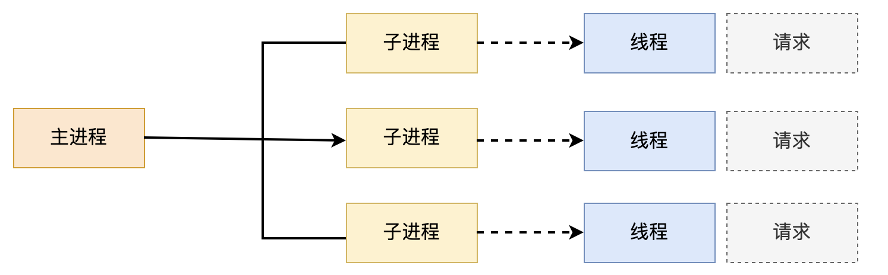
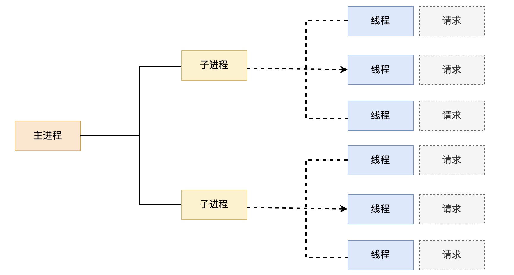
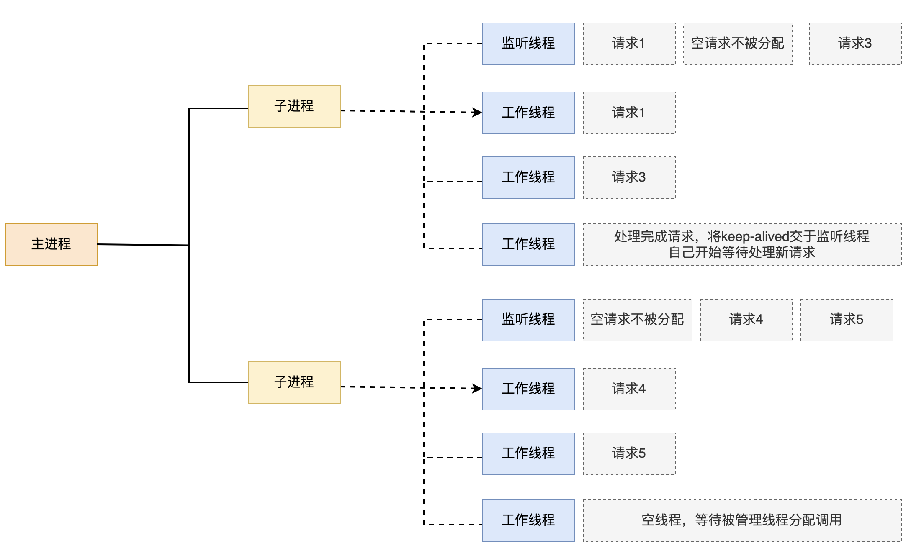
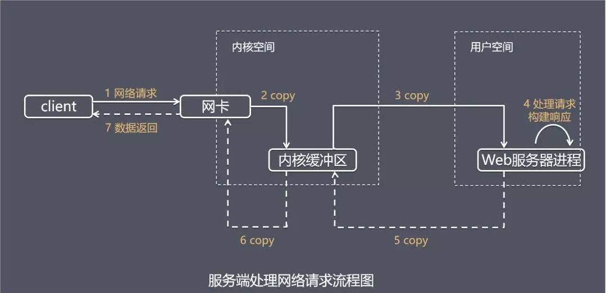
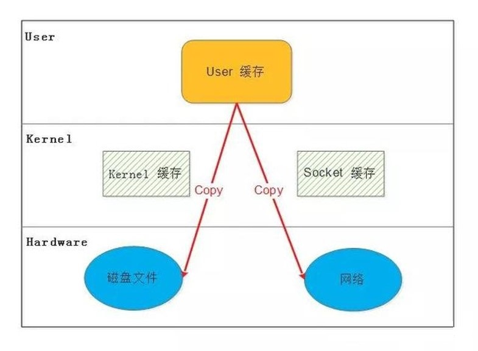
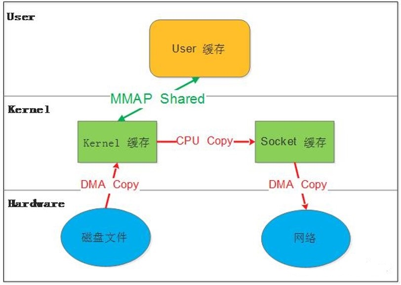
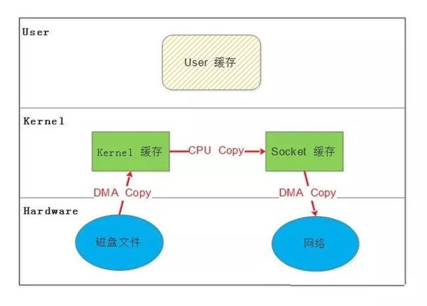
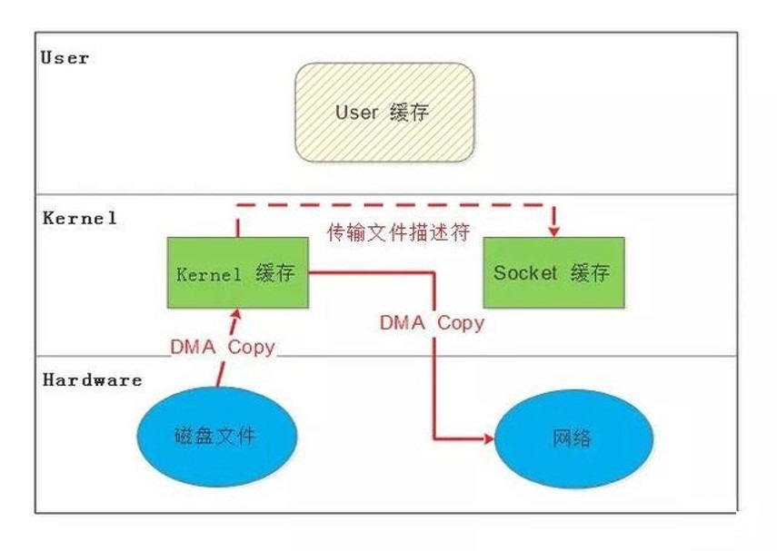
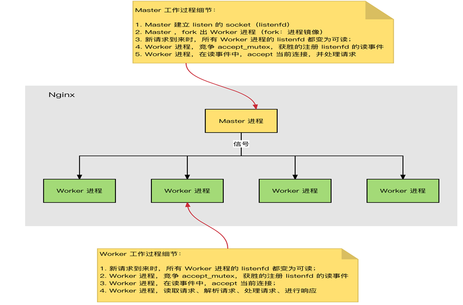

# nginx架构和安装

## Netcraft公司web网站服务器分析

https://www.netcraft.com/resources/?type=blog


## apache

官网  https://www.apache.org/

### apache 架构演进


####  Apache prefork 模型



* 优点：稳定
* 缺点：每个用户请求需要对应开启一个进程,占用资源较多，并发性差,不适用于高并发场景

#### Apache worker 模型




* 优点：
  * 相比prefork 占用的内存较少，可以同时处理更多的请求,可以基于select的IO多路复用技术实现
  * 使用更少的线程支持更多的并发连接
* 缺点：
  * 使用keepalive的长连接方式，某个线程会一直被占据，即使没有传输数据，也需要一直等待到超时才会被释放
  * 如果过多的线程，被这样占据，也会导致在高并发场景下的无服务线程可用（该问题在prefork模式下，同样会发生）


#### Apache event 模型





* 优点：
  * 单线程响应多请求，占据更少的内存，高并发下表现更优秀，会有一个专门的线程来管理keepalive类型的线程
  * 当有真实请求过来的时候，将请求传递给服务线程，执行完毕后，又允许它释放
  * 可以基于epoll 更加高效的IO多路复用技术实现使用更少的线程支持更多的并发连接
* 缺点：没有线程安全控制

##  Nginx 高性能的 Web 服务端

官网   https://nginx.org/

Tengine http://tengine.taobao.org/

OpenResty   https://openresty.org/cn/


**用户访问体验统计**

互联网存在用户速度体验的1-3-10原则，即1秒最优，1-3秒较优，3~10秒比较慢，10秒以上用户无法接
受。用户放弃一个产品的代价很低，只是换一个URL而已


**影响用户体验的因素**

* 客户端
  * 客户端硬件配置
  * 客户端网络速率
  * 客户端与服务端距离
* 服务器
  * 服务端网络速率
  * 服务端硬件配置
  * 服务端架构设计
  * 服务端应用程序工作模式
  * 服务端并发数量
  * 服务端响应文件大小及数量 buffer cache
  * 服务端I/O压力

#### 客户访问IO流程




#### 零拷贝

######  传统 Linux中 I/O 的问题



###### MMAP ( Memory Mapping )



###### SENDFILE



###### DMA辅助的 SENDFILE




### nginx进程结构

Nginx是多进程组织模型，而且是一个由Master主进程和Worker工作进程组成




##### 主进程(master process)的功能
* 对外接口：接收外部的操作（信号）
* 对内转发：根据外部的操作的不同，通过信号管理 Worker
* 监控：监控 worker 进程的运行状态，worker 进程异常终止后，自动重启 worker 进程
* 读取Nginx 配置文件并验证其有效性和正确性
* 建立、绑定和关闭socket连接
* 按照配置生成、管理和结束工作进程
* 接受外界指令，比如重启、升级及退出服务器等指令
* 不中断服务，实现平滑升级，重启服务并应用新的配置
* 开启日志文件，获取文件描述符
* 不中断服务，实现平滑升级，升级失败进行回滚处理
* 编译和处理perl脚本

##### 工作进程（worker process）的功能

* 所有 Worker 进程都是平等的
* 实际处理：网络请求，由 Worker 进程处理
* Worker进程数量：一般设置为核心数，充分利用CPU资源，同时避免进程数量过多，导致进程竞争CPU资源，
* 增加上下文切换的损耗
* 接受处理客户的请求
* 将请求依次送入各个功能模块进行处理
* I/O调用，获取响应数据
* 与后端服务器通信，接收后端服务器的处理结果
* 缓存数据，访问缓存索引，查询和调用缓存数据
* 发送请求结果，响应客户的请求
* 接收主程序指令，比如重启、升级和退出等

### nginx模块介绍

* 核心模块：是 Nginx 服务器正常运行必不可少的模块，提供错误日志记录 、配置文件解析 、事件驱动机制 、进程管理等核心功能
* 标准HTTP模块：提供 HTTP 协议解析相关的功能，比如： 端口配置 、 网页编码设置 、 HTTP响应头设置等
* 可选HTTP模块：主要用于扩展标准的 HTTP 功能，让 Nginx 能处理一些特殊的服务，比如： Flash 多媒体传输 、解析 GeoIP 请求、 网络传输压缩 、 安全协议 SSL 支持等
* 邮件服务模块：主要用于支持 Nginx 的 邮件服务 ，包括对 POP3 协议、 IMAP 协议和 SMTP协议的支持
* Stream服务模块: 实现反向代理功能,包括TCP协议代理
* 第三方模块：是为了扩展 Nginx 服务器应用，完成开发者自定义功能，比如： Json 支持、 Lua 支持等

```bash
核心模块：core module
标准模块：
 HTTP 模块： ngx_http_*
 HTTP Core modules   #默认功能
 HTTP Optional modules #需编译时指定
 Mail 模块: ngx_mail_*
 Stream 模块 ngx_stream_*
第三方模块

```


