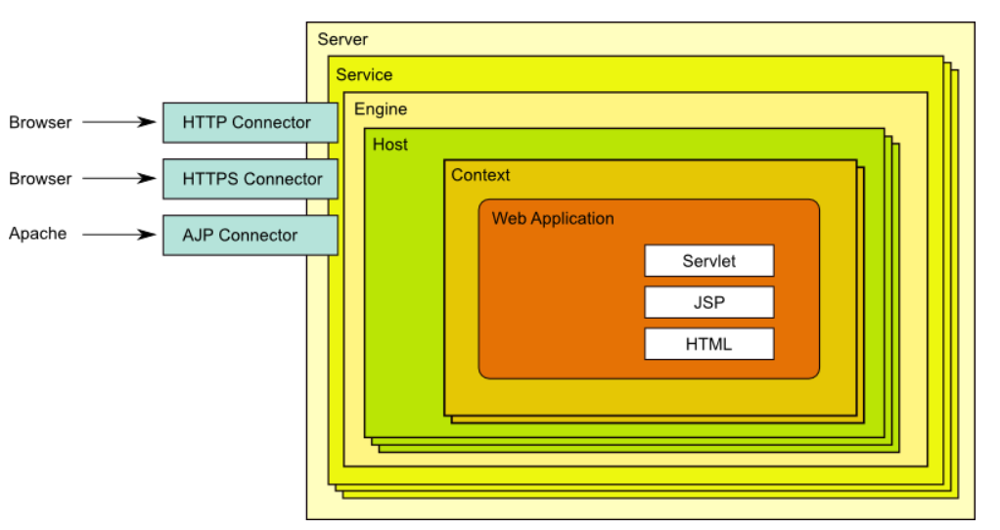

# tomcat 基础

### JDK 安装

##### OpenJDK

openjdk 在常见的Linux发行版中， 包仓库中默认是有的， 只需要通过发行版对应的yum或者apt 就可以安装

##### OracleJDK

OracleJDK 需要先到Oracle 官网 https://www.oracle.com/java/technologies/downloads/ ， 注册账号之后，才能下载

安装参见脚本 [OracleJDK安装](./scripts/install_jdk.sh)

#### 查看jdk版本
`java -version`


## tomcat

tomcat是java web应用服务器， 是servlet和jsp容器，同时也是一个静态web服务器  

官网 https://tomcat.apache.org/


tomcat 各版本的区别   https://tomcat.apache.org/whichversion.html

### tomcat 包安装

```bash
yum install tomcat*

apt install tomcat9

```

### tomcat二进制安装

参考脚本 [tomcat二进制包安装](./scripts/install_tomcat.sh)


### tomcat 文件结构和组成

##### 目录结构

|目录|说明|
|--------|---------------------------------|
|bin    |服务启动、停止等相关程序和文件 |
|conf   |配置文件|
|lib    |库目录|
|logs   |日志目录|
|webapps|应用程序，应用部署目录|
|work   |jsp编译后的结果文件，建议提前预热访问，升级应用后，删除此目录数据才能更新|


#####  配置文件说明

在tomcat安装目录下的 conf 子目录中，有以下的 tomcat 的配置文件

|文件名|说明|
|------|-------|
|server.xml          |主配置文件|
|web.xml             |每个webapp只有“部署”后才能被访问，它的部署方式通常由web.xml进行定义，其存放位置为WEB-INF/目录中；此文件为所有的webapps提供默认部署相关的配置,每个web应用也可以使用专用配置文件,来覆盖全局文件 |
|context.xml         |用于定义所有web应用均需加载的Context配置，此文件为所有的webapps提供默认配置，每个web应用也可以使用自已专用的配置，它通常由专用的配置文件context.xml来定义，其存放位置为WEB-INF/目录中,覆盖全局的文件 |
|tomcat-users.xml    |用户认证的账号和密码文件|
|catalina.policy     |当使用security选项启动tomcat时，用于为tomcat设置安全策略|
|catalina.properties |Tomcat 环境变量的配置，用于设定类加载器路径，以及一些与JVM调优相关参数|
|logging.properties  |Tomcat 日志系统相关的配置，可以修改日志级别和日志路径等|

**注意：配置文件大小写敏感**

### 日志文件

**tomcat有五类日志：catalina、localhost、manager、admin、host-manager**


**catalina.out**

catalina.out即标准输出和标准出错，所有输出到这两个位置的都会进入catalina.out，这里包含tomcat
运行自己输出的日志以及应用里向console输出的日志。默认这个日志文件是不会进行自动切割的，我们
需要借助其他工具进行切割（注意：catalina.out文件如果过大会影响）


**catalina.YYYY-MM-DD.log**

catalina.{yyyy-MM-dd}.log是tomcat自己运行的一些日志，这些日志还会输出到catalina.out，但是应
用向console输出的日志不会输出到catalina.{yyyy-MM-dd}.log,它是tomcat的启动和暂停时的运行日
志，注意，它和catalina.out是里面的内容是不一样的

**localhost.YYYY-MM-DD.log**

localhost.{yyyy-MM-dd}.log主要是应用初始化(listener, filter, servlet)未处理的异常最后被tomcat捕获
而输出的日志,它也是包含tomcat的启动和暂停时的运行日志,但它没有catalina.2018-09-19.log日志全。
它只是记录了部分日志

**localhost_access_log.YYYY-MM-DD.txt**

这个是访问tomcat的日志，请求时间和资源，状态码都有记录

**host-manager.YYYY-MM-DD.log**

这个是放tomcat的自带的manager项目的日志信息的，未看到有什么重要的日志信息

**manager.YYYY-MM-DD.log**

这个是tomcat manager项目专有的日志文件


#### Tomcat 访问日志格式

日志格式 https://tomcat.apache.org/tomcat-9.0-doc/config/valve.html#Access_Logging


######  tomcat日志实现json格式的访问日志
```bash
添加下面一行,注意是一行,不要换行
pattern="{&quot;clientip&quot;:&quot;%h&quot;,&quot;ClientUser&quot;:&quot;%l&quot;,&quot;authenticated&quot;:&quot;%u&quot;,&quot;AccessTime&quot;:&quot;%t&quot;,&quot;method&quot;:&quot;%r&quot;,&quot;status&quot;:&quot;%s&quot;,&quot;SendBytes&quot;:&quot;%b&quot;,&quot;Query?string&quot;:&quot;%q&quot;,&quot;partner&quot;:&quot;%{Referer}i&quot;,&quot;AgentVersion&quot;:&quot;%{User-Agent}i&quot;}"
```

### tomcat内部组成




## java应用部署

Tomcat中默认网站根目录是$CATALINA_BASE/webapps/
在Tomcat的webapps目录中，有个非常特殊的目录ROOT，它就是网站默认根目录。
将eshop解压后的文件放到这个$CATALINA_BASE/webapps/ROOT中。
bbs解压后文件都放在$CATALINA_BASE/webapps/forum目录下。
$CATALINA_BASE/webapps下面的每个目录都对应一个Web应用,即WebApp
最终网站链接有以下对应关系

http://localhost/ 对应于eshop的应用WebApp，即$CATALINA_BASE/webapps/ROOT/目录,
http://localhost/forum/ 对应于forum的应用WebApp，即$CATALINA_BASE/webapps/forum/


**war**
war 包直接放到webapps下，会自动解压

**jar**
java -jar  xxx.jar


### 基于WEB的管理Server status和Manager APP实现应用部署


