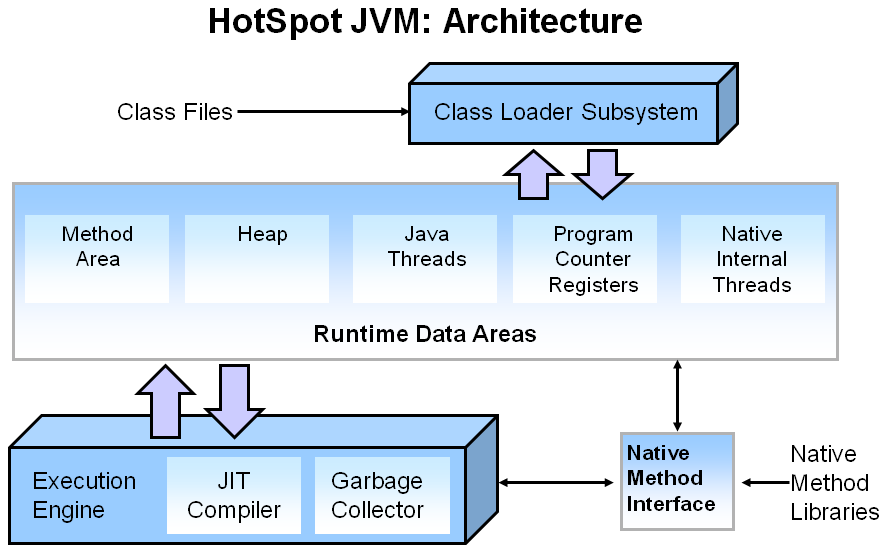

#  java应用性能优化

### JVM 组成

### 垃圾回收算法

#### 查找垃圾的几种方式

1. 引用计数(存在循环引用问题)
2. 根搜索(可达)算法 Root Searching

####  标记-清除 Mark-Sweep
* 标记阶段，找到所有可访问对象打个标记。清理阶段，遍历整个堆
* 对未标记对象(即不再使用的对象)逐一进行清理

**特点：**
优点：算法简单
缺点：标记-清除最大的问题会造成内存碎片,但是不浪费空间,效率较高(如果对象较多时,逐一删除效率也会受到影响)

#### 标记-压缩 (压实)Mark-Compact

* 标记阶段，找到所有可访问对象打个标记
* 内存清理阶段时，整理时将对象向内存一端移动，整理后存活对象连续的集中在内存一端。

**特点：**
* 标记-压缩算法好处是整理后内存空间连续分配，有大段的连续内存可分配，没有内存碎片。
* 缺点是内存整理过程有消耗,效率相对低下

#### 复制 Copying
先将可用内存分为大小相同两块区域A和B，每次只用其中一块，比如A。当A用完后，则将A中存活的对
象复制到B。复制到B的时候连续的使用内存，最后将A一次性清除干净。

**特点**
* 好处是没有碎片，复制过程中保证对象使用连续空间,且一次性清除所有垃圾,所以即使对象很多，收回效率也很高
* 缺点是比较浪费内存，只能使用原来一半内存，因为内存对半划分了，复制过程毕竟也是有代价

#### 算法总结

